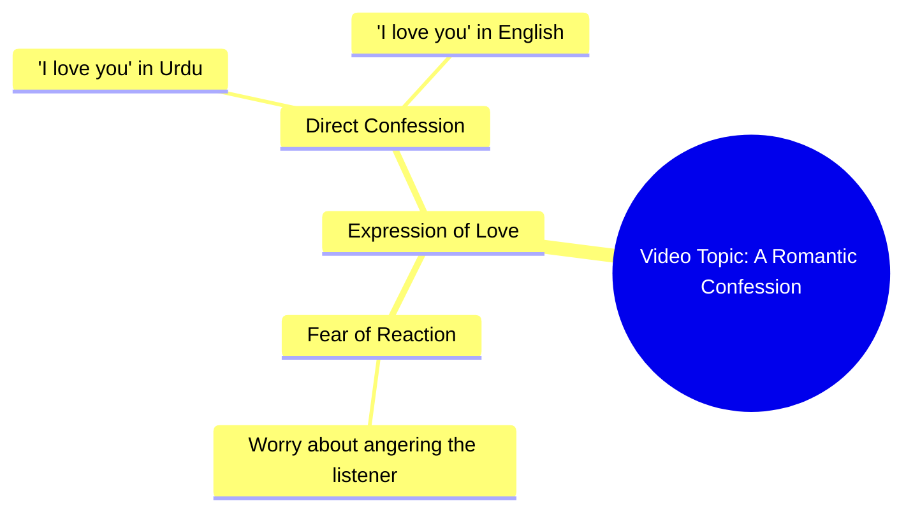

# Woman Says I Love You in Urdu, Asks Not to Get Angry

> 🌐 **Read this in:** **English** · [中文](../../zh-CN/2026-09/tiktok-transcript-1-2m-views-41k-reactions-03045658506-6e79.md)

> **Creator:** [@03045658506](https://www.tiktok.com/@03045658506) · **Views:** 436.7K · **Posted:** 2026-09-25 · **Niche:** entertainment
>
> **TL;DR:** The hook immediately engages the viewer by asking a vulnerable question, creating curiosity and emotional investment.

[Watch original video →](https://www.facebook.com/share/r/19cuLzjgdh/)

## Why This Went Viral

## Hook (first 3 seconds)
- **Verbatim opening:** "ایک بات کہیں آپ سے غصہ تو نہیں کروگے نا" ("Can I tell you something — you won't get mad at me, right?")
- **Hook pattern:** Permission-request + withheld confession (a "pre-confession" tension hook). It's a question that promises a secret is coming.
- **Why it stops the scroll:** It triggers an open loop instantly. The viewer is cast as the person being asked, so the question feels personal and direct. "You won't get mad?" implies something risky or vulnerable is about to be said — the brain can't leave an unresolved confession hanging.

## Emotional Rhythm
- **Beat 1 — Curiosity (0–2s):** "Can I tell you something?" opens the loop.
- **Beat 2 — Micro-tension (2–4s):** "You won't get mad, right?" adds stakes and vulnerability.
- **Beat 3 — Confession / release (4–6s):** "میں تم سے پیار کرتی ہوں" ("I love you") — the tension snaps into affection.
- **Beat 4 — Twist / escalation (final beat):** The English "I love you" lands as a soft punchline/reinforcement, doubling the confession in a second language.
- **Climax moment:** The drop of "میں تم سے پیار کرتی ہوں" — the exact second the withheld secret is revealed.
- **Resonance point:** The bilingual repeat ("I love you") — it feels like a real, unscripted confession rather than a performance.

## Keyword Density
- **پیار / love** — the emotional payload; drives saves and shares.
- **I love you** — the English anchor; broadens reach to non-Urdu audiences.
- **غصہ / mad** — creates the tension frame; hooks attention.
- **آپ / تم / you** — direct-address pronouns; make it feel personal.
- **کہیں / tell** — the "confession" verb; sets up the loop.
- **نا / right?** — the seeking-reassurance tag; softens tone and invites response.
- **Algorithmic drivers:** "I love you," "love," "you" — high-frequency, globally searchable, comment-baiting terms.
- **Emotional drivers:** "غصہ" (mad), "پیار" (love), "نا" (right?) — these carry the vulnerability and intimacy.

## Why It Spreads
- **Universal confession format:** "Can I tell you something… you won't get mad?" is a template anyone can imagine receiving — it invites viewers to project themselves into the scene.
- **Bilingual punch:** The Urdu confession followed by "I love you" in English lets the video travel across both Urdu-speaking and English-speaking feeds, doubling its addressable audience.
- **Comment-bait ending:** The direct "I love you" begs a reply — people comment "I love you too," tag partners, or react with hearts, which the algorithm reads as high engagement.
- **Short and loopable:** The whole thing runs in seconds, so replays are easy and completion rate stays near 100%.
- **Emotional whiplash:** The shift from nervous ("you won't get mad") to romantic ("I love you") creates a tiny emotional arc that feels satisfying and shareable.

## What You Can Steal
- **Open with a permission question.** "Can I tell you something?" or "Don't be mad, but…" forces viewers to stay for the payoff.
- **Delay the reveal by 2–3 seconds max.** Long enough to build tension, short enough to keep retention.
- **Repeat your key line in a second language or format.** Doubling the emotional payload (Urdu + English) widens reach and deepens impact.
- **End on a direct address that demands a reply.** "I love you" invites comments; a question invites even more.

## Mind Map

## Full Transcript (Generated by [TokTranscript.com](https://toktranscript.com/?utm_source=github&utm_medium=breakdown&utm_campaign=tool_attribution))

> 📝 Transcripts on this page are auto-generated and show the first 60%. Want to transcribe any TikTok in 30 seconds and get the full version? [Try TokTranscript free →](https://toktranscript.com/?utm_source=github&utm_medium=breakdown&utm_campaign=transcript_cta)

ایک بات کہیں آپ سے غصہ تو نہیں کروگے نا میں 

*[Read the full transcript on TokTranscript →](https://toktranscript.com/plaza/tiktok-transcript-1-2m-views-41k-reactions-03045658506-6e79?utm_source=github&utm_medium=breakdown&utm_campaign=transcript_full)*

## Browse More

- All [entertainment](../../by-niche/en/entertainment.md) breakdowns
- All [Question Hook](../../by-pattern/en/hook-question-hook.md) examples

## Video Info

| | |
|---|---|
| Creator | [@03045658506](https://www.tiktok.com/@03045658506) |
| Original video | [https://www.facebook.com/share/r/19cuLzjgdh/](https://www.facebook.com/share/r/19cuLzjgdh/) |
| Original title | 1.2M views · 41K reactions | غصا نہیں کرنا | 03045658506 |
| Views | 436.7K (436697) |
| Posted | 2026-09-25 |
| Duration | 0s |
| Niche | `entertainment` |
| Hook pattern | `Question Hook` |
| Original language | `en` |
| Available languages | en, zh-CN |
| Generated | 2026-09-27 by [TokTranscript](https://toktranscript.com/) |

---

*This breakdown is for educational analysis under fair use. Original video © [@03045658506](https://www.tiktok.com/@03045658506). All transcripts are auto-generated and may contain errors.*

*Want to analyze your own TikToks like this? [TokTranscript.com →](https://toktranscript.com/viral-breakdown?utm_source=github&utm_medium=breakdown&utm_campaign=footer_cta)*