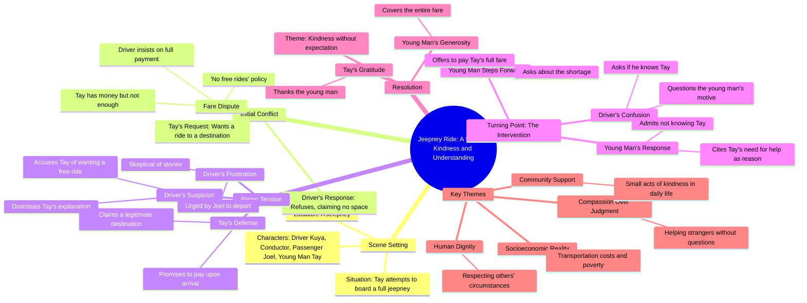

# The Mysterious Old Man — Part 1 | Kwentolohiya

> 🌐 **Read this in:** **English** · [中文](../../zh-CN/2026-09/tiktok-transcript-1-3m-views-25k-reactions-ang-misteryosong-lolo-part-1-kwento-3ed5.md)

> **Creator:** [@Kwentolohiya](https://www.tiktok.com/@Kwentolohiya) · **Views:** 746.5K · **Posted:** 2026-09-08 · **Niche:** entertainment
>
> **TL;DR:** The immediate call and polite request creates instant curiosity about the passenger's situation.

[Watch original video →](https://www.facebook.com/share/r/14nqgLXmow1/)

## Why This Went Viral

## Hook (first 3 seconds)
- **Verbatim opening line:** "Tay! Sandali! Saan ka pupunta? Pasakay sana, Iho."
- **Hook pattern:** Scene + urgent dialogue (interruption pattern).
- **Why it stops the scroll:** It drops you mid-conversation with two voices overlapping — a driver refusing a passenger and a young man calling out. The tension is immediate: someone is being denied, and someone else is stepping in. The viewer doesn't know who's right or what's happening, so they stay to resolve the ambiguity.

## Emotional Rhythm
- **Beat 1 — Confusion/Tension (0–3s):** Overheard argument; unclear who's at fault.
- **Beat 2 — Frustration (3–8s):** Driver's hardline "Walang libre rito!" makes him the antagonist; viewer leans against him.
- **Beat 3 — Sympathy (8–12s):** Passenger's plea "Babayaran ko pagdating" reveals vulnerability; viewer hopes someone intervenes.
- **Beat 4 — Escalation (12–15s):** Driver dismisses him with "Lahat na lang may kwento" — cynicism triggers moral outrage.
- **Beat 5 — Twist/Climax (15–20s):** Third voice (Joel) asks, "Kilala mo ba siya?" and stranger says "Hindi, pero kailangan niya ng tulong" — unexpected altruism lands hard.
- **Beat 6 — Relief/Gratitude (20–25s):** Payment offer + "Thank you" resolves tension; warm afterglow.

## Keyword Density
- **"Kulang" (lacking/short)** — repeated 3×; drives the core conflict and emotional pull.
- **"Tulong" (help)** — appears at climax; triggers empathy and moral resonance.
- **"Babayaran" (will pay)** — repeated 2×; frames the stakes (money vs. trust).
- **"Kilala" (know)** — repeated 2×; sets up the twist (stranger kindness).
- **"Pamasahe" (fare)** — repeated 2×; anchors the concrete, relatable problem.
- **"Libre" (free)** — repeated 2×; algorithmic reach via common transport grievance.

## Why It Spreads
- **Unexpected kindness from a stranger.** The line "Hindi, pero kailangan niya ng tulong" is the shareable core — it proves altruism doesn't require a personal connection. Viewers tag friends who'd do the same.
- **Relatable everyday injustice.** "Wala nang puwang sa loob" and fare disputes are universal in public transport; the video taps into a shared frustration, making it easy to comment on personal experiences.
- **Moral clarity with a twist.** The driver is clearly wrong, but the resolution isn't anger — it's generosity. This inversion of expected conflict (fight → kindness) makes it feel fresh and rewatchable.
- **Dialogue-driven suspense.** Short overlapping lines ("Bakit? Kilala mo ba siya?") force viewers to lean in, increasing watch time — a key algorithm signal.
- **Clean emotional payoff.** The final "Thank you" closes the loop in under 30 seconds, making it safe to share without context or follow-up.

## What You Can Steal
- **Open mid-conflict, not at the start.** Drop viewers into a heated exchange with no setup. Their instinct to resolve the ambiguity keeps them watching.
- **Use a third-party witness as the hero.** Don't make the victim save themselves — have a bystander intervene. This widens emotional resonance and makes the kindness feel more credible.
- **End on a single word of gratitude.** After the climax, don't over-explain. A simple "Thank you" lets the emotional impact land and invites the viewer to feel the resolution themselves.

## Mind Map

## Full Transcript (Generated by [try this transcription tool](https://toktranscript.com/?utm_source=github&utm_medium=breakdown&utm_campaign=tool_attribution))

> 📝 Transcripts on this page are auto-generated and show the first 60%. Want to transcribe any TikTok in 30 seconds and get the full version? [Try TokTranscript free →](https://toktranscript.com/?utm_source=github&utm_medium=breakdown&utm_campaign=transcript_cta)

Tay! Sandali! Saan ka pupunta? Pasakay sana, Iho. Wala nang puwang sa loob. May pamasahe ka ba? May pera ako, pero kulang pa ng kaunti. Hindi pwede yan! Walang libre rito! Baka naman gusto lang makalibre. May pupuntahan lang talaga ako. Babayaran ko pagdating. Lahat na lang may kwento. Joel! Aalis na tayo!

*[Read the full transcript on TokTranscript →](https://toktranscript.com/plaza/tiktok-transcript-1-3m-views-25k-reactions-ang-misteryosong-lolo-part-1-kwento-3ed5?utm_source=github&utm_medium=breakdown&utm_campaign=transcript_full)*

## Browse More

- All [entertainment](../../by-niche/en/entertainment.md) breakdowns
- All [Interruption + Request](../../by-pattern/en/hook-interruption-request.md) examples

## Video Info

| | |
|---|---|
| Creator | [@Kwentolohiya](https://www.tiktok.com/@Kwentolohiya) |
| Original video | [https://www.facebook.com/share/r/14nqgLXmow1/](https://www.facebook.com/share/r/14nqgLXmow1/) |
| Original title | 1.3M views · 25K reactions | Ang Misteryosong Lolo — PART 1 | Kwentolohiya |
| Views | 746.5K (746534) |
| Posted | 2026-09-08 |
| Duration | 0s |
| Niche | `entertainment` |
| Hook pattern | `Interruption + Request` |
| Original language | `en` |
| Available languages | en, zh-CN |
| Generated | 2026-09-09 by [TokTranscript](https://toktranscript.com/) |

---

*This breakdown is for educational analysis under fair use. Original video © [@Kwentolohiya](https://www.tiktok.com/@Kwentolohiya). All transcripts are auto-generated and may contain errors.*

*Want to analyze your own TikToks like this? [TokTranscript →](https://toktranscript.com/viral-breakdown?utm_source=github&utm_medium=breakdown&utm_campaign=footer_cta)*