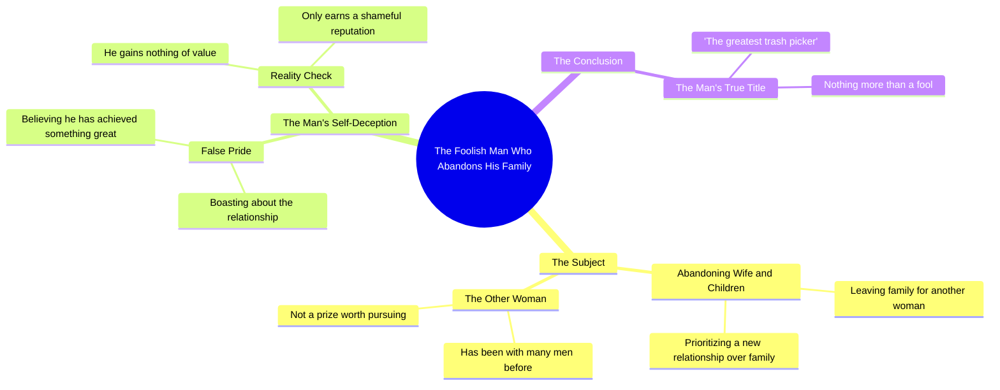

# Man Who Left Wife and Kids for Another Woman

> 🌐 **Read this in:** **English** · [中文](../../zh-CN/2026-09/tiktok-transcript-1-4m-views-32k-reactions-ng-i-n-ng-ng-u-nh-t-m-c-mi-n-0dc0.md)

> **Creator:** [@Mộc Miên](https://www.tiktok.com/@Mộc Miên) · **Views:** 658.5K · **Posted:** 2026-09-23 · **Niche:** entertainment
>
> **TL;DR:** Mở đầu bằng lời lăng mạ mạnh mẽ nhắm vào một nhóm người cụ thể, kích thích sự tò mò và tranh cãi.

[Watch original video →](https://www.facebook.com/share/r/14rzeAdxy52/)

## Why This Went Viral

## Hook (first 3 seconds)
- Verbatim opening: "Kiểu đàn ông ngu nhất." ("The stupidest type of man.")
- Hook pattern: **Bold claim + insult/attack** (a superlative judgment dropped with zero setup)
- Why it stops the scroll: It names a target ("the stupidest man") and leaves it undefined for a beat — the brain needs to know *who* and *why*. The insult is aimed at a third party, so the viewer isn't the victim yet, which lowers defensiveness and keeps them watching to see if they qualify.

## Emotional Rhythm
- **Beat 1 – Provocation (0–2s):** "Kiểu đàn ông ngu nhất" — instant judgment, no context. Curiosity + mild outrage.
- **Beat 2 – Specific accusation (2–6s):** "bỏ vợ bỏ con… đi theo một người đàn bà đã qua tay thằng này thằng kia" — concrete betrayal image. Tension rises; viewer forms a mental villain.
- **Beat 3 – Mockery of the villain's pride (6–10s):** "các ông còn tự hào khoe là rất là ngon" — irony. The target is now arrogant *and* foolish, which converts tension into contempt/laughter.
- **Beat 4 – Climax (10–13s):** "thằng bới rác vĩ đại nhất" ("the greatest trash-picker") — the punchline metaphor. This is the payoff line; it's the most quotable, most shareable moment.
- **Beat 5 – Call to tribe (13–15s):** "Chuẩn không các anh?" ("Right, fellas?") — relief + validation. Tension releases into agreement, inviting comments.
- **Climax moment:** the "bới rác vĩ đại nhất" metaphor — it reframes the whole rant into one image.

## Keyword Density
- "đàn ông" (men) — audience-identity anchor
- "bỏ vợ bỏ con" (abandon wife and kids) — emotional core
- "người đàn bà" (woman) — the opposing pole
- "qua tay thằng này thằng kia" (passed through many men) — the shaming phrase
- "tự hào" (proud) — irony trigger
- "ngon" (good/tough/cool) — mockery of ego
- "không được cái gì cả" (you have nothing) — negation punch
- "bới rác" (picking trash) — the signature metaphor
- "Chuẩn không các anh?" (Right, guys?) — engagement CTA
- **Algorithmic reach:** "đàn ông," "vợ," "con," "đàn bà" — high-volume relationship/gender terms that surface the video in a massive content pool.
- **Emotional pull:** "bỏ vợ bỏ con," "bới rác," "tự hào" — these carry the moral outrage and the humiliation image that make people react, not just watch.

## Why It Spreads
- **Tribal validation for men:** "Chuẩn không các anh?" directly recruits male viewers into a shared in-group, turning passive watching into a comment ("chuẩn" / "không chuẩn") — the cheapest possible engagement action.
- **A villain everyone can agree on:** "bỏ vợ bỏ con" is a universally condemned act, so the video needs no nuance — agreement is instant and safe to voice.
- **A reusable insult metaphor:** "thằng bới rác vĩ đại nhất" is a compact, vivid, screenshot-able phrase — the kind people quote in comments, captions, and duets.
- **Outrage-bait for the other side:** "người đàn bà đã qua tay thằng này thằng kia" is deliberately inflammatory; it pulls in critics who argue, doubling the comment count from both camps.
- **Zero-context cold open:** "Kiểu đàn ông ngu nhất" gives no setup, so both the curious and the offended must keep watching to identify the target — maximizing watch time on a 15-second clip.

## What You Can Steal
- **Open with a superlative verdict, not a topic.** Instead of "Let's talk about bad relationships," say "This is the dumbest type of [person]." Withhold the definition for 2–3 seconds to force retention.
- **Build to one screenshot-able metaphor.** The whole video earns its shareability from a single image ("bới rác vĩ đại nhất"). Write your script backwards from the line people will quote.
- **End with a two-word tribe check.** "Chuẩn không các anh?" converts viewers into commenters with near-zero effort. A binary, low-friction question at the end outperforms open-ended "what do you think?" prompts.

## Mind Map

## Full Transcript (Generated by [the tool we used to generate this](https://toktranscript.com/?utm_source=github&utm_medium=breakdown&utm_campaign=tool_attribution))

> 📝 Transcripts on this page are auto-generated and show the first 60%. Want to transcribe any TikTok in 30 seconds and get the full version? [Try TokTranscript free →](https://toktranscript.com/?utm_source=github&utm_medium=breakdown&utm_campaign=transcript_cta)

Kiểu đàn ông ngu nhất. Cái kiểu đàn ông bỏ vợ bỏ con của mình để đi theo một người đàn bà đã qua tay thằng này thằng kia. Các ông còn tự hào khoe là rất là ngon.

*[Read the full transcript on TokTranscript →](https://toktranscript.com/plaza/tiktok-transcript-1-4m-views-32k-reactions-ng-i-n-ng-ng-u-nh-t-m-c-mi-n-0dc0?utm_source=github&utm_medium=breakdown&utm_campaign=transcript_full)*

## Browse More

- All [entertainment](../../by-niche/en/entertainment.md) breakdowns
- All [Insult Hook](../../by-pattern/en/hook-insult-hook.md) examples

## Video Info

| | |
|---|---|
| Creator | [@Mộc Miên](https://www.tiktok.com/@Mộc Miên) |
| Original video | [https://www.facebook.com/share/r/14rzeAdxy52/](https://www.facebook.com/share/r/14rzeAdxy52/) |
| Original title | 1.4M views · 32K reactions | Người đàn ông "ngờ u" nhất ! | Mộc Miên |
| Views | 658.5K (658519) |
| Posted | 2026-09-23 |
| Duration | 0s |
| Niche | `entertainment` |
| Hook pattern | `Insult Hook` |
| Original language | `en` |
| Available languages | en, zh-CN |
| Generated | 2026-09-26 by [TokTranscript](https://toktranscript.com/) |

---

*This breakdown is for educational analysis under fair use. Original video © [@Mộc Miên](https://www.tiktok.com/@Mộc Miên). All transcripts are auto-generated and may contain errors.*

*Want to analyze your own TikToks like this? [try this transcription tool →](https://toktranscript.com/viral-breakdown?utm_source=github&utm_medium=breakdown&utm_campaign=footer_cta)*