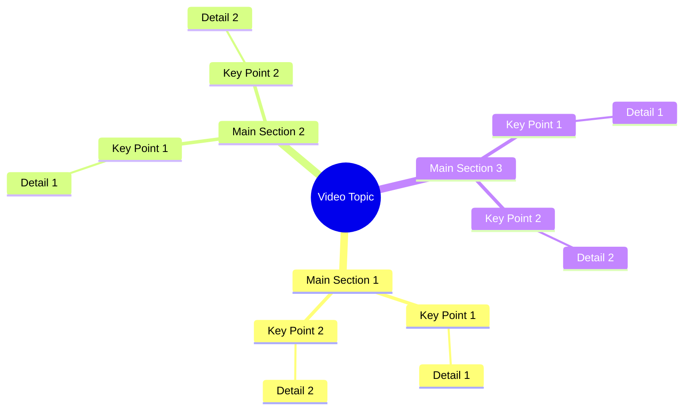

# Woman Recites Shahada on Target Mark in Video

> 🌐 **Read this in:** **English** · [中文](../../zh-CN/2026-09/tiktok-transcript-1-4m-views-84k-reactions-6672.md)

> **Creator:** [@شبنم ](https://www.tiktok.com/@شبنم ) · **Views:** 494.1K · **Posted:** 2026-09-25 · **Niche:** other
>
> **TL;DR:** The hook immediately contrasts the speaker with 'other girls' and asserts truthfulness, creating curiosity and emotional intrigue.

[Watch original video →](https://www.facebook.com/share/r/1GnAneW2pn/)

## Why This Went Viral

## Hook (first 3 seconds)
- **Verbatim opening line:** "اشہد ان لا الہ الا اللہ میں دوسری لڑکیوں کی طرح جھوٹ نہیں بول رہی" ("I bear witness that there is no god but Allah — I am not lying like other girls do.")
- **Hook pattern:** Oath + contrast + accusation. A religious testimony (shahada) fused with a bold social claim ("I'm not like other girls").
- **Why it stops the scroll:** The shahada is sacred and instantly recognizable, so it triggers attention and respect; the phrase "like other girls" triggers tribal recognition and defensiveness. The juxtaposition of the sacred and the gossipy is jarring — viewers pause to see whether this is sincere testimony or a confession-style reveal.

## Emotional Rhythm
- **Curiosity (0–2s):** Why is she swearing an oath? What is she about to reveal?
- **Tension (2–6s):** "تیر کے نشان پہ جائیں" — "go to the arrow mark" — a cryptic instruction that implies a hidden location or proof.
- **Anticipation (6–9s):** "وہاں آپ کو میری تصویر مل جائے گی" — "you'll find my picture there." This creates a puzzle: a photo placed somewhere specific, waiting to be discovered.
- **Climax:** The line "you'll find my picture there" — the reveal that the video is a scavenger hunt or a dare, not just a statement.
- **Resonance/twist:** The oath frames the entire message as truth-telling, so the "find my picture" becomes a challenge to the viewer's trust and curiosity.

## Keyword Density
- **اشہد ان لا الہ الا اللہ** (shahada) — drives algorithmic reach via religious keyword recognition and emotional weight.
- **جھوٹ نہیں بول رہی** (not lying) — emotional pull; signals confession or honesty.
- **دوسری لڑکیوں** (other girls) — algorithmic and emotional; triggers comparison and social identity.
- **تیر کے نشان** (arrow mark) — drives curiosity and search intent; unique phrase.
- **میری تصویر** (my picture) — emotional pull; personal and visual.
- **وہاں** (there) — creates mystery and location-based intrigue.

Religious terms drive reach in Muslim-majority audiences; personal pronouns and "not lying" drive emotional engagement and comments.

## Why It Spreads
- **Sacred oath as a hook** — The shahada is not used casually, so viewers stop to see if it's sincere. This line alone generates shares and debates.
- **Social comparison trigger** — "دوسری لڑکیوں کی طرح" ("like other girls") invites women to either relate or disagree, fueling comment-section arguments.
- **Scavenger-hunt mechanic** — "تیر کے نشان پہ جائیں" ("go to the arrow mark") turns the video into a real-world game, encouraging viewers to physically search and then post their findings.
- **Personal reveal** — "وہاں آپ کو میری تصویر مل جائے گی" ("you'll find my picture there") promises a payoff, so people rewatch and share to solve the puzzle.
- **Short, repeatable format** — The entire transcript is one breath, making it easy to duet, stitch, or meme.

## What You Can Steal
- **Open with a high-stakes oath or promise** — Use a culturally or personally significant phrase to signal seriousness and stop the scroll.
- **Create a physical or digital scavenger hunt** — Give viewers a specific location or clue ("go to the arrow mark") so they engage beyond the screen.
- **Use contrast to trigger identity** — Pair a universal value (honesty, faith) with a divisive comparison ("like other girls") to spark comments and shares.

## Mind Map

## Full Transcript (Generated by [TokTranscript](https://toktranscript.com/?utm_source=github&utm_medium=breakdown&utm_campaign=tool_attribution))

> 📝 Transcripts on this page are auto-generated and show the first 60%. Want to transcribe any TikTok in 30 seconds and get the full version? [Try TokTranscript free →](https://toktranscript.com/?utm_source=github&utm_medium=breakdown&utm_campaign=transcript_cta)

اشہد ان لا الہ الا اللہ میں دوسری لڑکیوں کی طرح جھوٹ نہیں بول رہی تیر ک

*[Read the full transcript on TokTranscript →](https://toktranscript.com/plaza/tiktok-transcript-1-4m-views-84k-reactions-6672?utm_source=github&utm_medium=breakdown&utm_campaign=transcript_full)*

## Browse More

- All [other](../../by-niche/en/other.md) breakdowns
- All [Contrast & Confession](../../by-pattern/en/hook-contrast-confession.md) examples

## Video Info

| | |
|---|---|
| Creator | [@شبنم ](https://www.tiktok.com/@شبنم ) |
| Original video | [https://www.facebook.com/share/r/1GnAneW2pn/](https://www.facebook.com/share/r/1GnAneW2pn/) |
| Original title | 1.4M views · 84K reactions | اشھد اللہ لاہ اللاہ میں | شبنم |
| Views | 494.1K (494110) |
| Posted | 2026-09-25 |
| Duration | 0s |
| Niche | `other` |
| Hook pattern | `Contrast & Confession` |
| Original language | `en` |
| Available languages | en, zh-CN |
| Generated | 2026-09-27 by [TokTranscript](https://toktranscript.com/) |

---

*This breakdown is for educational analysis under fair use. Original video © [@شبنم ](https://www.tiktok.com/@شبنم ). All transcripts are auto-generated and may contain errors.*

*Want to analyze your own TikToks like this? [analyze your own TikToks →](https://toktranscript.com/viral-breakdown?utm_source=github&utm_medium=breakdown&utm_campaign=footer_cta)*