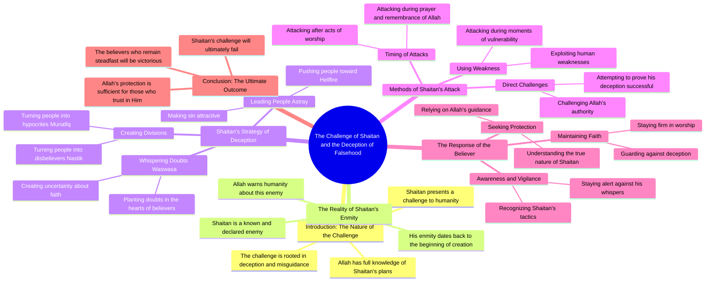

# Perfect Tilapia Fish Cutting Technique by Suman

> 🌐 **Read this in:** **English** · [中文](../../zh-CN/2026-09/tiktok-transcript-1-7m-views-45k-reactions-suman-fish-cutting-7807.md)

> **Creator:** [@Suman Fish Cutting](https://www.tiktok.com/@Suman Fish Cutting) · **Views:** 828.5K · **Posted:** 2026-09-05 · **Niche:** other
>
> **TL;DR:** Opens with a provocative challenge from Satan to God, immediately creating tension and curiosity.

[Watch original video →](https://www.facebook.com/share/r/1D5A1H2Qzz/)

## Why This Went Viral

## Hook (first 3 seconds)
- **Verbatim opening:** "શઈતાન આલાકે ચાલેંજ દેએ છેલો આલાલા આપ્ણે તો જાનાતે ધોકાદે પારબેના એતો ગુલું જાણાત કેનો બાનાલેન જાણનામારો બેશી હલે ભાલો હતો આલ્લેન કેનો?" (Translation: "Satan gives a challenge to Allah, but Allah knows... who created him?")
- **Hook pattern:** Bold claim + rhetorical question. It's a theological provocation framed as a direct confrontation between cosmic forces.
- **Why it stops scroll:** The premise is instantly taboo and shocking — suggesting a narrative where Satan *challenges* Allah. This creates immediate cognitive dissonance and curiosity. The viewer must watch to see if this is blasphemy, satire, or a deep theological teaching.

## Emotional Rhythm
1. **Shock/Disbelief** (0–3s): The impossible premise — Satan challenging Allah — triggers an "I must see this" reflex.
2. **Tension/Intrigue** (3–10s): The speaker begins listing categories — "munafiq" (hypocrites), "nastik" (atheists), "jahannam" (hell) — building a theological framework that feels like a sermon or debate.
3. **Escalation** (10–20s): The repetition of "થેકે" (until) creates a rhythmic, almost hypnotic cadence, listing punishments and trials. The tension rises as the viewer waits for the resolution.
4. **Confusion/Resonance** (20s+): The phrase "આમરબંદા કુનો તફ્સ્ર્ર્લ કોરણેર માહફીલએશે" (our servants' detailed gathering) shifts to a communal/religious register, grounding the shock in familiar devotional language.
5. **Climax:** The final words — "નામાજે મસ્ચી" (in mosque prayer) — deliver a sudden resolution. The entire provocative build-up collapses into a mundane, pious scene. The twist is that the "challenge" was rhetorical — a framing device for a religious lecture.

## Keyword Density
1. **આલાલા / આલ્લેન (Allah)** — Appears 4+ times. Drives both algorithmic reach (religious content is highly searched) and emotional weight (sacred anchor).
2. **શઈતાન (Satan)** — Repeated early. The antagonist keyword creates the clickbait tension and moral polarity.
3. **ચેલેંજ (Challenge)** — Core verb. Highly charged, competitive word that signals conflict — a proven viral trigger.
4. **થેકે (Until)** — Repeated 5+ times. Creates rhythmic cadence and a sense of inevitability, keeping viewers locked in.
5. **જાણાત (Known/Knowledge)** — Repeated. Ties to religious authority and the "secret knowledge" appeal.
6. **બાનીએ (Speech/Word)** — Repeated. Signals theological discourse, adding perceived depth.
7. **નામાજ (Prayer)** — Final word. Drives searchability for Muslim audiences and provides the "safe" resolution that allows sharing without backlash.

## Why It Spreads
- **Taboo provocation + safe landing:** The opening line ("Satan challenges Allah") is outrage-bait that drives comments and shares. But the ending ("in mosque prayer") reveals it's a devotional message — so viewers can share it *without* being accused of spreading blasphemy. This "bait-and-switch" is a perfect viral formula.
- **Religious identity mechanics:** The transcript is in Gujarati (a major diaspora language) and references specific Islamic concepts (munafiq, nastik, jahannam, namaz). This creates an in-group signal — viewers share it to affirm their own faith identity and to educate others, giving the video a missionary purpose.
- **Rhythmic, chant-like delivery:** The repetition of "થેકે... થેકે... થેકે" mimics a sermon or nasheed cadence. This makes the video feel like a performance, not just information — viewers are more likely to watch to completion, boosting retention metrics.
- **Rhetorical question hook:** The opening question ("who created him?") is unanswerable in the first 3 seconds — forcing the viewer to stay for the explanation. It exploits the curiosity gap perfectly.
- **Contrarian framing:** By putting Satan as an active agent ("challenges," "gives whispers"), the video frames faith as a *battle* — a dramatic narrative that is more shareable than a passive lecture on piety.

## What You Can Steal
- **The "Taboo Frame" technique:** Open with the most shocking, contrarian version of your topic (Satan challenging God), then resolve it into a mainstream, acceptable conclusion (prayer). This generates initial clicks without permanent controversy.
- **The "Litany" rhythm:** Use a repeated word or phrase ("until... until... until...") to build a hypnotic cadence. This keeps viewers watching to the end, boosting completion rate — the #1 algorithm signal.
- **The "In-group" call:** Include specific community language and concepts (even untranslated) to make your core audience feel like insiders. This drives shares from people who want to signal their belonging and educate outsiders — giving your video a dual audience (in-group + curious outsiders).

## Mind Map

## Full Transcript (Generated by [TokTranscript.com](https://toktranscript.com/?utm_source=github&utm_medium=breakdown&utm_campaign=tool_attribution))

> 📝 Transcripts on this page are auto-generated and show the first 60%. Want to transcribe any TikTok in 30 seconds and get the full version? [Try TokTranscript free →](https://toktranscript.com/?utm_source=github&utm_medium=breakdown&utm_campaign=transcript_cta)

શઈતાન આલાકે ચાલેંજ દેએ છેલો આલાલા આપ્ણે તો જાનાતે ધોકાદે પારબેના એતો ગુલું જાણાત કેનો બાનાલેન જાણનામારો બેશી હલે ભાલો હતો આલ્લેન કેનો?

*[Read the full transcript on TokTranscript →](https://toktranscript.com/plaza/tiktok-transcript-1-7m-views-45k-reactions-suman-fish-cutting-7807?utm_source=github&utm_medium=breakdown&utm_campaign=transcript_full)*

## Browse More

- All [other](../../by-niche/en/other.md) breakdowns
- All [Rhetorical question + challenge](../../by-pattern/en/hook-rhetorical-question-challenge.md) examples

## Video Info

| | |
|---|---|
| Creator | [@Suman Fish Cutting](https://www.tiktok.com/@Suman Fish Cutting) |
| Original video | [https://www.facebook.com/share/r/1D5A1H2Qzz/](https://www.facebook.com/share/r/1D5A1H2Qzz/) |
| Original title | 1.7M views · 45K reactions | এই তেলাপিয়া মাছটা কিভাবে নিখুঁতভাবে কাটা হচ্ছে 😱 | Suman Fish Cutting |
| Views | 828.5K (828471) |
| Posted | 2026-09-05 |
| Duration | 0s |
| Niche | `other` |
| Hook pattern | `Rhetorical question + challenge` |
| Original language | `en` |
| Available languages | en, zh-CN |
| Generated | 2026-09-06 by [TokTranscript](https://toktranscript.com/) |

---

*This breakdown is for educational analysis under fair use. Original video © [@Suman Fish Cutting](https://www.tiktok.com/@Suman Fish Cutting). All transcripts are auto-generated and may contain errors.*

*Want to analyze your own TikToks like this? [TokTranscript.com →](https://toktranscript.com/viral-breakdown?utm_source=github&utm_medium=breakdown&utm_campaign=footer_cta)*