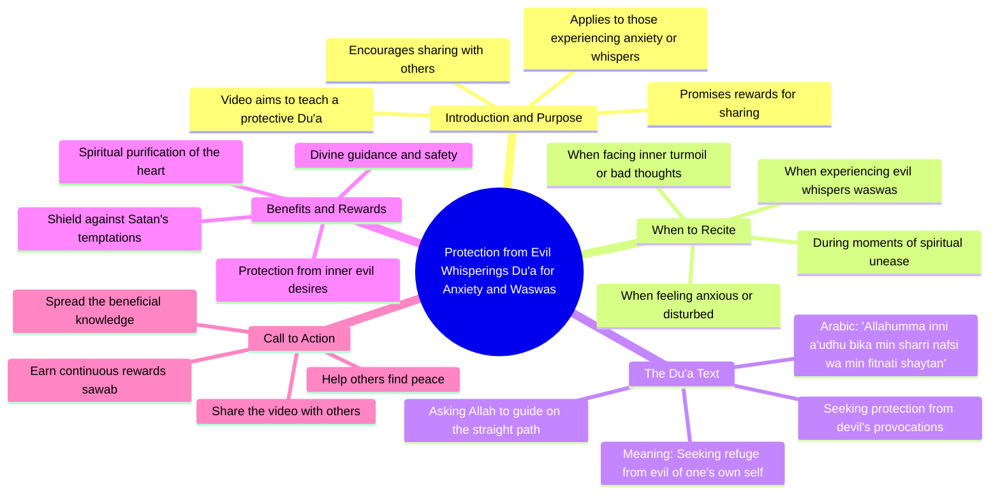

# Amazing Rohu Fish Cutting Skills Video

> 🌐 **Read this in:** **English** · [中文](../../zh-CN/2026-09/tiktok-transcript-1-8m-views-36k-reactions-foryoupage-reelschallenge-fishingli-6e60.md)

> **Creator:** [@Suman Fish Cutting](https://www.tiktok.com/@Suman Fish Cutting) · **Views:** 867.6K · **Posted:** 2026-09-05 · **Niche:** other
>
> **TL;DR:** Opens with a clear promise of protection and rewards for sharing, creating immediate value and urgency.

[Watch original video →](https://www.facebook.com/share/r/1GHtp41LPE/)

## Why This Went Viral

## Hook (first 3 seconds)
- **Verbatim opening:** "জেনা থেকے বাচার দোয়া" (The dua to be saved from this) — immediately signals a protective prayer.
- **Hook pattern:** **Bold claim + utility promise** — it promises a specific, high-stakes benefit (protection from evil/sins).
- **Why it stops the scroll:** It taps into a pre-existing fear and spiritual need. The viewer instantly thinks, "I need this," because it offers a solution to an invisible threat (bad desires, Shaytan's whispers) rather than a material want.

## Emotional Rhythm
1. **Urgency (0–3s):** "To be saved from this" — creates a gap of unknown danger.
2. **Anticipation (3–8s):** The promise of reward ("শেষমুস্ত স্বাব" — ultimate reward) builds a transactional hope.
3. **Tension (8–12s):** The conditional clause — "When you experience bad desires... then you recite this" — makes the viewer self-diagnose their own moments of weakness.
4. **Release (12–15s):** The actual Arabic dua is recited — a sacred, calming auditory shift.
5. **Resonance (final lines):** The translation lands personally: "From my bad desires and Shaytan's provocations" — a universal internal struggle.
- **Climax moment:** The recitation of the Arabic prayer itself. The shift from Bangla explanation to Arabic Quranic text creates a spiritual peak that feels authentic and powerful.

## Keyword Density
- **"দোয়া" (Dua/prayer)** — 3x — *Algorithmic reach:* High-search-volume religious term with evergreen demand.
- **"বাঁচার" (To be saved)** — 2x — *Emotional pull:* Fear-based trigger that drives shares.
- **"শয়তান" (Shaytan)** — 2x — *Emotional pull:* Names the enemy, making the solution concrete.
- **"নফস" (Nafs/desires)** — 1x (implied via "খারাপ ইচ্ছা") — *Emotional pull:* Internal struggle everyone relates to.
- **"সওয়াব" (Reward)** — 1x — *Algorithmic + emotional:* Incentivizes saving for later.
- **"আল্লাহ" (Allah)** — 1x — *Algorithmic:* Core religious keyword that ensures the video surfaces in faith-based feeds.

## Why It Spreads
- **Fear + Solution loop:** The opening "saved from this" creates an unnamed threat, and the video resolves it within 15 seconds. Viewers share it as a protective gesture to loved ones ("I'm sending you protection").
- **Direct call-to-action embedded in the script:** "Share this video so your loved ones can also recite it" — the transcript explicitly instructs sharing, converting passive viewers into distributors.
- **Sacred audio drop:** The shift from spoken Bangla to Arabic recitation changes the audio texture. This triggers a reflexive "save" or "share" because it feels like a religious artifact, not just content.
- **Universal internal conflict:** The dua addresses "bad desires" and "Shaytan's provocations" — struggles that transcend age, class, or nationality within the Muslim audience. It's not niche; it's universal.
- **Short + actionable:** The video teaches a 2-line prayer that can be memorized instantly. Low effort to adopt = high willingness to share.

## What You Can Steal
- **Open with the outcome, not the explanation:** Start with "To save yourself from X, watch this" — don't introduce yourself; introduce the fear or desire you're solving.
- **Embed a literal share command in the script:** Say "Send this to someone who needs it" or "Share this with your family" within the first 10 seconds, not just in the caption.
- **Use a sensory shift as the climax:** If your video explains something, switch to a different delivery mode (e.g., from talking to reading a quote, from music to silence) at the peak moment to make it feel like a gift, not a lecture.

## Mind Map

## Full Transcript (Generated by [TokTranscript.com](https://toktranscript.com/?utm_source=github&utm_medium=breakdown&utm_campaign=tool_attribution))

> 📝 Transcripts on this page are auto-generated and show the first 60%. Want to transcribe any TikTok in 30 seconds and get the full version? [Try TokTranscript free →](https://toktranscript.com/?utm_source=github&utm_medium=breakdown&utm_campaign=transcript_cta)

जेना थेके बाचार दोआ ए वीडियो टी आपनी जोतो पारें शेयर कुरे दिन आपना रुसीला एके उजुदी जेना थेके बेचे जेते पारे शेशमुस्त स्वाब आपनी पावेन जोखन अपनी अनुभग कुर्वेन जोपनी पापेड दीके जुखे पुर्चन तोखन अपनी एई दू-ाथी पाथ कुर्वेन अल्लाहु

*[Read the full transcript on TokTranscript →](https://toktranscript.com/plaza/tiktok-transcript-1-8m-views-36k-reactions-foryoupage-reelschallenge-fishingli-6e60?utm_source=github&utm_medium=breakdown&utm_campaign=transcript_full)*

## Browse More

- All [other](../../by-niche/en/other.md) breakdowns
- All [Direct benefit + urgency + share incentive](../../by-pattern/en/hook-direct-benefit-urgency-share-incentive.md) examples

## Video Info

| | |
|---|---|
| Creator | [@Suman Fish Cutting](https://www.tiktok.com/@Suman Fish Cutting) |
| Original video | [https://www.facebook.com/share/r/1GHtp41LPE/](https://www.facebook.com/share/r/1GHtp41LPE/) |
| Original title | 1.8M views · 36K reactions | অসাধারণ কাতল মাছ কাটার ভিডিও দেখলেই ভালো লাগবে 🔪😱 #foryoupageシ #reelschallenge #fishinglife #Amazing #millionviews | Suman Fish Cutting |
| Views | 867.6K (867596) |
| Posted | 2026-09-05 |
| Duration | 0s |
| Niche | `other` |
| Hook pattern | `Direct benefit + urgency + share incentive` |
| Original language | `en` |
| Available languages | en, zh-CN |
| Generated | 2026-09-06 by [TokTranscript](https://toktranscript.com/) |

---

*This breakdown is for educational analysis under fair use. Original video © [@Suman Fish Cutting](https://www.tiktok.com/@Suman Fish Cutting). All transcripts are auto-generated and may contain errors.*

*Want to analyze your own TikToks like this? [TokTranscript →](https://toktranscript.com/viral-breakdown?utm_source=github&utm_medium=breakdown&utm_campaign=footer_cta)*