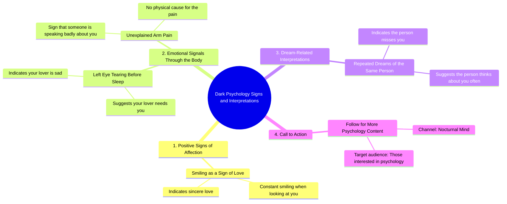

# 5 Dark Psychology Signs You Need to Know

> 🌐 **Read this in:** **English** · [中文](../../zh-CN/2026-09/tiktok-transcript-1-9m-views-109k-reactions-5-dark-psychology-signs-you-need-t-bb54.md)

> **Creator:** [@Nocturnal Mind](https://www.tiktok.com/@Nocturnal Mind) · **Views:** 978.8K · **Posted:** 2026-09-02 · **Niche:** entertainment
>
> **TL;DR:** The phrase 'dark psychology' creates intrigue and promises hidden knowledge, while the numbered list structure encourages viewers to watch until the end.

[Watch original video →](https://www.facebook.com/share/r/1GEhLt126X/)

## Why This Went Viral

## Hook (first 3 seconds)
- **Verbatim opening:** "Dark psychology number one, if someone looks at you and constantly smiles, it means they sincerely love you."
- **Hook pattern:** **Contrast + List format** ("Dark psychology" paired with a warm, romantic claim — subverts expectations of "dark" content).
- **Why it stops the scroll:** The word "dark" triggers curiosity and mild fear, but the first claim is emotionally soft and personal. That mismatch creates cognitive dissonance — viewers need to resolve it by watching more. Also, "number one" signals a numbered list, which primes the brain for completion (Zeigarnik effect).

## Emotional Rhythm
- **Beat 1 — Curiosity (0–2s):** "Dark psychology" sets a mysterious, slightly taboo tone.
- **Beat 2 — Warmth/Validation (2–6s):** Claim #1 (smiling = love) gives a dopamine hit of reassurance.
- **Beat 3 — Concern/Empathy (6–10s):** Claim #2 (left eye tearing = lover is sad) shifts to a softer, almost spiritual intimacy — viewers feel seen.
- **Beat 4 — Intrigue/Paranormal pull (10–15s):** Claim #3 (repeated dreams = they miss you) leans into superstition and romantic longing — high resonance for people in limerence or heartbreak.
- **Beat 5 — Mild anxiety (15–19s):** Claim #4 (arm pain = someone talking badly) introduces a slight fear spike — this is the "dark" payoff the title promised.
- **Beat 6 — Closure/CTA (19–21s):** "If you like psychology, follow..." — a soft landing that converts emotional investment into a follow.
- **Climax moment:** Claim #4 (arm pain) — it's the only genuinely "dark" item, and it lands last, giving the video a spike in tension right before the CTA.

## Keyword Density
- **"Psychology"** (2x, including title) — drives algorithmic reach (high-volume search term).
- **"You/Your"** (5x+) — personal pronouns create direct address, boosting watch time and relatability.
- **"Dark"** (1x, in opening) — high-click, high-curiosity modifier; pairs with "psychology" for search.
- **"Love/lover"** (2x) — emotional pull; taps into broad romantic interest.
- **"Sign"** (implied via "shows"/"means") — frames content as secret knowledge, driving saves.
- **"Follow"** (1x) — explicit conversion keyword.

**Algorithmic drivers:** "Psychology," "Dark," "Follow" — they match search and recommendation patterns.
**Emotional drivers:** "You," "Love," "Dreams," "Sad" — they trigger personal relevance and emotional resonance.

## Why It Spreads
- **Superstition as shareable currency:** Claims like "left eye tears = lover is sad" are pseudo-mystical. Viewers share to friends with captions like "this is so true" — it becomes a social test, not just a video.
- **Personalization trap:** Every claim uses "you" or "your" — viewers feel directly addressed, which increases the urge to tag someone ("this made me think of you").
- **Low-friction, high-emotion listicle:** The numbered format (1–5) lets viewers mentally "collect" the claims and compare their own experiences — a built-in engagement loop.
- **The "dark" bait-and-switch:** Only one item (arm pain) is actually dark. The rest are romantic and comforting. This broadens the audience — it attracts both psychology-curious and relationship-obsessed viewers.
- **Follow CTA positioned after emotional peak:** By placing the CTA after the tension spike (claim #4), the viewer is primed to act on impulse — they want more of this "secret knowledge."

## What You Can Steal
- **Use a "dark" or taboo frame for soft content:** Take a comforting, relatable idea and label it with an edgy word ("dark," "forbidden," "secret"). The contrast increases click-through and watch time.
- **Structure as a numbered list with escalating emotional stakes:** Start warm, get weirder, end on the most provocative claim. This keeps retention high and gives viewers a reason to watch to the end.
- **Make every point about the viewer directly:** Use "you" and "your" in every claim. Then end with a low-friction follow CTA — the emotional peak is the best moment to ask for a subscription.

## Mind Map

## Full Transcript (Generated by [the tool we used to generate this](https://toktranscript.com/?utm_source=github&utm_medium=breakdown&utm_campaign=tool_attribution))

> 📝 Transcripts on this page are auto-generated and show the first 60%. Want to transcribe any TikTok in 30 seconds and get the full version? [Try TokTranscript free →](https://toktranscript.com/?utm_source=github&utm_medium=breakdown&utm_campaign=transcript_cta)

Dark psychology number one, if someone looks at you and constantly smiles, it means they sincerely love you. Number two, if your left eye tears up before you sleep, it shows that your lover is sad and needs you.

*[Read the full transcript on TokTranscript →](https://toktranscript.com/plaza/tiktok-transcript-1-9m-views-109k-reactions-5-dark-psychology-signs-you-need-t-bb54?utm_source=github&utm_medium=breakdown&utm_campaign=transcript_full)*

## Browse More

- All [entertainment](../../by-niche/en/entertainment.md) breakdowns
- All [Listicle with curiosity gap](../../by-pattern/en/hook-listicle-with-curiosity-gap.md) examples

## Video Info

| | |
|---|---|
| Creator | [@Nocturnal Mind](https://www.tiktok.com/@Nocturnal Mind) |
| Original video | [https://www.facebook.com/share/r/1GEhLt126X/](https://www.facebook.com/share/r/1GEhLt126X/) |
| Original title | 1.9M views · 109K reactions | 5 Dark Psychology Signs You Need to Know | Human Behavior & Body Language #DarkPsychology #BodyLanguage #NocturnalMind | Nocturnal Mind |
| Views | 978.8K (978775) |
| Posted | 2026-09-02 |
| Duration | 0s |
| Niche | `entertainment` |
| Hook pattern | `Listicle with curiosity gap` |
| Original language | `en` |
| Available languages | en, zh-CN |
| Generated | 2026-09-03 by [TokTranscript](https://toktranscript.com/) |

---

*This breakdown is for educational analysis under fair use. Original video © [@Nocturnal Mind](https://www.tiktok.com/@Nocturnal Mind). All transcripts are auto-generated and may contain errors.*

*Want to analyze your own TikToks like this? [TokTranscript →](https://toktranscript.com/viral-breakdown?utm_source=github&utm_medium=breakdown&utm_campaign=footer_cta)*