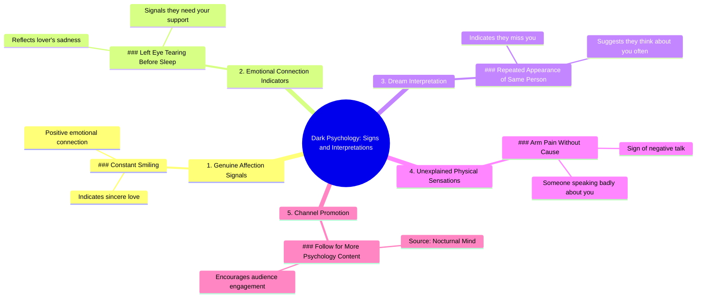

# 5 Dark Psychology Signs You Need to Know

> 🌐 **Read this in:** **English** · [中文](../../zh-CN/2026-09/tiktok-transcript-1-9m-views-110k-reactions-5-dark-psychology-signs-you-need-t-3ba2.md)

> **Creator:** [@Nocturnal Mind](https://www.tiktok.com/@Nocturnal Mind) · **Views:** 979.8K · **Posted:** 2026-09-04 · **Niche:** entertainment
>
> **TL;DR:** The phrase 'dark psychology' creates intrigue and promises hidden knowledge, while the numbered list structure hooks viewers to watch for all items.

[Watch original video →](https://www.facebook.com/share/r/19D1qSDV6P/)

## Why This Went Viral

## Hook (first 3 seconds)
- **Verbatim opening:** "Dark psychology number one, if someone looks at you and constantly smiles, it means they sincerely love you."
- **Hook pattern:** **Bold claim + listicle format** ("Dark psychology number one…") — instantly signals a numbered, bite-sized knowledge drop.
- **Why it stops the scroll:** It weaponizes the word "dark" (taboo, forbidden knowledge) against a soft, romantic outcome ("sincerely love you"). The contrast creates cognitive dissonance — viewers expect manipulation tactics but get a love test. That tension forces a pause.

## Emotional Rhythm
- **Beat 1 — Curiosity/Intrigue:** "Dark psychology" primes the brain for secrets or danger.
- **Beat 2 — Warmth/Validation (item #1):** Smiling = love. Feels good, instantly relatable.
- **Beat 3 — Empathy/Concern (item #2):** Left eye tearing = lover is sad. Shifts from self-focused to other-focused emotion.
- **Beat 4 — Superstition/Hope (item #3):** Dream repetition = they miss you. Taps into romantic longing.
- **Beat 5 — Paranoia/Alert (item #4):** Unexplained arm pain = someone talks badly. Jolt of anxiety — breaks the love spell.
- **Beat 6 — Call-to-action relief (item #5):** "Follow for more" — release valve, low-stakes commitment.
- **Climax moment:** Item #4 (arm pain) — it's the most absurd claim, yet it spikes emotional arousal because it's physically verifiable. That's the twist: it moves from emotional to physical proof.

## Keyword Density
- **"Psychology"** (2x) — algorithmic magnet for the self-improvement/curiosity niche.
- **"Love"** (implied via "lover," "love you," "miss you") — high emotional pull, broad reach.
- **"Number"** (5x) — signals structure, boosts watch time (viewers stay for the count).
- **"You/Your"** (6x) — second-person address drives personalization, increases engagement.
- **"Sign"** (1x, implied through "shows," "means," "sign") — triggers pattern-seeking behavior.
- **"Dark"** (1x) — high-click keyword for the "hidden knowledge" genre.
- **Algorithmic drivers:** "Psychology," "Follow" (direct CTA), "Number" (listicle retention).
- **Emotional pull drivers:** "Love," "Sad," "Miss you," "Talking badly" — all relatable human states.

## Why It Spreads
- **Superstitious shareability:** "If your left eye tears up…" — viewers screenshot and send to partners/friends to check if it's "true." The claims are unverifiable, which makes them perfect for group chats.
- **Personal validation loop:** Every line is directed at "you" — the viewer feels individually addressed. This triggers the "this is about me" reflex, driving comments like "My arm hurt yesterday!!"
- **Pattern interruption:** Listicles with escalating absurdity (love → sadness → dreams → physical pain) keep the brain guessing. The jump from emotional to physical is unexpected, reducing mid-video drop-off.
- **Low-effort, high-reward CTA:** The final line "follow for more" is a natural continuation, not a hard sell. Viewers who felt validated by any item will follow to get more "signs."
- **Cultural mysticism appeal:** Blends pop-psychology with folk superstition — a format that performs well across cultures (Latin America, South Asia, Philippines) where spiritual/emotional explanations are culturally resonant.

## What You Can Steal
- **Use the "numbered secret" format:** Open with "Dark [topic] number one…" — the word "dark" or "secret" before a numbered list instantly raises perceived value. Apply to any niche: "Dark productivity hack #1…"
- **Mix emotional and physical claims:** Alternate between feelings ("sad," "love") and bodily signs ("arm hurts," "eye tears"). This creates a rhythm that keeps viewers engaged and makes the content feel more "real" and testable.
- **End with a soft, niche-specific CTA:** Instead of "follow for more," say "If you like [topic], follow [handle] for more." Keep it as item #5 in the list — it doesn't break the format and feels like a natural bonus, not an ad.

## Mind Map

## Full Transcript (Generated by [try this transcription tool](https://toktranscript.com/?utm_source=github&utm_medium=breakdown&utm_campaign=tool_attribution))

> 📝 Transcripts on this page are auto-generated and show the first 60%. Want to transcribe any TikTok in 30 seconds and get the full version? [Try TokTranscript free →](https://toktranscript.com/?utm_source=github&utm_medium=breakdown&utm_campaign=transcript_cta)

Dark psychology number one, if someone looks at you and constantly smiles, it means they sincerely love you. Number two, if your left eye tears up before you sleep, it shows that your lover is sad and needs you.

*[Read the full transcript on TokTranscript →](https://toktranscript.com/plaza/tiktok-transcript-1-9m-views-110k-reactions-5-dark-psychology-signs-you-need-t-3ba2?utm_source=github&utm_medium=breakdown&utm_campaign=transcript_full)*

## Browse More

- All [entertainment](../../by-niche/en/entertainment.md) breakdowns
- All [Listicle with curiosity gap](../../by-pattern/en/hook-listicle-with-curiosity-gap.md) examples

## Video Info

| | |
|---|---|
| Creator | [@Nocturnal Mind](https://www.tiktok.com/@Nocturnal Mind) |
| Original video | [https://www.facebook.com/share/r/19D1qSDV6P/](https://www.facebook.com/share/r/19D1qSDV6P/) |
| Original title | 1.9M views · 110K reactions | 5 Dark Psychology Signs You Need to Know | Human Behavior & Body Language #DarkPsychology #BodyLanguage #NocturnalMind | Nocturnal Mind |
| Views | 979.8K (979779) |
| Posted | 2026-09-04 |
| Duration | 0s |
| Niche | `entertainment` |
| Hook pattern | `Listicle with curiosity gap` |
| Original language | `en` |
| Available languages | en, zh-CN |
| Generated | 2026-09-05 by [TokTranscript](https://toktranscript.com/) |

---

*This breakdown is for educational analysis under fair use. Original video © [@Nocturnal Mind](https://www.tiktok.com/@Nocturnal Mind). All transcripts are auto-generated and may contain errors.*

*Want to analyze your own TikToks like this? [TokTranscript →](https://toktranscript.com/viral-breakdown?utm_source=github&utm_medium=breakdown&utm_campaign=footer_cta)*