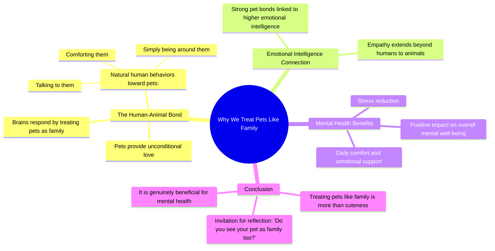

# Why People Treat Their Pets Like Humans

> 🌐 **Read this in:** **English** · [中文](../../zh-CN/2026-09/tiktok-transcript-1-9m-views-63k-reactions-why-some-people-treat-their-pets-li-5438.md)

> **Creator:** [@Lockedinangelo](https://www.tiktok.com/@Lockedinangelo) · **Views:** 834.9K · **Posted:** 2026-09-10 · **Niche:** other
>
> **TL;DR:** Starts with a relatable observation and immediately promises a deeper explanation.

[Watch original video →](https://www.facebook.com/share/r/18sP6jux6h/)

## Why This Went Viral

## Hook (first 3 seconds)
- **Verbatim opening line:** "Have you noticed how some people treat their pets like humans?"
- **Hook pattern:** Question + scene-setting (a relatable observation disguised as a query).
- **Why it stops the scroll:** It instantly validates a behavior the viewer likely exhibits or witnesses daily. It creates a "that's me" moment in under 2 seconds, forcing a mental pause to answer the question internally before the video even continues.

## Emotional Rhythm
- **Beat 1 – Curiosity/Validation (0–3s):** The question makes the viewer feel seen, triggering a mild ego boost ("I do that").
- **Beat 2 – Intellectual Elevation (3–7s):** Shift from "cute" to "unconditional love" and "your brain responds." This adds pseudo-scientific weight, making the viewer feel smart for bonding with their pet.
- **Beat 3 – Warmth/Comfort (7–12s):** Words like "comforting," "natural," and "reduces stress" create a soothing, safe emotional plateau.
- **Beat 4 – Pride/Affirmation (12–15s):** The claim about "higher emotional intelligence" is the climax. It rewards the viewer with a status boost—watching this makes them feel like a better person.
- **Beat 5 – Call to Action/Community (15–17s):** The closing question ("Do you see your pet as family too?") converts internal validation into external engagement, inviting a comment.

## Keyword Density
- **Pets** (drives search/surface-level reach)
- **Humans/Family** (emotional pull—creates the core contrast)
- **Unconditional love** (high-emotion phrase; triggers shareability)
- **Brain responds** (authority/algorithmic hook for science-curious niches)
- **Emotional intelligence** (status keyword; makes viewers feel superior)
- **Stress/Comfort** (relief keywords; algorithmic reach in wellness spaces)
- **Natural** (normalizes the behavior, reducing perceived weirdness)

## Why It Spreads
- **Confirmation bias loop:** The entire script is a series of affirmations. Lines like "talking to them feels completely natural" and "it's actually good for your mental health" give viewers permission to keep doing what they already do—and to share it as proof.
- **Identity badge:** The "higher emotional intelligence" line is the viral payload. Viewers don't share the video; they share the *identity* it grants them. They tag fellow pet owners to say, "See? We're the smart ones."
- **Low-stakes controversy:** By asking "some people" instead of "you," it creates a subtle in-group/out-group dynamic. Pet owners feel a gentle superiority over non-pet owners, which drives comments like "My dog is my child."
- **Universal relatability with a twist:** The first half is generic fluff (cute pets), but the second half pivots to a mental-health benefit. This makes it feel informative, not just sentimental, increasing saves.
- **Open-loop ending:** The final question is a direct invitation. It doesn't ask for a like; it asks for a personal answer, which is the highest-comment-driving tactic in short-form.

## What You Can Steal
- **Start with a "you" question, not a "look at this" statement.** Ask the viewer to recognize their own behavior first. It buys you 3 seconds of active attention.
- **Insert one status-boosting claim mid-script.** Don't just validate; elevate. Saying "people who do X have higher Y" turns passive viewers into proud ambassadors.
- **End with a personal, open-ended question.** Avoid "comment below." Instead, ask "Do you do this too?" or "Is this just me?"—it forces a self-reflective comment rather than a generic one.

## Mind Map

## Full Transcript (Generated by [free TikTok transcript generator](https://toktranscript.com/?utm_source=github&utm_medium=breakdown&utm_campaign=tool_attribution))

> 📝 Transcripts on this page are auto-generated and show the first 60%. Want to transcribe any TikTok in 30 seconds and get the full version? [Try TokTranscript free →](https://toktranscript.com/?utm_source=github&utm_medium=breakdown&utm_campaign=transcript_cta)

Have you noticed how some people treat their pets like humans? It's more than just being cute. Pets give unconditional love, and your brain responds by treating them like family. Talking to them, comforting them, or just being around them feels completely natural.

*[Read the full transcript on TokTranscript →](https://toktranscript.com/plaza/tiktok-transcript-1-9m-views-63k-reactions-why-some-people-treat-their-pets-li-5438?utm_source=github&utm_medium=breakdown&utm_campaign=transcript_full)*

## Browse More

- All [other](../../by-niche/en/other.md) breakdowns
- All [Rhetorical question + curiosity gap](../../by-pattern/en/hook-rhetorical-question-curiosity-gap.md) examples

## Video Info

| | |
|---|---|
| Creator | [@Lockedinangelo](https://www.tiktok.com/@Lockedinangelo) |
| Original video | [https://www.facebook.com/share/r/18sP6jux6h/](https://www.facebook.com/share/r/18sP6jux6h/) |
| Original title | 1.9M views · 63K reactions | Why Some People Treat Their Pets Like Humans #psychologyfacts #pets | Lockedinangelo |
| Views | 834.9K (834931) |
| Posted | 2026-09-10 |
| Duration | 0s |
| Niche | `other` |
| Hook pattern | `Rhetorical question + curiosity gap` |
| Original language | `en` |
| Available languages | en, zh-CN |
| Generated | 2026-09-10 by [TokTranscript](https://toktranscript.com/) |

---

*This breakdown is for educational analysis under fair use. Original video © [@Lockedinangelo](https://www.tiktok.com/@Lockedinangelo). All transcripts are auto-generated and may contain errors.*

*Want to analyze your own TikToks like this? [try this transcription tool →](https://toktranscript.com/viral-breakdown?utm_source=github&utm_medium=breakdown&utm_campaign=footer_cta)*