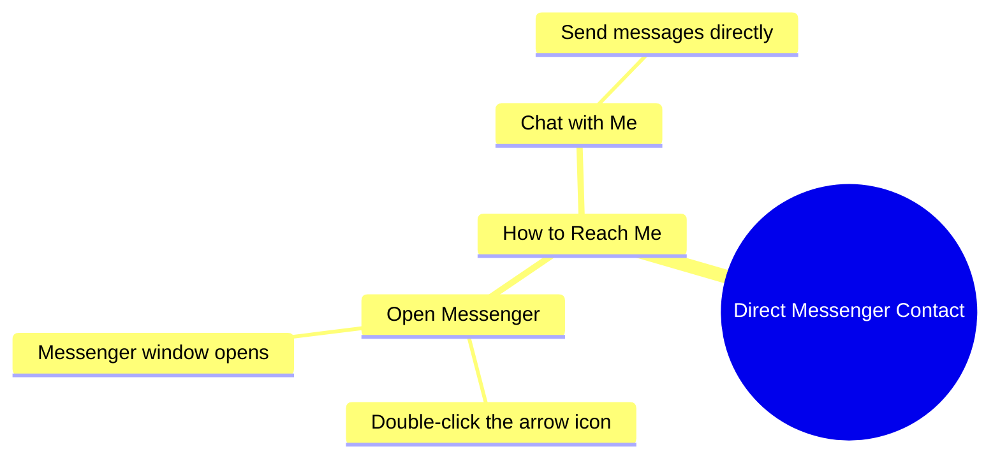

# How To Message Me Directly On Messenger

> 🌐 **Read this in:** **English** · [中文](../../zh-CN/2026-09/tiktok-transcript-1-9m-views-67k-reactions-wafa-world-facebookreels-reels-tren-98f2.md)

> **Creator:** [@afreen khan](https://www.tiktok.com/@afreen khan) · **Views:** 686.6K · **Posted:** 2026-09-26 · **Niche:** other
>
> **TL;DR:** Immediately offers a direct communication benefit, grabbing viewer attention.

[Watch original video →](https://www.facebook.com/reel/2185758796158018/)

## Why This Went Viral

## Hook (first 3 seconds)
- Verbatim opening: "अब आप मुझे सीधा मेसेंजर से बात कर सकते हैं" ("Now you can talk to me directly on Messenger")
- Hook pattern: **Direct access / bold claim** — a promise of personal, one-to-one contact with the creator.
- Why it stops the scroll: It flips the usual creator–audience wall. Instead of watching passively, the viewer is told *they* can now reach the person on screen. That's an instant, personal "this is for me" trigger, and the word "अब" (now) implies a change worth paying attention to.

## Emotional Rhythm
- **Curiosity** — "you can talk to me directly" raises the question: how? why now?
- **Tension (micro)** — the viewer momentarily doesn't know the mechanism, creating a tiny information gap.
- **Relief / payoff** — "जैसे तीर वाली निशान पे दो बार क्लिक करोगे, मेसेंजर खुल जाएगा" resolves it with a dead-simple instruction.
- **Invitation / warmth** — "आप वहाँ पे बात कर सकते हो मुझ से" closes on an open, welcoming note.
- Climax moment: the instruction "तीर वाली निशान पे दो बार क्लिक करोगे" — the exact second the mystery converts into an actionable step.

## Keyword Density
- आप (you)
- मुझे / मुझ से (me / with me)
- मेसेंजर (Messenger) — repeated
- सीधा (directly)
- बात कर सकते हो (can talk)
- तीर वाली निशान (the arrow icon)
- दो बार क्लिक (double click)
- खुल जाएगा (will open)
- Algorithmic reach drivers: "मेसेंजर," "क्लिक," "खुल जाएगा" — platform/action terms that signal interactivity and can boost engagement signals.
- Emotional pull drivers: "आप," "मुझे/मुझ से," "सीधा," "बात कर सकते हो" — these create the feeling of a personal, direct relationship.

## Why It Spreads
- **Reciprocity trigger** — "आप मुझे सीधा मेसेंजर से बात कर सकते हैं" offers the audience something rare (direct access), which makes people want to act and share.
- **Zero-friction CTA** — "तीर वाली निशान पे दो बार क्लिक करोगे, मेसेंजर खुल जाएगा" removes all guesswork. Clear, one-step instructions get followed and re-shared.
- **Personal address** — repeated "आप" and "मुझ से" make it feel like a private message, not a broadcast, driving comments and DMs.
- **Curiosity gap closed fast** — the promise ("सीधा... बात कर सकते हैं") is immediately answered ("मेसेंजर खुल जाएगा"), so viewers get a complete, satisfying loop in seconds — ideal for replays and shares.
- **Novelty of access** — "अब" signals a new capability, making the content feel timely and worth forwarding to others who'd want the same access.

## What You Can Steal
1. **Lead with access, not information.** Open with what the viewer *gets* ("you can now reach me directly") before explaining how — the promise is the hook.
2. **Use a "now" frame.** Words like "अब" make the content feel new and urgent, so viewers stop to check what changed.
3. **Give a one-step, physical instruction.** "Double-click the arrow icon" is concrete and visual — replace abstract CTAs with a single tap/click the viewer can do instantly.

## Mind Map

## Full Transcript (Generated by [analyze your own TikToks](https://toktranscript.com/?utm_source=github&utm_medium=breakdown&utm_campaign=tool_attribution))

> 📝 Transcripts on this page are auto-generated and show the first 60%. Want to transcribe any TikTok in 30 seconds and get the full version? [Try TokTranscript free →](https://toktranscript.com/?utm_source=github&utm_medium=breakdown&utm_campaign=transcript_cta)

अब आप मुझे सीधा मेसेंजर से बात कर सकते हैं, जैसे तीर वाली निशान पे दो बार क्लिक करो

*[Read the full transcript on TokTranscript →](https://toktranscript.com/plaza/tiktok-transcript-1-9m-views-67k-reactions-wafa-world-facebookreels-reels-tren-98f2?utm_source=github&utm_medium=breakdown&utm_campaign=transcript_full)*

## Browse More

- All [other](../../by-niche/en/other.md) breakdowns
- All [Direct Benefit Hook](../../by-pattern/en/hook-direct-benefit-hook.md) examples

## Video Info

| | |
|---|---|
| Creator | [@afreen khan](https://www.tiktok.com/@afreen khan) |
| Original video | [https://www.facebook.com/reel/2185758796158018/](https://www.facebook.com/reel/2185758796158018/) |
| Original title | 1.9M views · 67K reactions | Wafa World 😘🥀 #FacebookReels #Reels #TrendingReels #ReelsVideo #ShortVideo #ViralVideo #Explore #ForYou #Dosti #Friendship #OnlineDosti #DesiVibes #UrduPosts #followformore | afreen khan |
| Views | 686.6K (686581) |
| Posted | 2026-09-26 |
| Duration | 0s |
| Niche | `other` |
| Hook pattern | `Direct Benefit Hook` |
| Original language | `en` |
| Available languages | en, zh-CN |
| Generated | 2026-09-27 by [TokTranscript](https://toktranscript.com/) |

---

*This breakdown is for educational analysis under fair use. Original video © [@afreen khan](https://www.tiktok.com/@afreen khan). All transcripts are auto-generated and may contain errors.*

*Want to analyze your own TikToks like this? [the tool we used to generate this →](https://toktranscript.com/viral-breakdown?utm_source=github&utm_medium=breakdown&utm_campaign=footer_cta)*