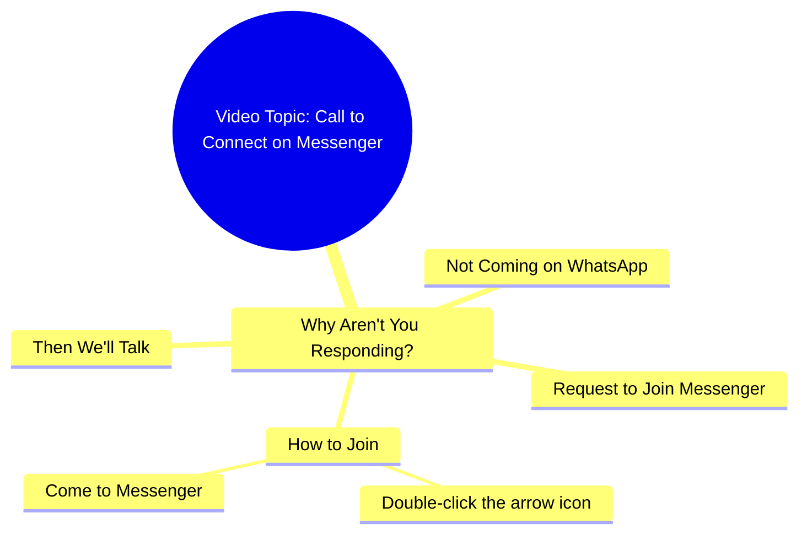

# Why Don't You Come Talk on Messenger

> 🌐 **Read this in:** **English** · [中文](../../zh-CN/2026-09/tiktok-transcript-13m-views-328k-reactions-03045658506-d988.md)

> **Creator:** [@03045658506](https://www.tiktok.com/@03045658506) · **Views:** 4.1M · **Posted:** 2026-09-22 · **Niche:** other
>
> **TL;DR:** The hook immediately engages the viewer by asking a direct, relatable question about messaging habits.

[Watch original video →](https://www.facebook.com/reel/1092072726808312/?app=fbl)

## Why This Went Viral

## Hook (first 3 seconds)
- Verbatim opening: "आप लोग क्यों नहीं आते हो, WhatsApp पे तो नहीं आ रहे हो, Messenger पे तो आ जाओ..."
- Hook pattern: **Direct accusation / callout question** ("Why don't you people come?") aimed straight at the viewer.
- Why it stops the scroll: It feels like a personal message meant for *you*, not a broadcast. The accusatory "तुम लोग" framing triggers an instant defensive reflex — "wait, is he talking to me?" — which is the strongest interrupt a feed can produce.

## Emotional Rhythm
- **Beat 1 (0–1s): Confrontation** — "क्यों नहीं आते हो" lands as mild guilt/accusation.
- **Beat 2 (1–3s): Escalation** — "WhatsApp पे तो नहीं आ रहे हो" piles on the guilt, naming a platform the viewer actually uses daily.
- **Beat 3 (3–5s): Pivot to instruction** — "Messenger पे तो आ जाओ" shifts from blame to a concrete, easy ask. Tension converts into action.
- **Beat 4 (5–7s): Micro-instruction / ritual** — "तीर के निशान पे दो बार क्लिक करो" — a tiny, almost childish task. This is the **climax**: the emotional peak is the moment the viewer is told *exactly* what to do, removing all friction.
- **Beat 5 (7–8s): Promise of reward** — "फिर बात करते हैं" — soft, intimate payoff. Relief + curiosity ("what will we talk about?").
- Climax lands on the **double-tap instruction** — the whole video is engineered to peak at the CTA.

## Keyword Density
- **आ जाओ / आते हो** ("come / don't come") — the emotional spine; repeated 3x.
- **Messenger** — repeated 2x; the algorithmic reach keyword (platform name = searchable, suggestible).
- **WhatsApp** — reach keyword; triggers recognition and platform-association.
- **बात करते हैं** ("let's talk") — emotional pull; promises relationship, not transaction.
- **क्यों नहीं** ("why not") — pull keyword; guilt + curiosity combo.
- **तीर के निशान / दो बार क्लिक** ("arrow mark / double click") — instruction keyword; drives the actual engagement metric.
- Reach drivers: **Messenger, WhatsApp** (platform names feed recommendation systems).
- Emotional drivers: **क्यों नहीं, बात करते हैं** (guilt + intimacy).

## Why It Spreads
- **It weaponizes guilt as a hook.** "आप लोग क्यों नहीं आते हो" makes the viewer feel personally singled out — the same mechanism as a friend's passive-aggressive text. People share it to say "he's talking about you."
- **It names real platforms the viewer is already on.** "WhatsApp पे तो नहीं आ रहे हो, Messenger पे तो आ जाओ" — this is not abstract; it points at the exact apps in the viewer's pocket, collapsing the distance between content and behavior.
- **The CTA is disguised as a casual instruction, not a plea.** "तीर के निशान पे दो बार क्लिक करो" sounds like a friend explaining a UI, not a creator begging for engagement. Low-friction, high-compliance.
- **The ending creates an open loop.** "फिर बात करते हैं" promises a future conversation without revealing it — the viewer has to follow/comment to close the loop.
- **It's short enough to loop.** The whole thing is ~8 seconds; the accusation at the start re-triggers on replay, compounding watch time.

## What You Can Steal
- **Open with a direct accusation or callout, not a greeting.** "Why don't you people…" outperforms "Hi guys" because it forces a self-referential reaction in under 1 second.
- **Name the exact platform or behavior you want.** Don't say "follow me" — say "double-tap the arrow" or "DM me on Instagram." Specificity converts.
- **End on an open promise, not a closed one.** "फिर बात करते हैं" works because it implies there's more. Replace "thanks for watching" with a hook for the next interaction.

## Mind Map

## Full Transcript (Generated by [try this transcription tool](https://toktranscript.com/?utm_source=github&utm_medium=breakdown&utm_campaign=tool_attribution))

> 📝 Transcripts on this page are auto-generated and show the first 60%. Want to transcribe any TikTok in 30 seconds and get the full version? [Try TokTranscript free →](https://toktranscript.com/?utm_source=github&utm_medium=breakdown&utm_campaign=transcript_cta)

आप लोग क्यों नहीं आते हो, WhatsApp पे तो नहीं आ रहे हो, Messenger पे तो आ जाओ, तीर के निश

*[Read the full transcript on TokTranscript →](https://toktranscript.com/plaza/tiktok-transcript-13m-views-328k-reactions-03045658506-d988?utm_source=github&utm_medium=breakdown&utm_campaign=transcript_full)*

## Browse More

- All [other](../../by-niche/en/other.md) breakdowns
- All [Direct Question](../../by-pattern/en/hook-direct-question.md) examples

## Video Info

| | |
|---|---|
| Creator | [@03045658506](https://www.tiktok.com/@03045658506) |
| Original video | [https://www.facebook.com/reel/1092072726808312/?app=fbl](https://www.facebook.com/reel/1092072726808312/?app=fbl) |
| Original title | 13M views · 328K reactions | آپ کیوں نہیں آتے ہو | 03045658506 |
| Views | 4.1M (4077557) |
| Posted | 2026-09-22 |
| Duration | 0s |
| Niche | `other` |
| Hook pattern | `Direct Question` |
| Original language | `en` |
| Available languages | en, zh-CN |
| Generated | 2026-09-23 by [TokTranscript](https://toktranscript.com/) |

---

*This breakdown is for educational analysis under fair use. Original video © [@03045658506](https://www.tiktok.com/@03045658506). All transcripts are auto-generated and may contain errors.*

*Want to analyze your own TikToks like this? [analyze your own TikToks →](https://toktranscript.com/viral-breakdown?utm_source=github&utm_medium=breakdown&utm_campaign=footer_cta)*