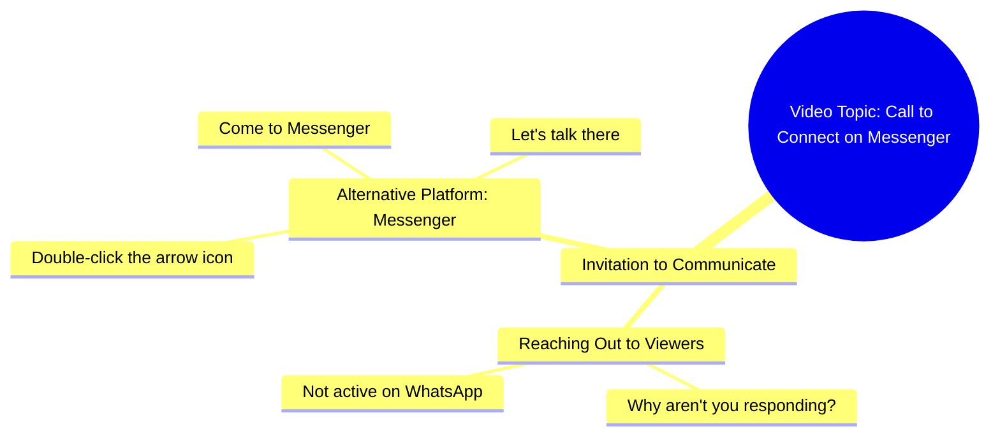

# Why Don't You Come on Messenger

> 🌐 **Read this in:** **English** · [中文](../../zh-CN/2026-09/tiktok-transcript-14m-views-339k-reactions-03045658506-31e0.md)

> **Creator:** [@03045658506](https://www.tiktok.com/@03045658506) · **Views:** 4.2M · **Posted:** 2026-09-25 · **Niche:** other
>
> **TL;DR:** The hook immediately engages the audience with a relatable question about messaging habits, creating curiosity and personal relevance.

[Watch original video →](https://www.facebook.com/share/r/1Mrhv594w2/)

## Why This Went Viral

## Hook (first 3 seconds)
- **Verbatim opening line:** "आप लोग क्यों नहीं आते हो, WhatsApp पे तो नहीं आ रहे हो, Messenger पे तो आ जाओ..."
- **Hook pattern:** Direct accusation + call-out ("Why don't you people come?") — a confrontational question aimed straight at the viewer.
- **Why it stops the scroll:** It feels like a personal message, not content. The viewer is addressed as "आप लोग" (you people) and accused of ignoring the speaker — triggering an instant "wait, is this about me?" reflex. The unresolved "why" creates a micro-gap the brain wants closed.

## Emotional Rhythm
- **Beat 1 — Confrontation/Curiosity (0–2s):** "आप लोग क्यों नहीं आते हो" — mild guilt + intrigue. Viewer feels singled out.
- **Beat 2 — Escalation/Repetition (2–5s):** "WhatsApp पे तो नहीं आ रहे हो, Messenger पे तो आ जाओ" — the speaker keeps naming platforms, building a nagging, familiar rhythm.
- **Beat 3 — Instruction/Tension (5–8s):** "तीर के निशान पे दो बार क्लिक करो" — an oddly specific action ("click twice on the arrow mark"). This is the suspense peak: what arrow? where?
- **Beat 4 — Payoff/Invitation (8–10s):** "Messenger पे आ जाओ, फिर बात करते हैं" — soft resolution, an open-ended promise ("then we'll talk").
- **Climax moment:** "तीर के निशान पे दो बार क्लिक करो" — the cryptic, hyper-specific instruction is the twist that makes the video feel like an inside joke or hidden puzzle.

## Keyword Density
- **आप लोग** (you people) — emotional pull; direct address.
- **क्यों नहीं आते हो** (why don't you come) — emotional pull; guilt/curiosity driver.
- **WhatsApp** — algorithmic reach; platform name recognition.
- **Messenger** (repeated twice) — algorithmic reach + CTA anchor.
- **आ जाओ** (come) — repeated imperative; builds urgency.
- **तीर के निशान** (arrow mark) — emotional pull; the mystery hook.
- **दो बार क्लिक करो** (click twice) — action trigger; drives comments/replies.
- **फिर बात करते हैं** (then we'll talk) — emotional pull; open loop.

**Reach vs. pull:** WhatsApp/Messenger/click drive discoverability and platform-signal association. "आप लोग," "क्यों नहीं," and "तीर के निशान" drive the emotional "this is about me / what arrow?" pull.

## Why It Spreads
- **It's a message, not a video.** The entire transcript reads like a DM the viewer forgot to answer — "आप लोग क्यों नहीं आते हो" makes sharing feel like forwarding a friend's complaint.
- **The "तीर के निशान" puzzle.** "तीर के निशान पे दो बार क्लिक करो" is deliberately cryptic, so viewers comment "कौन सा तीर?" — and comments are the strongest distribution signal.
- **Platform ping-pong.** Naming WhatsApp and Messenger back-to-back makes it feel cross-platform and urgent, nudging viewers to reply on whichever app they're already in.
- **Open loop ending.** "फिर बात करते हैं" withholds the actual conversation, so the video ends on unfinished business — the classic reason people rewatch or reply.
- **Low-effort relatability.** The nagging, informal tone mirrors how people actually text friends, so it gets shared as a joke tag ("ये तेरे लिए है").

## What You Can Steal
- **Open with a direct accusation, not a greeting.** Replace "Hi guys" with "तुम लोग क्यों..." — make the viewer feel personally addressed in the first second.
- **Bury one cryptic instruction.** A specific, slightly confusing action ("तीर के निशान पे दो बार क्लिक करो") forces comments asking for clarification — free engagement fuel.
- **End on an unfinished promise.** Close with "फिर बात करते हैं" style open loops instead of a hard CTA, so the video feels like the start of a conversation, not the end of one.

## Mind Map

## Full Transcript (Generated by [free TikTok transcript generator](https://toktranscript.com/?utm_source=github&utm_medium=breakdown&utm_campaign=tool_attribution))

> 📝 Transcripts on this page are auto-generated and show the first 60%. Want to transcribe any TikTok in 30 seconds and get the full version? [Try TokTranscript free →](https://toktranscript.com/?utm_source=github&utm_medium=breakdown&utm_campaign=transcript_cta)

आप लोग क्यों नहीं आते हो, WhatsApp पे तो नहीं आ रहे हो, Messenger पे तो आ जाओ, तीर के निश

*[Read the full transcript on TokTranscript →](https://toktranscript.com/plaza/tiktok-transcript-14m-views-339k-reactions-03045658506-31e0?utm_source=github&utm_medium=breakdown&utm_campaign=transcript_full)*

## Browse More

- All [other](../../by-niche/en/other.md) breakdowns
- All [Direct Question](../../by-pattern/en/hook-direct-question.md) examples

## Video Info

| | |
|---|---|
| Creator | [@03045658506](https://www.tiktok.com/@03045658506) |
| Original video | [https://www.facebook.com/share/r/1Mrhv594w2/](https://www.facebook.com/share/r/1Mrhv594w2/) |
| Original title | 14M views · 339K reactions | آپ کیوں نہیں آتے ہو | 03045658506 |
| Views | 4.2M (4248975) |
| Posted | 2026-09-25 |
| Duration | 0s |
| Niche | `other` |
| Hook pattern | `Direct Question` |
| Original language | `en` |
| Available languages | en, zh-CN |
| Generated | 2026-09-26 by [TokTranscript](https://toktranscript.com/) |

---

*This breakdown is for educational analysis under fair use. Original video © [@03045658506](https://www.tiktok.com/@03045658506). All transcripts are auto-generated and may contain errors.*

*Want to analyze your own TikToks like this? [analyze your own TikToks →](https://toktranscript.com/viral-breakdown?utm_source=github&utm_medium=breakdown&utm_campaign=footer_cta)*