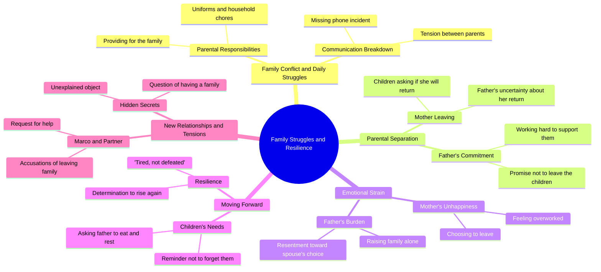

# Silent Burden Episode 2: Ramon Fights for His Kids

> 🌐 **Read this in:** **English** · [中文](../../zh-CN/2026-09/tiktok-transcript-14m-views-398k-reactions-tahimik-na-pasanin-episode-2-iniwan-a815.md)

> **Creator:** [@Tagalog Real Talks](https://www.tiktok.com/@Tagalog Real Talks) · **Views:** 7.2M · **Posted:** 2026-09-12 · **Niche:** entertainment
>
> **TL;DR:** The opening question immediately engages viewers by tapping into a common parental concern, setting a relatable and emotional tone.

[Watch original video →](https://www.facebook.com/share/v/1CYNNv2NNV/)

## Why This Went Viral

## Hook (first 3 seconds)
- **Verbatim opening line:** "Nakakain na ba mga bata?" ("Have you kids eaten?") — a father checking on his children, immediately followed by "Ewan ko" and the wife's sharp "Ano ba Ramon? Pagod ako."
- **Hook pattern:** **Scene / in-media-res domestic conflict** — no setup, no context, you're dropped mid-argument inside a household.
- **Why it stops the scroll:** It opens on an unresolved emotional transaction (a tired wife, a distracted husband, hungry kids). Viewers are trained to detect *conflict* in under a second, and the clipped, overlapping dialogue signals real family tension — the brain stays to find out who's right and what breaks.

## Emotional Rhythm
- **0–3s — Curiosity:** "Nakakain na ba mga bata?" plants a caretaker role; the snapped "Pagod ako" immediately destabilizes it.
- **3–15s — Tension building:** Rapid-fire domestic grievances — laundry, missing phone, "Babalik pa ba si Mama?" The child's question reframes the fight as abandonment.
- **15–30s — Sorrow / resonance:** "Nandito lang ako. At hindi ko kayo iiwan." The father becomes the anchor. Viewers shift from judging to empathizing.
- **30–50s — Conflict escalation:** The wife returns to collect things — "Hindi na ako masaya, Ramon. Puro trabaho ka na lang." The betrayal is now explicit.
- **50–65s — Twist / moral pivot:** "Umalis ka man bilang asawa, huwag ka sanang tuluyang mawala bilang ina." The frame flips — it's not about the marriage, it's about the children.
- **Climax:** "Iniwan ko ang pamilya ko para sa'yo. Kasalanan ko ba yun?" — the wife's own abandonment is mirrored back at her. Then the father's quiet "Pagod lang. Hindi talo. Babangon tayo."
- **Final beat — Suspense hook:** "May pamilya ka?" — a cliffhanger question that forces a Part 2 / rewatch.

## Keyword Density
- **"Mama" / "ina"** — the emotional core; every child line orbits this word.
- **"Pamilya"** — the thematic keyword; the video's entire moral argument.
- **"Pagod"** — repeated 4+ times; the shared exhaustion that unites father and wife.
- **"Hindi ko kayo iiwan" / "hindi ka iiwan"** — the promise motif, inverted by the wife's exit.
- **"Trabaho"** — the stated reason for the breakup; the practical villain.
- **"Ramon"** — name-dropping anchors the scene as real, not generic.
- **"Babalik pa ba?"** — the recurring question that drives the emotional loop.
- **Algorithmic drivers:** *pamilya, ina, anak, pagod* — high-search Tagalog family-drama terms that push the video into the "family/OFW/hugot" recommendation cluster.
- **Emotional drivers:** *iiwan, babangon, hindi talo* — these are the words viewers quote in comments, which is what actually fuels shares.

## Why It Spreads
- **It weaponizes the "hugot" reflex.** Lines like "Umalis ka man bilang asawa, huwag ka sanang tuluyang mawala bilang ina" are engineered to be screenshotted and reposted — they're aphorisms disguised as dialogue.
- **Every viewer picks a side.** The wife ("Hindi na ako masaya") vs. the father ("may binubuhay akong pamilya") is a deliberately balanced conflict, so comment sections explode with "Kawawa si Ramon" vs. "Naiintindihan ko si Misis." Comment wars = algorithmic fuel.
- **The child's question is the share trigger.** "Babalik pa ba si Mama?" hits the OFW / broken-family nerve in Filipino audiences — the exact demographic that shares this content to Facebook.
- **The twist reframes blame.** "Iniwan ko ang pamilya ko para sa'yo" turns the wife from villain to hypocrite in one line — a mini-reversal that rewards rewatch and clip-out.
- **Open ending forces engagement.** "May pamilya ka?" is a direct address to the viewer. It converts passive watching into commenting, duetting, and demanding Part 2.

## What You Can Steal
- **Open mid-conflict, not mid-setup.** Start on the sharpest line of an argument ("Ano ba Ramon? Pagod ako") — no establishing shot, no context. The audience catches up in 2 seconds and stays for the payoff.
- **Plant a child's question as the emotional anchor.** "Babalik pa ba si Mama?" does more work than any adult monologue. One innocent, repeated question can carry an entire narrative arc.
- **End on a direct question to the viewer.** "May pamilya ka?" converts a passive scroll into a comment, a share, or a Part 2 demand — the cheapest engagement lever in short-form.

## Mind Map

## Full Transcript (Generated by [TokTranscript](https://toktranscript.com/?utm_source=github&utm_medium=breakdown&utm_campaign=tool_attribution))

> 📝 Transcripts on this page are auto-generated and show the first 60%. Want to transcribe any TikTok in 30 seconds and get the full version? [Try TokTranscript free →](https://toktranscript.com/?utm_source=github&utm_medium=breakdown&utm_campaign=transcript_cta)

Nakakain na ba mga bata? Ewan ko. Alas sa is na. Ano ba Ramon? Pagod ako. Hindi mo na labahan uniform ko? Kailangan ko yan bukas. E di labhan mo. Ramon! Nasaan phone ko? Kung ayaw niya na sa atin, ako ang bubuhay sa inyo. Babalik pa ba si Mama? Pa, nandiyan ka pa? Nandito lang ako. At hindi ko kayo iiwan. Pa, babalik pa ba si Mama? Hindi ko alam. Pero ako, hindi ako titigil para sa inyo. Kita mo, hindi mo na kailangang magtiis doon. Parang ngayon lang ako nakahinga. Sa akin, hindi ka mahihirapan. Tatay, kumain ka na ba? Mamaya pa Kayo muna Kailangan lang nating lumaban Kukunin ko lang yung mga gamit ko Hindi kita pipigilan Pero huwag mong kalimutan na may mga batang na iwan dito Hindi na ako masaya, Ramon. Puro trabaho ka na lang. Puro trabaho.

*[Read the full transcript on TokTranscript →](https://toktranscript.com/plaza/tiktok-transcript-14m-views-398k-reactions-tahimik-na-pasanin-episode-2-iniwan-a815?utm_source=github&utm_medium=breakdown&utm_campaign=transcript_full)*

## Browse More

- All [entertainment](../../by-niche/en/entertainment.md) breakdowns
- All [Relatable Question](../../by-pattern/en/hook-relatable-question.md) examples

## Video Info

| | |
|---|---|
| Creator | [@Tagalog Real Talks](https://www.tiktok.com/@Tagalog Real Talks) |
| Original video | [https://www.facebook.com/share/v/1CYNNv2NNV/](https://www.facebook.com/share/v/1CYNNv2NNV/) |
| Original title | 14M views · 398K reactions | TAHIMIK NA PASANIN — EPISODE 2 Iniwan niya ang pamilya para sa buhay na akala niya’y mas magiging masaya. Habang si Ramon ay tahimik na lumalaban para sa kanilang mga anak, unti-unti namang lumalabas ang tunay na mukha ng lalaking pinili ni Liza. May mga desisyong sa umpisa ay parang kalayaan… hanggang dumating ang araw na singilin ka ng kapalit. #tagalogstory #PinoyDrama #DramaSeries | Tagalog Real Talks |
| Views | 7.2M (7192204) |
| Posted | 2026-09-12 |
| Duration | 0s |
| Niche | `entertainment` |
| Hook pattern | `Relatable Question` |
| Original language | `en` |
| Available languages | en, zh-CN |
| Generated | 2026-09-13 by [TokTranscript](https://toktranscript.com/) |

---

*This breakdown is for educational analysis under fair use. Original video © [@Tagalog Real Talks](https://www.tiktok.com/@Tagalog Real Talks). All transcripts are auto-generated and may contain errors.*

*Want to analyze your own TikToks like this? [TokTranscript.com →](https://toktranscript.com/viral-breakdown?utm_source=github&utm_medium=breakdown&utm_campaign=footer_cta)*