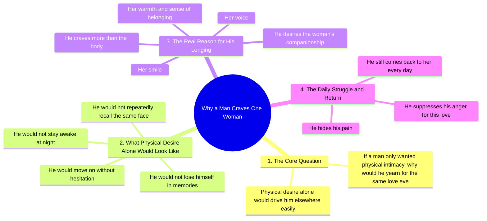

# A Man's Life Is Not Easy, He Just Hides His Pain

> 🌐 **Read this in:** **English** · [中文](../../zh-CN/2026-09/tiktok-transcript-14m-views-607k-reactions-husband-myhusband-lovemyhusband-hus-4d1f.md)

> **Creator:** [@ai video ki duniya](https://www.tiktok.com/@ai video ki duniya) · **Views:** 6.0M · **Posted:** 2026-09-05 · **Niche:** entertainment
>
> **TL;DR:** A provocative rhetorical question challenges common assumptions and immediately hooks the audience.

[Watch original video →](https://www.facebook.com/share/r/1DfqAZMP24/)

## Why This Went Viral

## Hook (first 3 seconds)
- **Verbatim opening line:** "اگر مرد کو صرف جسم چاہیے ہوتا تو وہ ہر دن ایک ہی محبت کے لیے کیوں تڑپتا ہے؟" ("If a man only wanted a body, why would he yearn for the same love every day?")
- **Hook pattern:** Rhetorical question + bold claim (contrast between "body" and "love/yearning")
- **Why it stops the scroll:** It challenges a stereotype directly. The viewer feels personally addressed and either agrees strongly or wants to argue — both reactions generate a full watch-through. The question creates an immediate "answer me" tension in the brain.

## Emotional Rhythm
1. **Defensive validation** (0–3s): The question validates men who feel misunderstood — instant resonance.
2. **Escalating contrast** (3–10s): "He could go elsewhere easily" — builds a "but he doesn't" tension. Creates a sense of loyalty being proven.
3. **Nostalgic ache** (10–15s): Mentions memories, sleepless nights, replaying one face — pulls the viewer into a melancholic, romanticized state.
4. **Soft resolution** (15–20s): Shifts from body to voice, smile, warmth — an emotional "answer" to the opening question.
5. **Quiet sacrifice** (20–end): "He suppresses his anger, hides his pain, and still returns" — climax lands on forgiveness and devotion. This is the emotional peak: it reframes male love as patient suffering.
- **Climax moment:** The final line — "اور پھر بھی لوٹ آتا ہے" ("and still he comes back") — delivers a punch of admiration and heartbreak simultaneously.

## Keyword Density
- **تڑپتا ہے (yearns/aches)** — appears twice; drives emotional pull, signals depth of feeling.
- **صرف جسم (only body)** — repeated early; sets up the contrast that fuels the argument.
- **محبت (love)** — repeated; algorithmic reach (high-volume romantic keyword in Urdu content).
- **چاہیے (wants/needs)** — used repeatedly; frames desire as emotional, not physical.
- **لوٹ آتا ہے (comes back)** — closing anchor; emotional pull of loyalty and forgiveness.
- **یادیں (memories), راتیں (nights), چہرہ (face)** — sensory words that drive emotional resonance and comment-section storytelling.
- **Algorithmic reach drivers:** محبت, عورت, مرد (love, woman, man) — high-search-volume relationship keywords.
- **Emotional pull drivers:** تڑپتا, لوٹ آتا ہے, یاد کرتا (yearns, comes back, remembers) — these trigger personal anecdotes in comments.

## Why It Spreads
- **It weaponizes a gender-based assumption.** The line "if he only wanted a body, he'd go elsewhere" flips a common criticism of men into a defense. This sparks debate in comments — men tag each other ("this is us"), women tag partners ("this is you") — driving shares.
- **It offers a redemption narrative.** The progression from "body" to "voice, smile, warmth" gives viewers a poetic arc they want to re-share as a status or story. It's quotable — the entire transcript reads like a caption-ready manifesto.
- **It ends on sacrifice, not romance.** "He suppresses his anger, hides his pain, and still comes back" — this is unexpected. It positions love as endurance, which feels more authentic than typical romantic content. This twist makes it feel profound, not cliché.
- **It's gender-targeted but universally watchable.** Men watch to feel seen; women watch to understand or verify. This dual audience doubles the potential share pool.
- **The language is rhythmic and hypnotic.** The repeated structure ("not… not… not… but…") creates a spoken-word cadence that encourages full replays and audio-based shares (e.g., used over other visuals).

## What You Can Steal
- **Open with a stereotype-shattering rhetorical question.** Frame your topic as "Everyone thinks X, but here's the real truth" — it creates instant tension and a reason to watch until the answer arrives.
- **Use a "not… not… not… but…" build-up.** Stack three negations to create suspense, then release with a single positive resolution. This rhythm keeps retention high and makes the ending feel earned.
- **End on an act of quiet sacrifice, not triumph.** Instead of a happy ending, close with a line that implies ongoing struggle ("and still he returns"). This leaves emotional residue — viewers comment, tag, and share because they're left with a feeling, not just a conclusion.

## Mind Map

## Full Transcript (Generated by [TokTranscript.com](https://toktranscript.com/?utm_source=github&utm_medium=breakdown&utm_campaign=tool_attribution))

> 📝 Transcripts on this page are auto-generated and show the first 60%. Want to transcribe any TikTok in 30 seconds and get the full version? [Try TokTranscript free →](https://toktranscript.com/?utm_source=github&utm_medium=breakdown&utm_campaign=transcript_cta)

اگر مرد کو صرف جسم چاہیے ہوتا تو وہ ہر دن ایک ہی محبت کے لیے کیوں تڑپتا ہے؟ اگر صرف جسم کی چاہ ہوتی تو وہ آسانی سے کہیں اور چلا جاتا نہ یادوں میں کھوتا نہ راتوں کو جاگتا نہ ایک ہی چہرے کو بار بار یاد کرتا لیکن وہ تڑپتا ہے کیونکہ اسے صرف جسم نہ

*[Read the full transcript on TokTranscript →](https://toktranscript.com/plaza/tiktok-transcript-14m-views-607k-reactions-husband-myhusband-lovemyhusband-hus-4d1f?utm_source=github&utm_medium=breakdown&utm_campaign=transcript_full)*

## Browse More

- All [entertainment](../../by-niche/en/entertainment.md) breakdowns
- All [Rhetorical Question](../../by-pattern/en/hook-rhetorical-question.md) examples

## Video Info

| | |
|---|---|
| Creator | [@ai video ki duniya](https://www.tiktok.com/@ai video ki duniya) |
| Original video | [https://www.facebook.com/share/r/1DfqAZMP24/](https://www.facebook.com/share/r/1DfqAZMP24/) |
| Original title | 14M views · 607K reactions | مرد کی زندگی بھی آسان نہیں ہوتی، بس وہ درد چھپا لیتا ہےHusband #MyHusband #LoveMyHusband #HusbandLove #CoupleGoals #MarriageLove #MyLove #Hubby #WifeAndHusband #LoveForever #marriedlife | ai video ki duniya |
| Views | 6.0M (6026195) |
| Posted | 2026-09-05 |
| Duration | 0s |
| Niche | `entertainment` |
| Hook pattern | `Rhetorical Question` |
| Original language | `en` |
| Available languages | en, zh-CN |
| Generated | 2026-09-06 by [TokTranscript](https://toktranscript.com/) |

---

*This breakdown is for educational analysis under fair use. Original video © [@ai video ki duniya](https://www.tiktok.com/@ai video ki duniya). All transcripts are auto-generated and may contain errors.*

*Want to analyze your own TikToks like this? [TokTranscript →](https://toktranscript.com/viral-breakdown?utm_source=github&utm_medium=breakdown&utm_campaign=footer_cta)*