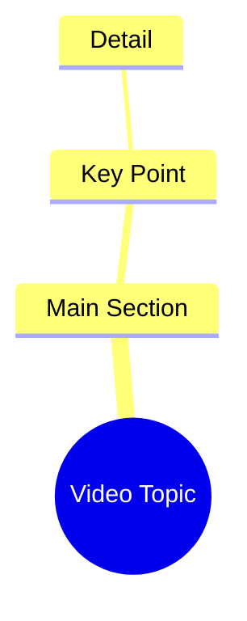

# Woman Says She Wants a Long Hug in Hindi Reel

> 🌐 **Read this in:** **English** · [中文](../../zh-CN/2026-09/tiktok-transcript-1m-views-37k-reactions-facebookreels-viralreels-trendingreel-9d27.md)

> **Creator:** [@Deepika](https://www.tiktok.com/@Deepika) · **Views:** 388.8K · **Posted:** 2026-09-28 · **Niche:** entertainment
>
> **TL;DR:** The hook directly expresses a desire for a hug, creating an immediate emotional connection with the viewer.

[Watch original video →](https://www.facebook.com/share/r/1FDrr4KSva/)

## Why This Went Viral

## Hook (first 3 seconds)
- Opening line verbatim: "ओए मुझे तुमसे गले मिलना है और बहुत देर तक गले मिलना है" ("Hey, I want to hug you, and hug you for a long time")
- Hook pattern: **Direct address + emotional confession** (second-person "you" + vulnerable desire)
- Why it stops the scroll: It speaks straight to the viewer as if they're the one being addressed, triggering an instant parasocial/romantic reflex — the brain treats it as a personal message, not content, so the thumb halts before the rational brain catches up.

## Emotional Rhythm
- **Beat 1 – Intimate confession (0–3s):** Longing stated plainly ("I want to hug you for a long time") → curiosity + warmth.
- **Beat 2 – Conditional invitation (3–6s):** "अगर तुम भी मिलना चाहते हो तो कमेंट करके बताओ" ("if you also want to meet, comment and tell me") → tension + agency handed to viewer.
- **Beat 3 – Open loop / unresolved ending:** No payoff shown — the hug never happens on screen → suspense held indefinitely.
- **Climax moment:** The pivot word "अगर" ("if") — the exact second the video shifts from one-way confession to a two-way transaction, converting emotion into an action demand.

## Keyword Density
- **गले मिलना / मिलना** ("hug" / "meet") — repeated 3x; core emotional pull, anchors the fantasy.
- **बहुत देर तक** ("for a long time") — intensifier that adds longing; emotional pull.
- **तुम / तुम भी** ("you" / "you too") — second-person address; drives parasocial engagement.
- **कमेंट करके बताओ** ("comment and tell me") — algorithmic reach driver (explicit CTA).
- **चाहते हो** ("do you want") — reciprocity trigger; converts passive watching into commenting.
- **ओए** ("hey") — informal intimacy marker; signals closeness, not formality.

Algorithmic reach: "कमेंट करके बताओ" + "तुम" (comment velocity + reply bait). Emotional pull: "गले मिलना" + "बहुत देर तक" (unfulfilled desire).

## Why It Spreads
- **Comment-bait reciprocity:** "अगर तुम भी मिलना चाहते हो तो कमेंट करके बताओ" turns every viewer into a potential responder — comments explode because answering feels like accepting a confession, not leaving a comment.
- **Parasocial second-person framing:** "मुझे तुमसे गले मिलना है" makes the creator the speaker and the viewer the beloved — each viewer feels personally chosen, so they share it to signal the same feeling to someone else.
- **Unresolved emotional loop:** The hug is promised but never delivered on screen ("बहुत देर तक गले मिलना है" stays a wish), forcing rewatches and duets/stitches that "complete" the moment.
- **Low-effort, high-emotion format:** One line, one ask — instantly remixable, so others copy the template with their own face/voice, multiplying the trend.
- **Universal longing trigger:** The phrase works for romantic, platonic, or nostalgic contexts, so it crosses audience segments without changing a word.

## What You Can Steal
1. **Open with a second-person confession, not a pitch.** Address "you" and state a desire in the first 3 seconds — it reads as a personal message and beats any "hey guys" intro.
2. **Convert emotion into a one-step CTA.** Pair the feeling with a single, low-friction action ("comment and tell me") — reciprocity, not instruction, is what drives the reply.
3. **Leave the payoff off-screen.** Promise the hug, the answer, the reveal — but don't show it. The unresolved loop is what fuels comments, rewatches, and remixes.

## Mind Map

## Full Transcript (Generated by [TokTranscript.com](https://toktranscript.com/?utm_source=github&utm_medium=breakdown&utm_campaign=tool_attribution))

> 📝 Transcripts on this page are auto-generated and show the first 60%. Want to transcribe any TikTok in 30 seconds and get the full version? [Try TokTranscript free →](https://toktranscript.com/?utm_source=github&utm_medium=breakdown&utm_campaign=transcript_cta)

ओए मुझे तुमसे गले मिलना है और बहुत देर तक गले मिलना है अगर 

*[Read the full transcript on TokTranscript →](https://toktranscript.com/plaza/tiktok-transcript-1m-views-37k-reactions-facebookreels-viralreels-trendingreel-9d27?utm_source=github&utm_medium=breakdown&utm_campaign=transcript_full)*

## Browse More

- All [entertainment](../../by-niche/en/entertainment.md) breakdowns
- All [Direct Emotional Request](../../by-pattern/en/hook-direct-emotional-request.md) examples

## Video Info

| | |
|---|---|
| Creator | [@Deepika](https://www.tiktok.com/@Deepika) |
| Original video | [https://www.facebook.com/share/r/1FDrr4KSva/](https://www.facebook.com/share/r/1FDrr4KSva/) |
| Original title | 1M views · 37K reactions | “मुझे तुमसे गले मिलना है… बहुत देर तक ❤️🥰” #FacebookReels #ViralReels #TrendingReels | Deepika |
| Views | 388.8K (388765) |
| Posted | 2026-09-28 |
| Duration | 0s |
| Niche | `entertainment` |
| Hook pattern | `Direct Emotional Request` |
| Original language | `en` |
| Available languages | en, zh-CN |
| Generated | 2026-09-29 by [TokTranscript](https://toktranscript.com/) |

---

*This breakdown is for educational analysis under fair use. Original video © [@Deepika](https://www.tiktok.com/@Deepika). All transcripts are auto-generated and may contain errors.*

*Want to analyze your own TikToks like this? [TokTranscript →](https://toktranscript.com/viral-breakdown?utm_source=github&utm_medium=breakdown&utm_campaign=footer_cta)*