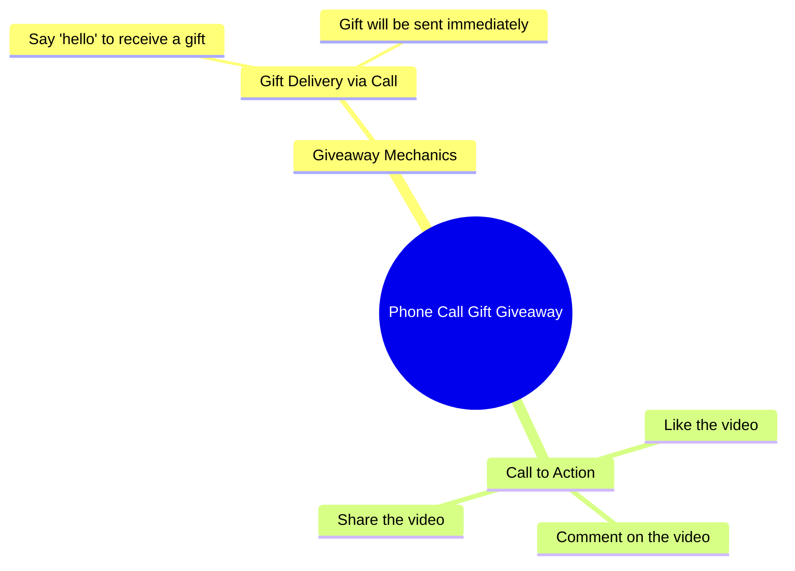

# Alawi Family Gift Giveaway via Call for Commenters

> 🌐 **Read this in:** **English** · [中文](../../zh-CN/2026-09/tiktok-transcript-2-4m-views-150k-reactions-comment-nyo-na-mga-boss-baka-sa-in-24fb.md)

> **Creator:** [@𝗔𝗟𝗮𝘄𝗶 𝗙𝗮𝗺𝗶𝗹𝗹𝘆'](https://www.tiktok.com/@𝗔𝗟𝗮𝘄𝗶 𝗙𝗮𝗺𝗶𝗹𝗹𝘆') · **Views:** 938.8K · **Posted:** 2026-09-13 · **Niche:** entertainment
>
> **TL;DR:** It immediately offers a free gift via a simple phone call, creating curiosity and a clear incentive to keep watching.

[Watch original video →](https://www.facebook.com/share/r/19DFFehRRQ/?mibextid=wwXIfr)

## Why This Went Viral

## Hook (first 3 seconds)
- Verbatim opening line: "Padadalhan kita ng regalo sa pamamagitan ng tawag." ("I'll send you a gift through a call.")
- Hook pattern: **Bold promise / conditional giveaway** — a direct, second-person offer of a reward.
- Why it stops the scroll: It creates an instant self-interest loop ("this could be for me") and a curiosity gap (what gift? what call?). The promise is concrete but unexplained, so the viewer waits for the payoff.

## Emotional Rhythm
- Beat 1 — **Curiosity/anticipation**: "Padadalhan kita ng regalo..." sets up a reward with no details.
- Beat 2 — **Lowered barrier / relief**: "Sabihin mo lang ang hello" makes participation feel effortless.
- Beat 3 — **Reassurance/tension release**: "talagang makakatanggap ka ng regalo" confirms the promise and removes doubt.
- Beat 4 — **Action/closure**: "Sige, ipapadala ko na sa iyo" signals the gift is happening now.
- Beat 5 — **CTA spike**: "i-like, i-comment at i-share" converts emotion into platform actions.
- Climax moment: "talagang makakatanggap ka ng regalo" — the strongest emotional peak because it validates the viewer's hope.

## Keyword Density
- regalo (gift) — main emotional pull and the reason to keep watching.
- tawag (call) — creates the mystery mechanism; drives curiosity.
- hello — the low-effort action cue; makes participation feel easy.
- makakatanggap (will receive) — promise/benefit language; reinforces reward.
- ipapadala (will send) — immediate payoff language; reduces skepticism.
- i-like, i-comment, i-share — algorithmic reach drivers; explicit engagement commands.
- Sige (okay/go) — conversational momentum word; keeps the tone casual and urgent.

Algorithmic reach keywords: like, comment, share. Emotional pull keywords: regalo, makakatanggap, ipapadala.

## Why It Spreads
- **Direct second-person promise** — "Padadalhan kita ng regalo" makes every viewer feel personally addressed, which increases watch time and comment intent.
- **Low-effort participation trigger** — "Sabihin mo lang ang hello" lowers the barrier to engagement, so comments flood in with a single word.
- **Unresolved curiosity gap** — the video never explains the gift or the call, so viewers rewatch, comment questions, and share to find out.
- **Explicit engagement commands** — "i-like, i-comment at i-share" tells the audience exactly what to do, converting passive viewers into distribution.
- **Reward framing + urgency** — "ipapadala ko na sa iyo" implies the gift is happening now, which pressures immediate action and sharing.

## What You Can Steal
- **Open with a direct, second-person promise** that names a concrete reward but withholds the details — this creates an instant curiosity gap.
- **Make the participation step absurdly easy** — one word, one tap, one comment — so engagement feels effortless and happens at scale.
- **End with a clear, stacked CTA** — like, comment, share — spoken naturally in the same tone as the rest of the video, so it doesn't feel like an ad break.

## Mind Map

## Full Transcript (Generated by [TokTranscript](https://toktranscript.com/?utm_source=github&utm_medium=breakdown&utm_campaign=tool_attribution))

> 📝 Transcripts on this page are auto-generated and show the first 60%. Want to transcribe any TikTok in 30 seconds and get the full version? [Try TokTranscript free →](https://toktranscript.com/?utm_source=github&utm_medium=breakdown&utm_campaign=transcript_cta)

Padadalhan kita ng regalo sa pamamagitan ng tawag. Sabihin mo lang ang hello ha, talagang makakatanggap ka ng regalo.

*[Read the full transcript on TokTranscript →](https://toktranscript.com/plaza/tiktok-transcript-2-4m-views-150k-reactions-comment-nyo-na-mga-boss-baka-sa-in-24fb?utm_source=github&utm_medium=breakdown&utm_campaign=transcript_full)*

## Browse More

- All [entertainment](../../by-niche/en/entertainment.md) breakdowns
- All [Direct Promise](../../by-pattern/en/hook-direct-promise.md) examples

## Video Info

| | |
|---|---|
| Creator | [@𝗔𝗟𝗮𝘄𝗶 𝗙𝗮𝗺𝗶𝗹𝗹𝘆'](https://www.tiktok.com/@𝗔𝗟𝗮𝘄𝗶 𝗙𝗮𝗺𝗶𝗹𝗹𝘆') |
| Original video | [https://www.facebook.com/share/r/19DFFehRRQ/?mibextid=wwXIfr](https://www.facebook.com/share/r/19DFFehRRQ/?mibextid=wwXIfr) |
| Original title | 2.4M views · 150K reactions | Comment nyo na mga boss baka sa inyo na sunod! #ivanaalawi #monaalawi #ivanaalawireall #laptopwarehouse #lapag #dailyvlog #laptop #bossa #BossA #Pamorma #CrisHippers #Kuyamoboss #fistbump #TisayShin #filipina #iphone #pera | 𝗔𝗟𝗮𝘄𝗶 𝗙𝗮𝗺𝗶𝗹𝗹𝘆' |
| Views | 938.8K (938759) |
| Posted | 2026-09-13 |
| Duration | 0s |
| Niche | `entertainment` |
| Hook pattern | `Direct Promise` |
| Original language | `en` |
| Available languages | en, zh-CN |
| Generated | 2026-09-16 by [TokTranscript](https://toktranscript.com/) |

---

*This breakdown is for educational analysis under fair use. Original video © [@𝗔𝗟𝗮𝘄𝗶 𝗙𝗮𝗺𝗶𝗹𝗹𝘆'](https://www.tiktok.com/@𝗔𝗟𝗮𝘄𝗶 𝗙𝗮𝗺𝗶𝗹𝗹𝘆'). All transcripts are auto-generated and may contain errors.*

*Want to analyze your own TikToks like this? [TokTranscript →](https://toktranscript.com/viral-breakdown?utm_source=github&utm_medium=breakdown&utm_campaign=footer_cta)*