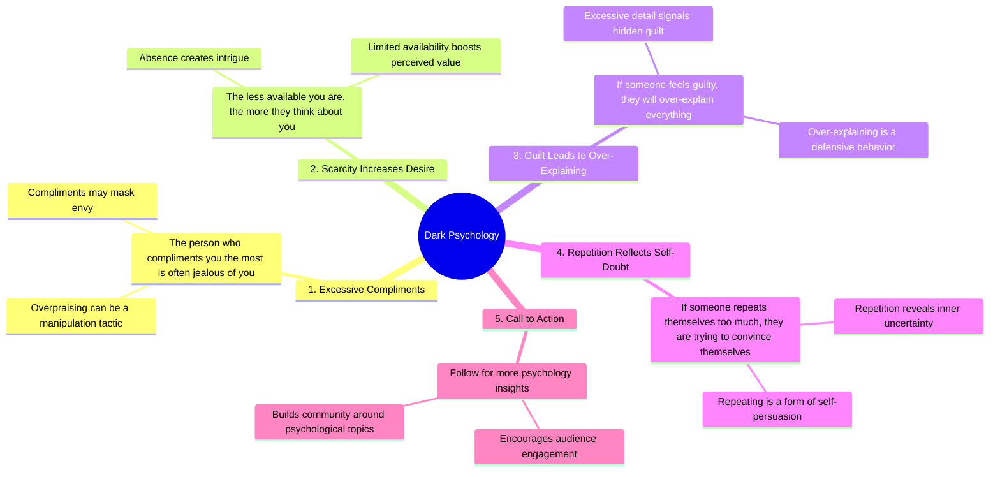

# Dark Psychology Facts: Over-Explaining Signals Guilt

> 🌐 **Read this in:** **English** · [中文](../../zh-CN/2026-09/tiktok-transcript-2-4m-views-53k-reactions-read-3-again-darkpsychology-psychol-12d9.md)

> **Creator:** [@PsychSora](https://www.tiktok.com/@PsychSora) · **Views:** 1.1M · **Posted:** 2026-09-07 · **Niche:** entertainment
>
> **TL;DR:** Immediately challenges a common belief, creating curiosity and a sense of insider knowledge.

[Watch original video →](https://www.facebook.com/share/r/1GJyJgALQu/)

## Why This Went Viral

## Hook (first 3 seconds)
- **What happens verbatim:** The opening line is "Dark psychology." followed immediately by "Number one, the person who compliments you the most is often jealous of you."
- **What type of hook pattern it is:** **Bold claim + listicle pattern** (a provocative statement disguised as a numbered rule).
- **Why it makes viewers stop scrolling:** The phrase "dark psychology" signals forbidden or insider knowledge. The first claim ("the person who compliments you the most is often jealous of you") is a direct, cynical contradiction of social norms — it creates instant cognitive dissonance. Viewers stop to verify if this applies to their own relationships.

## Emotional Rhythm
- **Beat 1 — Intrigue (0–1s):** "Dark psychology" sets a mysterious, slightly taboo tone.
- **Beat 2 — Shock/Recognition (1–3s):** Claim #1 flips a positive behavior (compliments) into a negative motive (jealousy). This triggers a "wait, is that true?" reaction.
- **Beat 3 — Tension (3–6s):** Claims #2 and #3 ("less available" and "guilt → over-explain") escalate the manipulative framing, making the viewer feel slightly exposed or validated.
- **Beat 4 — Self-Reflection (6–8s):** Claim #4 ("repeats themselves → convincing themselves") lands as a subtle accusation. The viewer may internally audit their own speech patterns.
- **Beat 5 — Call-to-Action / Resolution (8–10s):** "If you like psychology, follow." This is a soft, community-building close that converts curiosity into a follow without a hard sell.
- **Climax moment:** Claim #4 ("if someone repeats themselves too much, they are trying to convince themselves") — this is the most personally invasive point, making the viewer feel "seen" or caught.

## Keyword Density
1. **"Number one/two/three/four"** — Structural repetition that creates a rhythm and implies a finite, digestible list.
2. **"You/your"** — Direct address that personalizes every claim.
3. **"They/them"** — Creates an "us vs. them" dynamic (the viewer vs. the manipulator).
4. **"Psychology"** — The core keyword; drives algorithmic reach because it's a high-search, evergreen topic.
5. **"Compliments" / "jealous"** — Emotionally charged words that trigger social comparison.
6. **"Available"** — Relates to dating/attachment theory, a massive niche with high engagement.
7. **"Guilty" / "convince"** — Negative emotional triggers that drive comments (people arguing or agreeing).

**Algorithmic reach drivers:** "Psychology," "dark," "follow" — these are searchable and trend-friendly.
**Emotional pull drivers:** "Jealous," "guilty," "convince" — these provoke comments like "this is so true" or "this is toxic advice."

## Why It Spreads
- **Comment-bait via contradiction:** The claims are absolute and cynical. Viewers either comment "this is so accurate" or "this is manipulative garbage" — both drive engagement. The transcript's "Number one" line is the primary trigger.
- **Self-referential trap:** Claim #4 ("repeats themselves → convincing themselves") makes viewers who rewatch or share the video question their own motives — a meta-loop that keeps them engaged longer.
- **FOMO via list format:** The numbered structure ("Number one… two… three…") promises a complete set. Viewers must watch to the end to get all the rules, and the "Read again" line (after #3) forces a re-read, increasing watch time.
- **Niche + universal overlap:** "Dark psychology" is a niche interest, but the examples (compliments, availability, guilt) are universal social situations. This allows the video to cross-pollinate between psychology, dating, and self-improvement audiences.
- **Low-effort, high-utility save:** The content is list-like and referenceable. Viewers save it to "use later" on friends or partners, which signals to the algorithm that it's valuable.

## What You Can Steal
- **Start with a taboo or counterintuitive claim, not a question.** "Dark psychology" + a specific accusation outperforms "Do you know why people compliment you?" because it asserts authority and creates immediate dissonance.
- **Use numbered micro-rules to force completion.** Even if you only have 4 points, numbering them creates a "must finish the list" compulsion. Add a "Read again" or "Save this" mid-way to artificially boost watch time.
- **End with a niche-specific follow CTA, not a generic one.** "If you like psychology, follow" is targeted. Replace "follow for more" with "If you like [your niche], follow" — it filters for the exact audience the algorithm wants to push your content to.

## Mind Map

## Full Transcript (Generated by [free TikTok transcript generator](https://toktranscript.com/?utm_source=github&utm_medium=breakdown&utm_campaign=tool_attribution))

> 📝 Transcripts on this page are auto-generated and show the first 60%. Want to transcribe any TikTok in 30 seconds and get the full version? [Try TokTranscript free →](https://toktranscript.com/?utm_source=github&utm_medium=breakdown&utm_campaign=transcript_cta)

Dark psychology. Number one, the person who compliments you the most is often jealous of you. Number two, the less available you are, the more they think about you.

*[Read the full transcript on TokTranscript →](https://toktranscript.com/plaza/tiktok-transcript-2-4m-views-53k-reactions-read-3-again-darkpsychology-psychol-12d9?utm_source=github&utm_medium=breakdown&utm_campaign=transcript_full)*

## Browse More

- All [entertainment](../../by-niche/en/entertainment.md) breakdowns
- All [Contrarian listicle](../../by-pattern/en/hook-contrarian-listicle.md) examples

## Video Info

| | |
|---|---|
| Creator | [@PsychSora](https://www.tiktok.com/@PsychSora) |
| Original video | [https://www.facebook.com/share/r/1GJyJgALQu/](https://www.facebook.com/share/r/1GJyJgALQu/) |
| Original title | 2.4M views · 53K reactions | Read #3 again. #DarkPsychology #PsychologyFacts #HumanBehavior #mindset #shorts | PsychSora |
| Views | 1.1M (1071696) |
| Posted | 2026-09-07 |
| Duration | 0s |
| Niche | `entertainment` |
| Hook pattern | `Contrarian listicle` |
| Original language | `en` |
| Available languages | en, zh-CN |
| Generated | 2026-09-08 by [TokTranscript](https://toktranscript.com/) |

---

*This breakdown is for educational analysis under fair use. Original video © [@PsychSora](https://www.tiktok.com/@PsychSora). All transcripts are auto-generated and may contain errors.*

*Want to analyze your own TikToks like this? [analyze your own TikToks →](https://toktranscript.com/viral-breakdown?utm_source=github&utm_medium=breakdown&utm_campaign=footer_cta)*