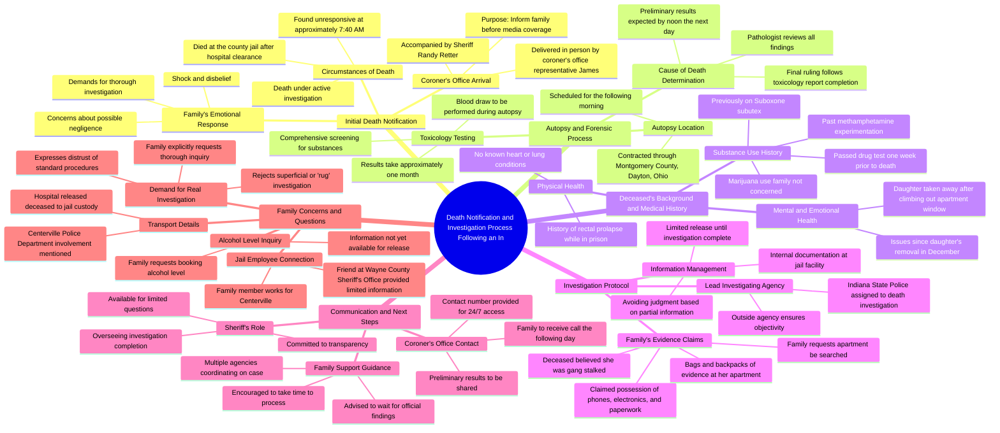

# Amanda Cole Hewitt Death Investigation Reopened by Mother

> 🌐 **Read this in:** **English** · [中文](../../zh-CN/2026-09/tiktok-transcript-2-6m-views-20k-reactions-exposedjusticeisstilljustice-it-s-b-a3c7.md)

> **Creator:** [@Kathy J Marcum](https://www.tiktok.com/@Kathy J Marcum) · **Views:** 1.2M · **Posted:** 2026-09-06 · **Niche:** other
>
> **TL;DR:** The blunt, devastating opening immediately grabs attention and sets a somber tone.

[Watch original video →](https://www.facebook.com/reel/2428768650862213/)

## Why This Went Viral

## Hook (first 3 seconds)
- **Verbatim opening line:** "She is gone. She did pass away and it is under investigation."
- **Hook pattern:** Bold claim + unresolved mystery. The speaker drops a death announcement with zero context, immediately followed by "under investigation," which signals wrongdoing or foul play.
- **Why it stops scroll:** The viewer is thrust into the middle of a real, raw, tragic moment. There's no intro, no setup — just a gut-punch statement. The ambiguity ("Who took her? Jail? Hospital?") creates instant cognitive dissonance that demands the viewer watch to piece together what happened.

## Emotional Rhythm
1. **Shock/Disbelief** — The mother repeats "I can't fucking believe it" and "It's unbelievable." The viewer is anchored in the mother's raw grief.
2. **Confusion/Frustration** — The mother asks basic logistical questions (who took her, where, alcohol level) and gets "I don't have that information." This builds tension and suspicion.
3. **Anger/Accusation** — "I want a fucking investigation. Not a rug one, a real one." The mother implies cover-up, which triggers the viewer's justice instinct.
4. **Paranoia/Conspiracy** — The mother reveals Amanda believed she was "gang stalked by police," had "bags of evidence," and was "going to the top." This introduces a narrative of systemic corruption.
5. **Resignation/Helplessness** — "My brain going in and out of neutral." The mother's emotional collapse humanizes her and deepens viewer empathy.
6. **Climax** — The mother asks, "Are you going to our apartment? Is somebody going to our apartment to look for stuff?" The sheriff deflects: "You four aren't currently involved in the actual investigation." This is the twist — the person in power is distancing himself from the evidence.
7. **Unresolved Tension** — The video ends without answers, leaving the viewer in the same state of anxious uncertainty as the mother.

## Keyword Density
- **"Investigation"** (10+ mentions) — Drives algorithmic reach via current-events/news adjacency; signals a developing story.
- **"Information"** (8+ mentions) — Repeated denial of info fuels the "cover-up" narrative and keeps viewers hooked.
- **"Evidence"** (5+ mentions) — Emotional pull; implies the mother has proof of wrongdoing, making viewers want to see it.
- **"Trust"** (4+ mentions) — The sheriff repeatedly says "you have to trust him," which ironically breeds distrust in the audience.
- **"Answers"** (5+ mentions) — The promise of future answers creates a "part 2" compulsion in viewers.
- **"Jail/Hospital"** (5+ mentions) — Geographic/contextual keywords that help the video surface in local and true-crime searches.
- **"Gang stalked"** (1 mention) — A niche, high-engagement true-crime term that triggers comment-section debate.

## Why It Spreads
- **Raw, unscripted grief is undeniably authentic.** The mother's "I just can't fucking believe it" and "My brain going in and out of neutral" are not performative. Viewers share content that feels real, not produced.
- **The power dynamic is visible on screen.** A sheriff in uniform stands over a grieving mother, repeating "I don't have that information" and "you have to trust us." This visual of institutional authority vs. vulnerable citizen is a universal emotional trigger.
- **The "evidence" thread creates a cliffhanger.** The mother says Amanda had "bags and backpacks of evidence" and was "gang stalked by police." The sheriff then says he's not investigating it. Viewers are left wanting the evidence revealed — they comment, tag others, and demand updates.
- **The twist lands at the end.** The mother's final question about the apartment is deflected. This is the moment the video becomes "shareable" — it confirms the viewer's suspicion that something is being hidden.
- **It fits the "systemic injustice" template.** Videos showing a grieving family member confronting officials about a suspicious death consistently outperform because they tap into pre-existing cultural distrust of institutions.

## What You Can Steal
- **Start mid-crisis, not at the beginning.** Drop the viewer into the most emotionally charged moment with zero context. The confusion is the hook. Let the backstory unfold naturally through dialogue.
- **Let the subject speak in fragments.** Don't edit out hesitation, repetition, or emotional breakdowns. "I just... It's unbelievable" is more powerful than any polished monologue. Authentic speech patterns signal truth.
- **End on an unanswered question.** The mother's final plea — "Is somebody going to our apartment?" — is never resolved. End your video at the moment of maximum tension, not resolution. This forces comments, shares, and "part 2" requests.

## Mind Map

## Full Transcript (Generated by [free TikTok transcript generator](https://toktranscript.com/?utm_source=github&utm_medium=breakdown&utm_campaign=tool_attribution))

> 📝 Transcripts on this page are auto-generated and show the first 60%. Want to transcribe any TikTok in 30 seconds and get the full version? [Try TokTranscript free →](https://toktranscript.com/?utm_source=github&utm_medium=breakdown&utm_campaign=transcript_cta)

She is gone. She did pass away and it is under investigation. Who took her to the jail? To the hospital? I don't have that information. I believe it was Centerville Police Department, but I don't have that information so I can't confirm that. Well, I can call Centerville. Because I work for Centerville. Okay. Indiana? Yep. Okay, good. the city employee. I found that out. Well, I'm just... It's gotta be shocking to hear. Considering, yeah. You have a seat. I mean, no one wants to get that news, this news. My name is James. I'm with the coroner's office. Um, so I just want to let you know a little bit of the next steps. Okay, we have our autopsies contracted through Montgomery County in Dayton, Ohio. So that's where we'll be going this morning. Okay, the autopsy will be performed first thing in the morning. And they'll call me tomorrow sometime probably around noon. Can't they do a blood draw like while she's dead? It's going to be accurate. It's going to show everything on there. We'll be doing that as well. We're going to do everything. Toxicology as well. All right. They'll call me tomorrow with some preliminary results. Just a little bit of information, not a lot. And then toxicology will be sent. toxicology can take a couple weeks to get back probably about a month to get back okay and then the autopsy will follow the toxicology report whenever the pathologist reviews everything and comes up with a ruling is their interpretation of a cause of death okay i'm very sorry i'm sorry we have to do this she knew somebody didn't kill her can you tell me a little bit about her medical history She's been fine. I mean she's had mental and emotional issues since her daughter got taken away. That was December. Meaning what kind of... Emotional issues? Yeah. Upset because her daughter got taken away for climbing out her goddamn window at her apartment. Any other medical issues like heart, lungs? No, nothing. A rectal prolapse one time while in prison. Okay. But yeah, nothing. Do you know if she had a drug history? Yeah, of course. Marijuana, she was on a sub-y tech for a while. She got off of it. She experimented with meth. And I just drug tested her a week ago. Passed it. Marijuana, I mean, hello? I don't have an issue with marijuana. That's natural weed. Anything man I have issues with Those are all drugs Those are my concern Please just Oh my God I certainly hated to have to deliver this news, but I felt it was important to tell you personally. And again, if there's anything that we can do to help you We're here for you. We want to stay in contact with you as best we can and help you through this process. Kathy, what's a good phone number we can reach you at? 765-277-2323. So you'll probably get a call from me sometime tomorrow, probably early afternoon. Do what? Huh? Do what? You'll probably get a phone call from me sometime tomorrow, early to mid-afternoon, with some updates on what we have, okay? There won't be answers. I want a fucking investigation. Oh, we are. No, I mean, not a rug one, a real one. No, the Indiana State Police is doing the investigation on Amanda's death. Thank you. Okay. She said she's got evidence, lots of evidence. She's got phones, she's got electronic equipment, she's gathered paperwork. She believed she was gang stalked by police and other people. I don't understand it. She was definitely doing stuff. She said she was going to the top for their evidence. Does anybody know anything about this? Nobody? Nobody? She's got bags of evidence at her apartment. And her apartment is horrible shape right now. She had five dogs and she's lost her power. like I said the Indiana State Police and the coroner's office are doing an investigation we're documenting it obviously internally as well at our facility did she die at the hospital? no she died at our jail after she got checked out at the hospital? correct what was her alcohol level? I don't have that information Why not? That's usually the first thing they have when they book somebody in. At this point, we're not going to be able to release a lot of information anyway, and I'm not going to release any information until it's complete, because as you know, I do. until we know all of the aspects of the investigation it wouldn be proper to make judgment on little bits of information So it important for us to get this thoroughly investigated And I'm having it investigated by an outside agency. She said she's got bags and backpacks of evidence in her apartment. Please do something. I think when you get things like this, you want answers. So everyone does. But I think you have to just happen this morning. And I can tell you what time? What time to pass away? We don't have an exact time of death. She was she was found unresponsive at approximately 740 a.m. So the sheriff wanted to let you know as mother as soon as he could. So there's a lot of answers that you want right now that we'd all want. We'd all want if we have it. You just have to trust him. I know it's a hard thing in our world today. You have to trust the sheriff's here on his own willingness to come and you this. There's nothing to hide. He's going to do everything he can to give you an answer what he can. You've got to give him the seconds to do that. It's hard. No one ever wants to hear. We don't want to stand here. I just can't fucking believe it. I just, I.

*[Read the full transcript on TokTranscript →](https://toktranscript.com/plaza/tiktok-transcript-2-6m-views-20k-reactions-exposedjusticeisstilljustice-it-s-b-a3c7?utm_source=github&utm_medium=breakdown&utm_campaign=transcript_full)*

## Browse More

- All [other](../../by-niche/en/other.md) breakdowns
- All [Shocking Revelation](../../by-pattern/en/hook-shocking-revelation.md) examples

## Video Info

| | |
|---|---|
| Creator | [@Kathy J Marcum](https://www.tiktok.com/@Kathy J Marcum) |
| Original video | [https://www.facebook.com/reel/2428768650862213/](https://www.facebook.com/reel/2428768650862213/) |
| Original title | 2.6M views · 20K reactions | #ExposedJusticeIsStillJustice It's been 11 (eleven) whole months. Amanda Cole Hewitt died in the Wayne county jail in Richmond, Indiana.09/27/25 I've reopened the investigation myself and have been sharing the EVIDENCE since my daughter died. Amanda Cole Hewitt had No STREET DRUGS IN HER SYSTEM. SHE DIED IN HER CELL UNDER 8 HOURS AFTER BOOKING. Everyone is looking up at my husband. The drug usage was 2020. She wasn't even smoking weed. Removing pharmaceuticals. One left. Only one. The cps case was fake and dropped. Lots more to expose. I hope this helps with all the questions going forward. The day Sheriff Ritter showed up with coroner Jones. Just wanted to let you know. Amanda Cole Hewitt is dead. We're going to do a GREAT JOB. The first four minutes are missing because I was in shock. Woke up my husband Bill Marcum and came back outside to this.. | Kathy J Marcum |
| Views | 1.2M (1167024) |
| Posted | 2026-09-06 |
| Duration | 0s |
| Niche | `other` |
| Hook pattern | `Shocking Revelation` |
| Original language | `en` |
| Available languages | en, zh-CN |
| Generated | 2026-09-07 by [TokTranscript](https://toktranscript.com/) |

---

*This breakdown is for educational analysis under fair use. Original video © [@Kathy J Marcum](https://www.tiktok.com/@Kathy J Marcum). All transcripts are auto-generated and may contain errors.*

*Want to analyze your own TikToks like this? [TokTranscript →](https://toktranscript.com/viral-breakdown?utm_source=github&utm_medium=breakdown&utm_campaign=footer_cta)*