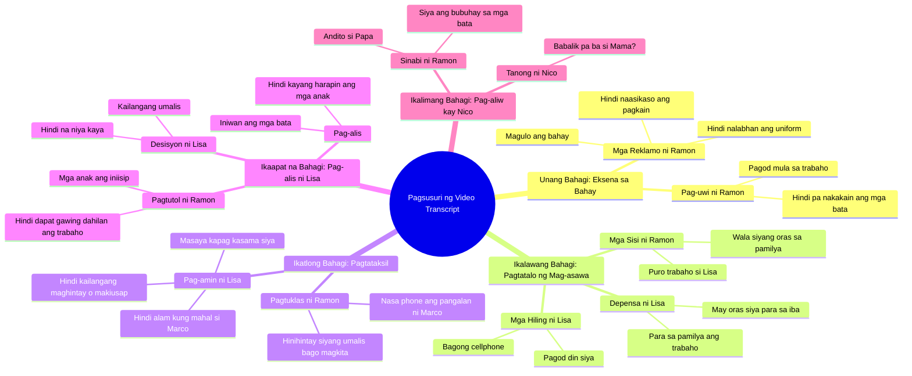

# Filipino Father's Silent Sacrifice Family Drama Part 1

> 🌐 **Read this in:** **English** · [中文](../../zh-CN/2026-09/tiktok-transcript-2-7m-views-81k-reactions-tahimik-na-pasanin-part-1-isang-ama-7d7d.md)

> **Creator:** [@Tagalog Real Talks](https://www.tiktok.com/@Tagalog Real Talks) · **Views:** 1.4M · **Posted:** 2026-09-10 · **Niche:** entertainment
>
> **TL;DR:** Opens with a common family concern that immediately draws viewers into the domestic tension.

[Watch original video →](https://www.facebook.com/share/v/19N359PLce/)

## Why This Went Viral

## Hook (first 3 seconds)
- **Verbatim line:** "Have the kids eaten? I don't know. Not yet, sir. I'm hungry."
- **Type of hook pattern:** **Scene + contrast** — immediately shows a chaotic family situation (hungry kids, tired parent) with tension inside the house.
- **Why it stops the scroll:** The tone sounds like a normal household conversation but with obvious tension — like you're listening to a family fight. The natural dialogue and relatable problems (fatigue, hunger, work) are familiar to many Filipinos, so curiosity is immediately hooked: "What's happening with this family?"

## Emotional Rhythm
- **Curiosity** → "Have the kids eaten?" — immediately introduces the family situation, like you're listening to real life.
- **Tension** → Tension gradually rises: "You didn't wash my uniform?" → "The kids' food, you didn't take care of it" → "Who is Marco?" — this is where jealousy and conflict enter.
- **Suspense** → "Do you love Marco?" — the heaviest question, the viewer waits for the answer.
- **Resonance** → "I don't have to wait. I don't have to beg to be noticed." — extremely relatable for people who feel neglected.
- **Twist** → "I can't do this anymore. I need to leave for a while." — Lisa's sudden decision to leave, even with children.
- **Climax** → "Even the kids? No. Lisa! They're your children!" — this is where emotions explode, the mother's departure and the children's crying.
- **Relief / Resolution** → "It's okay, child, Papa is here. If she doesn't want us anymore, I'll be the one to support you." — there's comfort even though it hurts.
- **Final hook** → "Will Mama come back?" — leaves a question that stirs emotions and makes viewers think.

## Keyword Density
- **Strongest words / phrases:**
  1. **Tired** — emotional foundation of the fight
  2. **Work** — reason for neglect and conflict
  3. **Kids / children** — center of moral weight
  4. **Not / don't** — repeated negation, intensifies tension
  5. **Love** — carries emotional weight
  6. **Leave / leaving** — drives the plot
  7. **Pa / Papa / Mama** — familiar terms, intensifies emotion
  8. **Food / hungry** — symbol of neglect
  9. **Sorry** — final emotional punch
  10. **Come back** — leaves a question

- **Algorithmic reach vs. emotional pull:**
  - **Algorithmic:** "tired," "work," "family," "child" — frequently searched and shared by Filipinos, so the algorithm distributes it faster.
  - **Emotional pull:** "love," "sorry," "come back," "leave" — makes people cry and share, resulting in higher engagement (comments, shares, saves).

## Why It Spreads
- **Relatable family fight:** The line "I'm tired. I'm tired too." is exactly what many Filipino couples say — so viewers immediately connect.
- **Moral dilemma:** "Do you love Marco?" and "Even the kids? No." — forces viewers to pick a side, resulting in many comments and shares.
- **Emotional climax:** "Lisa! They're your children!" — an extremely heavy scene that makes people cry, so it gets replayed and shared.
- **Open-ended ending:** "Will Mama come back?" — leaves a question that makes people think and encourages discussion in the comments.
- **Authentic dialogue:** The conversation is natural, like real life — not scripted, so it's easier to believe and share.

## What You Can Steal
1. **Use a relatable household situation** — start the video with a normal conversation mixed with tension, so viewers immediately recognize themselves.
2. **Ask a question with no answer** — leave the audience with an open-ended question at the end (like "Will Mama come back?") to force them to comment and share.
3. **Use "tired" and "work" as emotional anchors** — these words are familiar to everyone, so there's a bigger chance the video gets shared and saved.

## Mind Map

## Full Transcript (Generated by [the tool we used to generate this](https://toktranscript.com/?utm_source=github&utm_medium=breakdown&utm_campaign=tool_attribution))

> 📝 Transcripts on this page are auto-generated and show the first 60%. Want to transcribe any TikTok in 30 seconds and get the full version? [Try TokTranscript free →](https://toktranscript.com/?utm_source=github&utm_medium=breakdown&utm_campaign=transcript_cta)

Nakakain na ba mga bata? Ewan ko. Hindi pa po pa. Gutom na ako. Liza, alas seis na. Ano ba Ramon? Pagod ako. Kakauwi ko lang galing site. E di ikaw muna. Ako na dyan, Nico. Hindi mo na labahan uniform ko? Kailangan ko yan bukas. E di labhan mo. Mika! Ang kalat-kalat dito! Linisin mo yan! Salamat po, pa. Ramon, bilan mo nga ako ng bagong cellphone. Pagkain ng mga bata, hindi mo naasikaso. Uniform ko, hindi mo nilabhan. Pati bahay. Sabi ko nga, pagod ako. Pagod din ako. Ramon! Nasaan phone ko? Sino si Marco? Kaibigan ko. Kaibigan? Bakit hinihintay niyang umalis ako bago kayo magkita? Kasi kailan ka ba nandito? Puro trabaho ka. Pag uwi mo, pagod. Kinaumagahan, trabaho na naman. Para kanino ba yung trabaho ko Alam ko Pero pagdating ko rito gutom ang mga bata Hindi na luto ang pagkain Hindi na labahan damit ko Pero siya may oras ka? Pa? Anak, sa kwarto muna kayo. Nika, isama mo muna si Enzo. Mahal mo ba si Marco? Hindi ko alam. 

*[Read the full transcript on TokTranscript →](https://toktranscript.com/plaza/tiktok-transcript-2-7m-views-81k-reactions-tahimik-na-pasanin-part-1-isang-ama-7d7d?utm_source=github&utm_medium=breakdown&utm_campaign=transcript_full)*

## Browse More

- All [entertainment](../../by-niche/en/entertainment.md) breakdowns
- All [Relatable Question Hook](../../by-pattern/en/hook-relatable-question-hook.md) examples

## Video Info

| | |
|---|---|
| Creator | [@Tagalog Real Talks](https://www.tiktok.com/@Tagalog Real Talks) |
| Original video | [https://www.facebook.com/share/v/19N359PLce/](https://www.facebook.com/share/v/19N359PLce/) |
| Original title | 2.7M views · 81K reactions | Tahimik na Pasanin Part 1 Isang ama ang tahimik na bumubuhat sa bigat ng pamilya—hanggang sa isang gabi, mabunyag ang katotohanang tuluyang sisira sa tahanang pinoprotektahan niya. #tagalogstory #DramaSeries #PinoyDrama | Tagalog Real Talks |
| Views | 1.4M (1392321) |
| Posted | 2026-09-10 |
| Duration | 0s |
| Niche | `entertainment` |
| Hook pattern | `Relatable Question Hook` |
| Original language | `tl` (this page translated by AI) |
| Available languages | en, zh-CN |
| Generated | 2026-09-11 by [TokTranscript](https://toktranscript.com/) |

---

*This breakdown is for educational analysis under fair use. Original video © [@Tagalog Real Talks](https://www.tiktok.com/@Tagalog Real Talks). All transcripts are auto-generated and may contain errors.*

*Want to analyze your own TikToks like this? [try this transcription tool →](https://toktranscript.com/viral-breakdown?utm_source=github&utm_medium=breakdown&utm_campaign=footer_cta)*