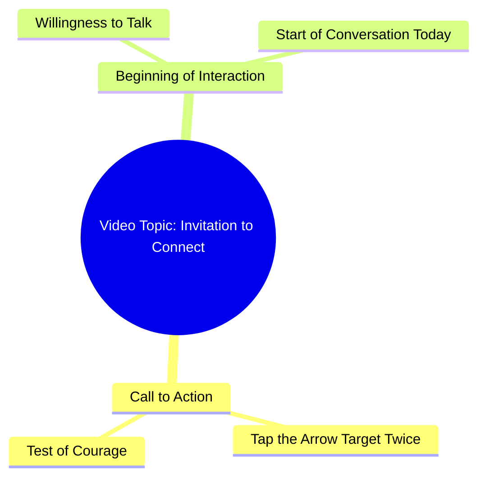

# Touch the Arrow Target Twice If You Dare

> 🌐 **Read this in:** **English** · [中文](../../zh-CN/2026-09/tiktok-transcript-2-8m-views-42k-reactions-03045658504-81ab.md)

> **Creator:** [@03045658504](https://www.tiktok.com/@03045658504) · **Views:** 1.0M · **Posted:** 2026-09-26 · **Niche:** other
>
> **TL;DR:** Directly challenges the viewer's courage, compelling them to engage.

[Watch original video →](https://www.facebook.com/reel/2105355380187493/?app=fbl)

## Why This Went Viral

## Hook (first 3 seconds)
- **Verbatim opening line:** "क्या आप हिम्मत करेंगे?" (Will you dare?) followed immediately by "इस तीर वाले निसान पर दो बार टच करके देखो" (Touch this arrow symbol twice and see).
- **Hook pattern:** Direct challenge/question + physical micro-commitment (a "dare" hook fused with a ritual action cue).
- **Why it stops the scroll:** It converts a passive viewer into a participant within one second. The word "हिम्मत" (courage/dare) triggers ego and curiosity simultaneously, and the instruction to *touch the screen* creates an involuntary micro-action that halts the thumb and boosts engagement signals (taps, replays) the algorithm reads as interest.

## Emotional Rhythm
- **Beat 1 — Curiosity/Challenge (0–2s):** "क्या आप हिम्मत करेंगे?" opens a loop: *dare for what?*
- **Beat 2 — Instruction/Tension (2–5s):** The touch-the-arrow command creates mild suspense — the viewer waits to see what happens or what it means.
- **Beat 3 — Intimacy/Resonance (5–10s):** "अगर आप सच में मुझसे बात करना चाहते हैं" pivots from dare to emotional invitation — flips a game into a personal connection.
- **Beat 4 — Promise/Climax (final line):** "सायद आज से हमारी बातचीत की सुरुआत हो जाए" — the climax is the *promise of a beginning*, an open-ended emotional payoff rather than a reveal.
- **Climax moment:** The final sentence, where the dare resolves into a soft, almost romantic invitation — this is where the emotional hook lands hardest and drives comments/replies.

## Keyword Density
- **हिम्मत** (courage/dare) — ego trigger, drives stop-rate.
- **टच** (touch) — action verb, drives engagement mechanics.
- **तीर / निसान** (arrow / target) — visual anchor, drives curiosity and comment questions ("what does it mean?").
- **सच में** (really/truly) — authenticity signal, emotional pull.
- **बात करना / बातचीत** (talk / conversation) — relational keyword, drives DMs and comments.
- **आज से** (from today) — urgency/newness, drives shares.
- **सुरुआत** (beginning) — narrative promise, emotional pull.
- **Algorithmic drivers:** टच, हिम्मत, निसान (action + challenge words boost watch-through and re-taps).
- **Emotional drivers:** सच में, बातचीत, सुरुआत (build parasocial intimacy, drive saves and replies).

## Why It Spreads
- **Forces a physical interaction:** "दो बार टच करके देखो" makes viewers tap the screen — taps and replays are strong ranking signals, so the video gets pushed further.
- **Dare + reward loop:** "क्या आप हिम्मत करेंगे?" sets up a challenge; viewers stay to see if there's a payoff, inflating average watch time.
- **Parasocial intimacy bait:** "अगर आप सच में मुझसे बात करना चाहते हैं" makes each viewer feel personally addressed, triggering comments like "मैंने टच किया" and DMs.
- **Open-ended mystery:** The arrow/target (तीर वाला निसान) is never explained, so comment sections fill with interpretations — comment volume feeds the algorithm.
- **Shareable emotional promise:** "आज से हमारी बातचीत की सुरुआत हो जाए" gives viewers a reason to tag or send it to someone as a "sign," driving shares.

## What You Can Steal
- **Open with a dare or a direct question** that forces a micro-action ("touch twice," "comment your answer") — physical engagement beats passive viewing.
- **Flip the tone mid-video:** start with a challenge, end with intimacy or a promise. The tonal pivot is what makes viewers rewatch and reply.
- **Leave one element unexplained** (the arrow, the sign, the number) so the comment section becomes the real content engine — ambiguity is a share multiplier.

## Mind Map

## Full Transcript (Generated by [TokTranscript](https://toktranscript.com/?utm_source=github&utm_medium=breakdown&utm_campaign=tool_attribution))

> 📝 Transcripts on this page are auto-generated and show the first 60%. Want to transcribe any TikTok in 30 seconds and get the full version? [Try TokTranscript free →](https://toktranscript.com/?utm_source=github&utm_medium=breakdown&utm_campaign=transcript_cta)

क्या आप हिम्मत करेंगे? इस तीर वाले निसान पर दो बार टच करके देखो.

*[Read the full transcript on TokTranscript →](https://toktranscript.com/plaza/tiktok-transcript-2-8m-views-42k-reactions-03045658504-81ab?utm_source=github&utm_medium=breakdown&utm_campaign=transcript_full)*

## Browse More

- All [other](../../by-niche/en/other.md) breakdowns
- All [Challenge/Question Hook](../../by-pattern/en/hook-challenge-question-hook.md) examples

## Video Info

| | |
|---|---|
| Creator | [@03045658504](https://www.tiktok.com/@03045658504) |
| Original video | [https://www.facebook.com/reel/2105355380187493/?app=fbl](https://www.facebook.com/reel/2105355380187493/?app=fbl) |
| Original title | 2.8M views · 42K reactions | کیا آپ ہمت کریں گے | 03045658504 |
| Views | 1.0M (1037542) |
| Posted | 2026-09-26 |
| Duration | 0s |
| Niche | `other` |
| Hook pattern | `Challenge/Question Hook` |
| Original language | `en` |
| Available languages | en, zh-CN |
| Generated | 2026-09-27 by [TokTranscript](https://toktranscript.com/) |

---

*This breakdown is for educational analysis under fair use. Original video © [@03045658504](https://www.tiktok.com/@03045658504). All transcripts are auto-generated and may contain errors.*

*Want to analyze your own TikToks like this? [TokTranscript →](https://toktranscript.com/viral-breakdown?utm_source=github&utm_medium=breakdown&utm_campaign=footer_cta)*