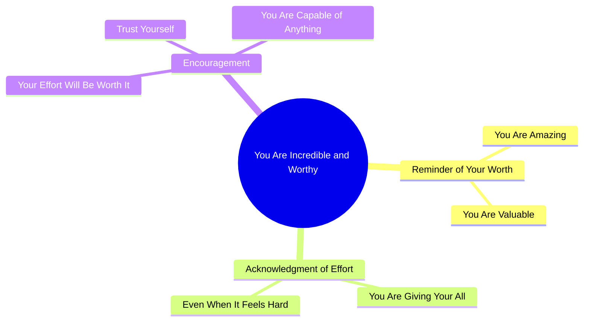

# Motivational Spanish Message About Self-Worth and Effort

> 🌐 **Read this in:** **English** · [中文](../../zh-CN/2026-09/tiktok-transcript-22k-views-148k-reactions-tinitov-0716.md)

> **Creator:** [@TinitoV](https://www.tiktok.com/@TinitoV) · **Views:** 2.6M · **Posted:** 2026-09-16 · **Niche:** entertainment
>
> **TL;DR:** Immediately validates the viewer with a positive affirmation, creating an instant emotional connection.

[Watch original video →](https://www.facebook.com/share/v/1DNGeVXYmQ/)

## Why This Went Viral

## Hook (first 3 seconds)
- **Verbatim opening line:** "Solo quería recordarte lo increíble que eres y lo mucho que vales." ("I just wanted to remind you how incredible you are and how much you're worth.")
- **Hook pattern:** Direct second-person affirmation / emotional validation (a "you are enough" hook).
- **Why it stops the scroll:** It addresses the viewer personally ("recordarte," "eres") within the first second, triggering an instant self-referential reflex — the brain treats "you" as a cue to pay attention. It promises a mood lift with zero friction, so viewers stay to receive the emotional payoff rather than a piece of information.

## Emotional Rhythm
- **Beat 1 — Recognition (0–2s):** "lo increíble que eres" → instant warmth, viewer feels seen.
- **Beat 2 — Empathy/tension (3–6s):** "Sé que le estás echando todas las ganas… aunque parezca difícil" → acknowledges struggle, creates a small tension spike by naming the viewer's hidden effort.
- **Beat 3 — Relief/promise (7–9s):** "todo ese esfuerzo va a valer la pena" → resolves the tension with hope.
- **Beat 4 — Empowerment climax (10–13s):** "Confía en ti. Eres capaz de todo." → the emotional peak; short, punchy imperatives land as the release.
- **Climax moment:** The final two sentences ("Confía en ti. Eres capaz de todo.") — the shortest lines carry the highest emotional charge and are the most quotable/screenshot-able.

## Keyword Density
- **Strongest repeated words/phrases:**
  1. "eres" / "eres capaz" (you are / you are capable)
  2. "todo" (everything — "todo ese esfuerzo," "capaz de todo")
  3. "lo mucho que vales" (how much you're worth)
  4. "esfuerzo" / "ganas" (effort / willpower)
  5. "Confía en ti" (trust yourself)
  6. "difícil" (difficult)
  7. "valer la pena" (worth it)
  8. "recordarte" (remind you)
- **Algorithmic reach vs. emotional pull:**
  - *Reach drivers:* "confía en ti," "eres capaz," "vales" — high-search, high-save motivational keywords that push the video into self-help / motivational feeds and boost shares.
  - *Emotional pull:* "esfuerzo," "ganas," "difícil" — these name the viewer's private struggle and create the intimacy that converts a passive scroll into a save or a share to a friend.

## Why It Spreads
- **Universal second-person address:** Every line uses "tú/ti" ("recordarte," "Confía en ti"), so each viewer feels individually targeted — the core mechanic of shareable affirmation content.
- **Validation of unseen effort:** "Sé que le estás echando todas las ganas" rewards the viewer for invisible labor, which is exactly the emotion people forward to friends who are struggling.
- **Low cognitive load, high emotional density:** The whole script is ~40 words with no story or context — it's pure feeling, making it instantly consumable and re-watchable.
- **Quotable closing lines:** "Confía en ti. Eres capaz de todo." functions as a standalone caption/screenshot, driving saves and reposts as a text post or story.
- **Share-as-care trigger:** The message is framed as a gift ("Solo quería recordarte"), so sharing it feels like doing something kind for someone else — a built-in distribution motive.

## What You Can Steal
1. **Open with "Solo quería recordarte…" or an equivalent gift-frame.** Framing your message as something you're giving the viewer (not teaching them) lowers defenses and increases watch time.
2. **Name the struggle before the payoff.** Insert one line that acknowledges the viewer's effort ("Sé que le estás echando todas las ganas") before delivering hope — tension then relief is what makes the ending land.
3. **End on two ultra-short imperatives.** Close with a punchy, screenshot-able pair like "Confía en ti. Eres capaz de todo." Short final lines get saved, quoted, and shared more than long ones.

## Mind Map

## Full Transcript (Generated by [TokTranscript.com](https://toktranscript.com/?utm_source=github&utm_medium=breakdown&utm_campaign=tool_attribution))

> 📝 Transcripts on this page are auto-generated and show the first 60%. Want to transcribe any TikTok in 30 seconds and get the full version? [Try TokTranscript free →](https://toktranscript.com/?utm_source=github&utm_medium=breakdown&utm_campaign=transcript_cta)

Solo quería recordarte lo increíble que eres y lo mucho que vales.

*[Read the full transcript on TokTranscript →](https://toktranscript.com/plaza/tiktok-transcript-22k-views-148k-reactions-tinitov-0716?utm_source=github&utm_medium=breakdown&utm_campaign=transcript_full)*

## Browse More

- All [entertainment](../../by-niche/en/entertainment.md) breakdowns
- All [Direct compliment](../../by-pattern/en/hook-direct-compliment.md) examples

## Video Info

| | |
|---|---|
| Creator | [@TinitoV](https://www.tiktok.com/@TinitoV) |
| Original video | [https://www.facebook.com/share/v/1DNGeVXYmQ/](https://www.facebook.com/share/v/1DNGeVXYmQ/) |
| Original title | 22K views · 148K reactions | 🖤✨ | TinitoV |
| Views | 2.6M (2603027) |
| Posted | 2026-09-16 |
| Duration | 0s |
| Niche | `entertainment` |
| Hook pattern | `Direct compliment` |
| Original language | `en` |
| Available languages | en, zh-CN |
| Generated | 2026-09-17 by [TokTranscript](https://toktranscript.com/) |

---

*This breakdown is for educational analysis under fair use. Original video © [@TinitoV](https://www.tiktok.com/@TinitoV). All transcripts are auto-generated and may contain errors.*

*Want to analyze your own TikToks like this? [free TikTok transcript generator →](https://toktranscript.com/viral-breakdown?utm_source=github&utm_medium=breakdown&utm_campaign=footer_cta)*