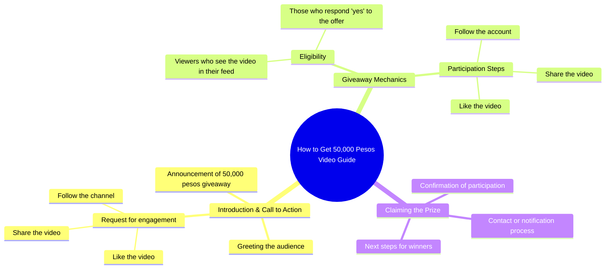

# Comment Now Boss, You Might Be Next! Win 50,000 Pesos

> 🌐 **Read this in:** **English** · [中文](../../zh-CN/2026-09/tiktok-transcript-339k-views-15k-reactions-comment-nyo-na-mga-boss-baka-sa-iny-126b.md)

> **Creator:** [@ꓮꓡawi familly](https://www.tiktok.com/@ꓮꓡawi familly) · **Views:** 146.1K · **Posted:** 2026-09-07 · **Niche:** other
>
> **TL;DR:** The hook instantly makes viewers feel special and lucky, creating immediate personal relevance.

[Watch original video →](https://www.facebook.com/share/r/1ETpA5vTL4/)

## Why This Went Viral

## Hook (first 3 seconds)
- **Verbatim opening line:** "Hello sa inyong lahat! Kung lumabas ang video na ito sa iyong feed, swerte ka!"
- **Hook pattern:** Bold claim + direct address + flattery/fortune-telling
- **Why it stops scroll:** It instantly flatters the viewer ("swerte ka") and implies a reward for mere presence. It doesn't ask for attention—it grants luck. That psychological jolt of "I'm special/lucky" halts the thumb.

## Emotional Rhythm
1. **Curiosity + Flattery** ("swerte ka") — Viewer feels singled out and lucky.
2. **Greed/Anticipation** ("gusto mong makakuha ng 50,000 pesos") — Concrete reward dangles, spiking desire.
3. **Urgency/Anxiety** ("Huwag kalimutang i-follow, i-like at i-share") — Fear of missing out on the reward if they don't act now.
4. **Compliance/Commitment** — The viewer's brain enters a transactional state: "I did the action, now where's my money?"
- **Climax:** The moment "50,000 pesos" is spoken — the entire video pivots on that number.
- **No twist, no relief** — the tension is maintained by the unfulfilled promise, which compels comments ("Yes!") to keep the loop alive.

## Keyword Density
- **"swerte ka"** (lucky) — emotional pull; makes the viewer feel chosen.
- **"50,000 pesos"** — algorithmic reach driver (high-value number, searchable, shareable).
- **"gusto"** (want) — emotional pull; triggers desire.
- **"i-follow, i-like, i-share"** — algorithmic reach driver; explicit engagement commands.
- **"video na ito"** (this video) — algorithmic driver; creates a self-referential loop that boosts watch time and shares.
- **"Hello sa inyong lahat"** — emotional pull; creates a community/familiar tone.

## Why It Spreads
- **The "You're the chosen one" frame** — "swerte ka" makes viewers feel exceptional, so they comment "Yes" to claim the luck, boosting engagement signals.
- **The explicit reward bribe** — "50,000 pesos" is a concrete, high-stakes number that triggers a Pavlovian response; viewers share it to friends who "need luck," multiplying reach.
- **The engagement loop disguised as a condition** — "i-follow, i-like, i-share" is not a request but a requirement to qualify for the money. This converts passive viewers into active promoters.
- **The open-ended promise** — no mechanism, no date, no name. The vagueness keeps the comment section alive with "Ako po!" and "Paano?" which further feeds the algorithm.
- **The language specificity** — Tagalog/Filipino targeting a high-engagement demographic where "giveaway" culture thrives; the video feels native and personal, not spammy.

## What You Can Steal
- **Lead with a "luck bomb," not a pitch** — Start by telling the viewer they're lucky to see this. It flips the dynamic from "watch me" to "this is for you."
- **Make engagement a qualification, not a request** — Instead of "please like," say "to get X, you must like." This converts soft asks into hard conditions that spike compliance.
- **Use a concrete, round reward number early** — "50,000 pesos" is specific enough to feel real but round enough to be memorable. Drop it within the first 5 seconds to anchor the entire video's value.

## Mind Map

## Full Transcript (Generated by [free TikTok transcript generator](https://toktranscript.com/?utm_source=github&utm_medium=breakdown&utm_campaign=tool_attribution))

> 📝 Transcripts on this page are auto-generated and show the first 60%. Want to transcribe any TikTok in 30 seconds and get the full version? [Try TokTranscript free →](https://toktranscript.com/?utm_source=github&utm_medium=breakdown&utm_campaign=transcript_cta)

Hello sa inyong lahat! Kung lumabas ang video na ito sa iyong feed, swerte ka!

*[Read the full transcript on TokTranscript →](https://toktranscript.com/plaza/tiktok-transcript-339k-views-15k-reactions-comment-nyo-na-mga-boss-baka-sa-iny-126b?utm_source=github&utm_medium=breakdown&utm_campaign=transcript_full)*

## Browse More

- All [other](../../by-niche/en/other.md) breakdowns
- All [Direct Address + Luck/Exclusivity](../../by-pattern/en/hook-direct-address-luck-exclusivity.md) examples

## Video Info

| | |
|---|---|
| Creator | [@ꓮꓡawi familly](https://www.tiktok.com/@ꓮꓡawi familly) |
| Original video | [https://www.facebook.com/share/r/1ETpA5vTL4/](https://www.facebook.com/share/r/1ETpA5vTL4/) |
| Original title | 339K views · 15K reactions | Comment nyo na mga boss baka sa inyo na sunod! 😱🥳 #ivanaalawi #monaalawi #ivanaalawireall #laptopwarehouse #lapag #dailyvlog #laptop #bossa #BossA #Pamorma #CrisHippers #Kuyamoboss #fistbump #TisayShin #filipina #iphone #pera | ꓮꓡawi familly |
| Views | 146.1K (146076) |
| Posted | 2026-09-07 |
| Duration | 0s |
| Niche | `other` |
| Hook pattern | `Direct Address + Luck/Exclusivity` |
| Original language | `en` |
| Available languages | en, zh-CN |
| Generated | 2026-09-08 by [TokTranscript](https://toktranscript.com/) |

---

*This breakdown is for educational analysis under fair use. Original video © [@ꓮꓡawi familly](https://www.tiktok.com/@ꓮꓡawi familly). All transcripts are auto-generated and may contain errors.*

*Want to analyze your own TikToks like this? [TokTranscript →](https://toktranscript.com/viral-breakdown?utm_source=github&utm_medium=breakdown&utm_campaign=footer_cta)*