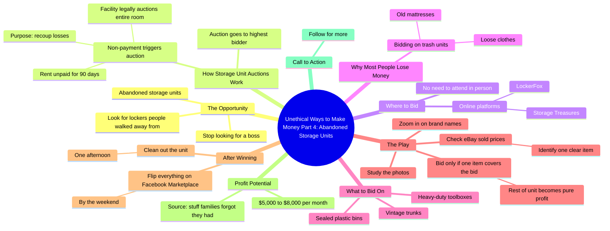

# Abandoned Storage Unit Auctions: Real Profit

> 🌐 **Read this in:** **English** · [中文](../../zh-CN/2026-09/tiktok-transcript-392k-views-11k-reactions-everyone-watches-those-storage-show-d8ff.md)

> **Creator:** [@Secret Money](https://www.tiktok.com/@Secret Money) · **Views:** 195.1K · **Posted:** 2026-09-27 · **Niche:** finance
>
> **TL;DR:** The word 'unethical' combined with profanity creates immediate intrigue and promises forbidden knowledge, while 'part four' implies a proven series.

[Watch original video →](https://www.facebook.com/share/r/1BcjGSaTpY/)

## Why This Went Viral

## Hook (first 3 seconds)
- **Verbatim opening line:** "Unethical ways to make fucking money, part four."
- **Hook pattern:** Bold claim + forbidden-fruit framing + numbered series ("part four").
- **Why it stops the scroll:** "Unethical" creates a curiosity gap and a mild moral transgression the viewer wants to witness. "Fucking money" spikes emotional intensity. "Part four" signals an established, bingeable series — viewers assume it's proven and feel FOMO for missing parts 1–3.

## Emotional Rhythm
- **Curiosity (0–3s):** "Unethical ways to make money" — what's the trick?
- **Reframe / tension (3–8s):** "Stop looking for a boss and start looking for the lockers people literally walked away from." Us-vs-them energy; positions the viewer as the insider.
- **Authority / relief (8–15s):** "legally required to auction… just to recoup their losses" — legitimizes the scheme, removes risk anxiety.
- **Problem → tension (15–22s):** "Most people lose money because they bid on trash units…" — creates a villain (the naive bidder) and stakes.
- **Climax (22–30s):** "Here is the play." — the reveal. The step-by-step method (zoom in, check eBay sold price, one item covers the bid) is the payoff moment.
- **Reward / proof (30–40s):** "$5,000 to $8,000 a month" — concrete number lands as the emotional high.
- **CTA (final line):** "Follow for more." — converts the dopamine hit into a follow.

**Climax moment:** "Here is the play. Look at the photos. Zoom in on the brand names…" — the moment the promise converts into a replicable tactic.

## Keyword Density
- **Strongest repeated words/phrases:**
  1. "money" / "make money"
  2. "storage units" / "abandoned storage units"
  3. "auction" / "bid" / "highest bidder"
  4. "unethical"
  5. "flip" / "flip everything"
  6. "profit" / "pure profit"
  7. "eBay" / "Facebook Marketplace"
  8. "$5,000 to $8,000 a month"
  9. "part four"
  10. "Follow for more"

- **Algorithmic reach drivers:** "money," "storage units," "auction," "eBay," "Facebook Marketplace" — high-search, high-interest commerce keywords that match what the algorithm already knows performs.
- **Emotional pull drivers:** "unethical," "fucking money," "$5,000 to $8,000 a month," "families forgot they had" — these create desire, taboo, and nostalgia in one pass.

## Why It Spreads
- **Forbidden-knowledge framing.** "Unethical ways to make fucking money" promises information most people wouldn't say out loud — viewers share it as a flex ("look what I found").
- **Series mechanics.** "Part four" implies a proven franchise; viewers binge backwards and follow forward, which drives session time and follow-through.
- **Concrete, replicable steps.** "Zoom in on the brand names and check the sold price on eBay" gives an actionable play — saves and shares spike because the video is *useful*, not just entertaining.
- **Numbers as proof.** "$5,000 to $8,000 a month" and "90 days" give the claim credibility; specific numbers are more shareable than vague ones.
- **Built-in villain + hero.** "Most people lose money… You only bid on units that have sealed plastic bins" — the viewer is cast as the smart insider, which triggers identity-based sharing.

## What You Can Steal
1. **Open with a forbidden or counterintuitive frame.** Words like "unethical," "nobody talks about," or "they don't want you to know" create an instant curiosity gap that outperforms neutral intros.
2. **Build a numbered series.** "Part four" turns one video into a bingeable franchise and gives viewers a reason to follow, not just like.
3. **Give one identifiable, replicable step.** The "zoom in on brand names → check eBay sold price" move is the shareable unit. End with a single tactic a viewer can execute today, not a vague promise.

## Mind Map

## Full Transcript (Generated by [try this transcription tool](https://toktranscript.com/?utm_source=github&utm_medium=breakdown&utm_campaign=tool_attribution))

> 📝 Transcripts on this page are auto-generated and show the first 60%. Want to transcribe any TikTok in 30 seconds and get the full version? [Try TokTranscript free →](https://toktranscript.com/?utm_source=github&utm_medium=breakdown&utm_campaign=transcript_cta)

Unethical ways to make fucking money, part four. Stop looking for a boss and start looking for the lockers people literally walked away from. I am talking about abandoned storage units. When someone stops paying their rent for 90 days, the facility is legally required to auction off the entire room to the highest bidder just to recoup their losses. You do not have to show up in person like a reality TV show. You go to sites like Storage Treasures or LockerFox. Most people lose money because they bid on trash units full of loose clothes and old mattresses. You only bid on units that have sealed plastic bins, vintage trunks, or heavy-duty toolboxes.

*[Read the full transcript on TokTranscript →](https://toktranscript.com/plaza/tiktok-transcript-392k-views-11k-reactions-everyone-watches-those-storage-show-d8ff?utm_source=github&utm_medium=breakdown&utm_campaign=transcript_full)*

## Browse More

- All [finance](../../by-niche/en/finance.md) breakdowns
- All [Controversial Curiosity Hook](../../by-pattern/en/hook-controversial-curiosity-hook.md) examples

## Video Info

| | |
|---|---|
| Creator | [@Secret Money](https://www.tiktok.com/@Secret Money) |
| Original video | [https://www.facebook.com/share/r/1BcjGSaTpY/](https://www.facebook.com/share/r/1BcjGSaTpY/) |
| Original title | 392K views · 11K reactions | Everyone watches those storage shows on TV and thinks it’s all fake, but the online auctions are where the real money is moving. People leave their lives in these units and then stop paying rent. If you see sealed plastic bins, you’re usually looking at someone’s "good" stuff. It’s a dirty job cleaning them out, but the profit margins are insane if you find the right tools or electronics. 🔒💰 #secretmoney | Secret Money |
| Views | 195.1K (195074) |
| Posted | 2026-09-27 |
| Duration | 0s |
| Niche | `finance` |
| Hook pattern | `Controversial Curiosity Hook` |
| Original language | `en` |
| Available languages | en, zh-CN |
| Generated | 2026-09-28 by [TokTranscript](https://toktranscript.com/) |

---

*This breakdown is for educational analysis under fair use. Original video © [@Secret Money](https://www.tiktok.com/@Secret Money). All transcripts are auto-generated and may contain errors.*

*Want to analyze your own TikToks like this? [TokTranscript.com →](https://toktranscript.com/viral-breakdown?utm_source=github&utm_medium=breakdown&utm_campaign=footer_cta)*