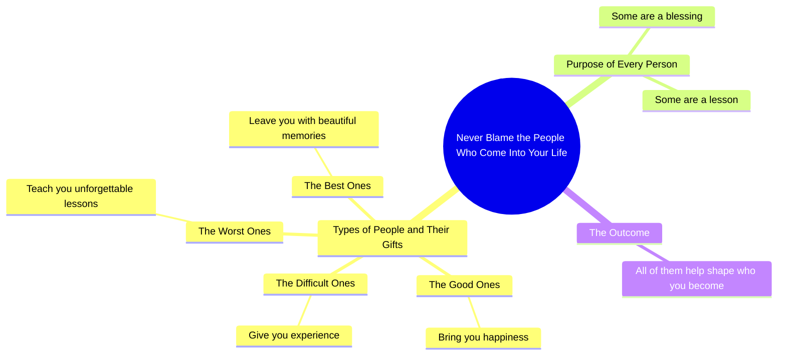

# Every Person Enters Your Life for a Reason

> 🌐 **Read this in:** **English** · [中文](../../zh-CN/2026-09/tiktok-transcript-4-5m-views-110k-reactions-every-person-enters-your-life-for-3600.md)

> **Creator:** [@Mind Decoded](https://www.tiktok.com/@Mind Decoded) · **Views:** 2.1M · **Posted:** 2026-09-10 · **Niche:** entertainment
>
> **TL;DR:** A direct imperative that challenges a common behavior, immediately grabbing attention.

[Watch original video →](https://www.facebook.com/share/r/1EP4YiAsVw/)

## Why This Went Viral

## Hook (first 3 seconds)
- Opening line, verbatim: "Never blame the people who come into your life."
- Hook pattern: **Bold command / counterintuitive directive** — it tells the viewer to drop a behavior (blaming) they probably feel entitled to.
- Why it stops the scroll: It triggers instant self-reference. Anyone who has been hurt by someone mentally replays that person within the first second, so the thumb freezes before the brain decides to. The word "Never" adds absolutism, which reads as authority.

## Emotional Rhythm
- **Beat 1 — Defiance/curiosity:** "Never blame the people who come into your life." Opens with a rule that feels slightly unfair, creating mild friction.
- **Beat 2 — Relief:** "The good ones bring you happiness." Validates the viewer's good memories; tension drops.
- **Beat 3 — Tension:** "The difficult ones give you experience. The worst ones teach you unforgettable lessons." The word "worst" spikes pain; this is where the viewer's specific wound surfaces.
- **Beat 4 — Warmth/resonance:** "The best ones leave you with beautiful memories." Emotional exhale; nostalgia replaces grievance.
- **Climax:** "Every person has a purpose." This is the thesis line — the pivot from individual grievance to universal meaning. It lands right after the emotional low ("worst ones") and reframes it.
- **Resolution:** "Some are a blessing, and some are a lesson. But all of them help shape who you become." Closes the loop opened by the hook, converting blame into gratitude.

The rhythm is a **descending-then-ascending arc**: happiness → difficulty → worst → best → purpose. The dip to "worst" before the rise to "purpose" is what makes the payoff feel earned.

## Keyword Density
- **people** — the anchor noun; makes the message universally applicable (algorithmic reach).
- **ones** — repeated 4× in parallel structure; drives rhythm and retention.
- **lessons / lesson** — the core reframe word; carries the emotional payload.
- **memories** — nostalgia trigger; the shareable, screenshot-worthy word.
- **purpose** — the philosophical payoff; drives saves and comments.
- **blame** — the hook word; high emotional charge, sets up the reversal.
- **happiness / beautiful / blessing** — positive-valence words that make the video safe to share with family.
- **experience** — the neutral bridge word that softens the "difficult ones" beat.

Algorithmic drivers: **people, purpose, lessons** (broad, searchable, high-engagement themes). Emotional drivers: **blame, worst, memories, blessing** (these are what make someone tag a friend or repost to their story).

## Why It Spreads
- **It gives the viewer permission to reframe a real wound.** "The worst ones teach you unforgettable lessons" lets someone convert a specific painful person into a growth story — that's a shareable identity move, not just a quote.
- **Parallel structure makes it quotable and screenshot-ready.** The repeated "The ___ ones ___" pattern is easy to memorize and repost as text, which is why this format survives outside the video itself.
- **The hook creates a mild moral challenge.** "Never blame the people who come into your life" is slightly provocative — it invites disagreement in the comments ("but what about abusers?"), and comment volume is a primary ranking signal.
- **The ending is a universal closer.** "All of them help shape who you become" applies to literally anyone's life, so no viewer feels excluded — maximum addressable audience.
- **It's emotionally safe to share.** No politics, no controversy, no specific person — just a positive reframe. That makes it low-risk to send to a friend, a partner, or a parent.

## What You Can Steal
- **Open with a command that contradicts a common instinct.** "Never blame…" works because it forbids something people do automatically. Try "Stop explaining yourself to people who…" or "Never apologize for…" — the friction is the hook.
- **Use a numbered parallel structure with an emotional gradient.** Good → difficult → worst → best forces the viewer through a full feeling cycle in under 20 seconds. Build your list so it dips before it rises; the low point is what makes the ending land.
- **End on a universal reframe, not a specific one.** "Every person has a purpose" beats "Your ex taught you something" because it scales to every viewer. Write the last line so anyone can insert their own story into it.

## Mind Map

## Full Transcript (Generated by [try this transcription tool](https://toktranscript.com/?utm_source=github&utm_medium=breakdown&utm_campaign=tool_attribution))

> 📝 Transcripts on this page are auto-generated and show the first 60%. Want to transcribe any TikTok in 30 seconds and get the full version? [Try TokTranscript free →](https://toktranscript.com/?utm_source=github&utm_medium=breakdown&utm_campaign=transcript_cta)

Never blame the people who come into your life. The good ones bring you happiness. The difficult ones give you experience. The worst ones teach you unforgettable lessons.

*[Read the full transcript on TokTranscript →](https://toktranscript.com/plaza/tiktok-transcript-4-5m-views-110k-reactions-every-person-enters-your-life-for-3600?utm_source=github&utm_medium=breakdown&utm_campaign=transcript_full)*

## Browse More

- All [entertainment](../../by-niche/en/entertainment.md) breakdowns
- All [Command + Reframe](../../by-pattern/en/hook-command-reframe.md) examples

## Video Info

| | |
|---|---|
| Creator | [@Mind Decoded](https://www.tiktok.com/@Mind Decoded) |
| Original video | [https://www.facebook.com/share/r/1EP4YiAsVw/](https://www.facebook.com/share/r/1EP4YiAsVw/) |
| Original title | 4.5M views · 110K reactions | Every person enters your life for a reason, even the ones who hurt you #relationships #mindset #reels #psychology #silence #lifelessons #wisdom #mentalhealth #InnerPeace | Mind Decoded |
| Views | 2.1M (2050238) |
| Posted | 2026-09-10 |
| Duration | 0s |
| Niche | `entertainment` |
| Hook pattern | `Command + Reframe` |
| Original language | `en` |
| Available languages | en, zh-CN |
| Generated | 2026-09-11 by [TokTranscript](https://toktranscript.com/) |

---

*This breakdown is for educational analysis under fair use. Original video © [@Mind Decoded](https://www.tiktok.com/@Mind Decoded). All transcripts are auto-generated and may contain errors.*

*Want to analyze your own TikToks like this? [analyze your own TikToks →](https://toktranscript.com/viral-breakdown?utm_source=github&utm_medium=breakdown&utm_campaign=footer_cta)*