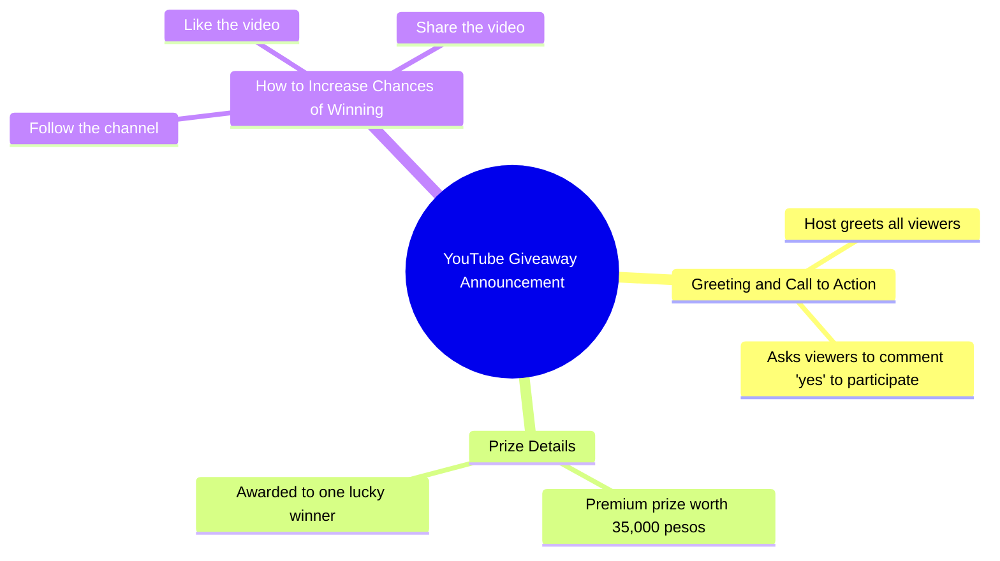

# Lucky Commenter Wins ₱35,000 Premium Prize

> 🌐 **Read this in:** **English** · [中文](../../zh-CN/2026-09/tiktok-transcript-402k-views-18k-reactions-comment-nyo-na-mga-boss-baka-sa-iny-9869.md)

> **Creator:** [@𝐀𝐋𝐀𝐰𝐢 𝐅𝐀𝐦𝐢𝐥𝐥𝐲](https://www.tiktok.com/@𝐀𝐋𝐀𝐰𝐢 𝐅𝐀𝐦𝐢𝐥𝐥𝐲) · **Views:** 175.3K · **Posted:** 2026-09-07 · **Niche:** other
>
> **TL;DR:** Immediately offers a high-value prize in exchange for a simple action, creating instant incentive.

[Watch original video →](https://www.facebook.com/share/v/1C37i6fHBT/)

## Why This Went Viral

## Hook (first 3 seconds)
- **Verbatim opening:** “Hello sa inyong lahat! Makikipag-ugnayan ako sa inyo kung isusulat ninyo ang yes sa comment section ngayon din.”
- **Hook pattern:** Direct engagement + conditional reward (comment “yes” → I’ll contact you). It’s a **call-to-action bribe**, not a question or bold claim.
- **Why it stops scroll:** It creates instant FOMO (fear of missing out) by dangling a specific high-value prize (₱35,000) and demanding immediate action. The word “ngayon din” (right now) injects urgency, forcing a split-second decision before the brain can rationalize skipping.

## Emotional Rhythm
- **Beat 1 — Curiosity/Enticement:** “Makikipag-ugnayan ako sa inyo” — implies a personal, exclusive connection.
- **Beat 2 — Greed/Anticipation:** “May premium 35,000 pesos para sa isang maswerteng mananalo” — the prize is concrete, large, and framed as luck-based (not skill), making it feel attainable.
- **Beat 3 — Urgency/Tension:** “kung isusulat ninyo ang yes sa comment section ngayon din” — pressure spikes; the viewer feels they must act or lose out.
- **Beat 4 — Action/Commitment:** “pakifollow, like, at share” — the ask escalates from comment to full engagement, creating a mini-ritual of compliance.
- **Climax:** The moment the prize amount is spoken. It’s the emotional peak because it quantifies the reward and validates the effort of commenting.
- **Resolution:** None — the video ends on the action list, leaving the viewer in a state of unfinished tension (will I win?), which drives repeat views and shares.

## Keyword Density
- **“yes”** — appears twice in the opening; the core action word. Drives algorithmic reach via comment velocity (comments = engagement signals).
- **“comment section”** — repeated contextually; algorithmic trigger for comment counts.
- **“35,000 pesos”** — the exact prize; high-intent keyword for search and shareability (people share to friends who need money).
- **“mananalo” (winner)** — emotional pull; evokes hope and personal relevance.
- **“follow, like, at share”** — explicit engagement verbs; algorithmic trifecta for reach.
- **“ngayon din” (right now)** — urgency phrase; emotional pull, not algorithmic, but boosts retention by forcing immediate action.

**Algorithmic drivers:** “yes,” “comment,” “follow,” “like,” “share” — these directly inflate engagement metrics.
**Emotional drivers:** “35,000,” “mananalo,” “ngayon din” — these trigger desire, hope, and urgency.

## Why It Spreads
- **Comment-bait loop:** The explicit “write yes” instruction creates a low-friction action. Every comment boosts the video in the algorithm, and the comment section itself becomes social proof (others are playing, so I should too).
- **Prize specificity:** “35,000 pesos” is not vague (“huge prize”) — it’s a precise, relatable amount for the Filipino audience (roughly 3–4 months of minimum wage). Precision increases perceived legitimacy and shareability.
- **Urgency without deadline:** “ngayon din” creates pressure but no actual cutoff, so viewers share it to friends immediately to “not miss out,” even though the video stays live.
- **Multi-step engagement ladder:** Comment → Follow → Like → Share. Each step is a separate algorithmic signal, and the video trains viewers to complete all four in sequence, maximizing distribution.
- **Luck framing:** “maswerteng mananalo” (lucky winner) removes skill barriers — anyone can win, so it’s shareable to broad networks, not niche audiences.

## What You Can Steal
1. **Open with a conditional reward, not a greeting.** Start with “If you [action], I’ll [reward]” instead of “Hi guys, welcome back.” This front-loads the value proposition and kills scroll time.
2. **Use a precise, local-currency prize.** Instead of “big giveaway,” say “₱35,000” or “$500” — exact numbers trigger concrete desire and are easier to remember and repeat in shares.
3. **Stack engagement asks in a single sentence.** Don’t say “please like” at the end. Bundle them: “Comment yes, follow, like, and share” — the cascade of actions feels like one quick task, not four separate chores, and each one feeds the algorithm.

## Mind Map

## Full Transcript (Generated by [TokTranscript](https://toktranscript.com/?utm_source=github&utm_medium=breakdown&utm_campaign=tool_attribution))

> 📝 Transcripts on this page are auto-generated and show the first 60%. Want to transcribe any TikTok in 30 seconds and get the full version? [Try TokTranscript free →](https://toktranscript.com/?utm_source=github&utm_medium=breakdown&utm_campaign=transcript_cta)

Hello sa inyong lahat! Makikipag-ugnayan ako sa inyo kung isusulat ninyo ang yes sa comment section ngayon din.

*[Read the full transcript on TokTranscript →](https://toktranscript.com/plaza/tiktok-transcript-402k-views-18k-reactions-comment-nyo-na-mga-boss-baka-sa-iny-9869?utm_source=github&utm_medium=breakdown&utm_campaign=transcript_full)*

## Browse More

- All [other](../../by-niche/en/other.md) breakdowns
- All [Direct address + conditional reward](../../by-pattern/en/hook-direct-address-conditional-reward.md) examples

## Video Info

| | |
|---|---|
| Creator | [@𝐀𝐋𝐀𝐰𝐢 𝐅𝐀𝐦𝐢𝐥𝐥𝐲](https://www.tiktok.com/@𝐀𝐋𝐀𝐰𝐢 𝐅𝐀𝐦𝐢𝐥𝐥𝐲) |
| Original video | [https://www.facebook.com/share/v/1C37i6fHBT/](https://www.facebook.com/share/v/1C37i6fHBT/) |
| Original title | 402K views · 18K reactions | Comment nyo na mga boss baka sa inyo na sunod! 😱🥳 #ivanaalawi #monaalawi #ivanaalawireall #laptopwarehouse #lapag #dailyvlog #laptop #bossa #BossA #CrisHippers #Kuyamoboss #fistbump #TisayShin #filipina #iphone #pera #Pamorma #CrisHippers #laptop #bossa #Kuyamoboss #fistbump #sugodbahay | 𝐀𝐋𝐀𝐰𝐢 𝐅𝐀𝐦𝐢𝐥𝐥𝐲 |
| Views | 175.3K (175267) |
| Posted | 2026-09-07 |
| Duration | 0s |
| Niche | `other` |
| Hook pattern | `Direct address + conditional reward` |
| Original language | `en` |
| Available languages | en, zh-CN |
| Generated | 2026-09-08 by [TokTranscript](https://toktranscript.com/) |

---

*This breakdown is for educational analysis under fair use. Original video © [@𝐀𝐋𝐀𝐰𝐢 𝐅𝐀𝐦𝐢𝐥𝐥𝐲](https://www.tiktok.com/@𝐀𝐋𝐀𝐰𝐢 𝐅𝐀𝐦𝐢𝐥𝐥𝐲). All transcripts are auto-generated and may contain errors.*

*Want to analyze your own TikToks like this? [TokTranscript.com →](https://toktranscript.com/viral-breakdown?utm_source=github&utm_medium=breakdown&utm_campaign=footer_cta)*