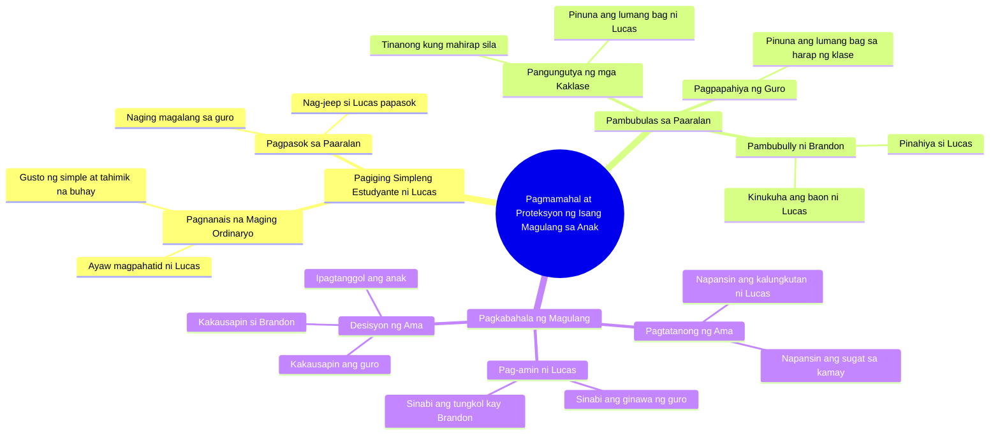

# Billionaire Dad Part 1: Daughter Rides Jeep to School

> 🌐 **Read this in:** **English** · [中文](../../zh-CN/2026-09/tiktok-transcript-417k-views-19k-reactions-part-1-ang-bilyonaryong-tatay-melom-b4e7.md)

> **Creator:** [@Melo Movie](https://www.tiktok.com/@Melo Movie) · **Views:** 243.5K · **Posted:** 2026-09-26 · **Niche:** entertainment
>
> **TL;DR:** Opens with a high-stakes, emotional question that immediately grabs attention and sets up a revenge/justice narrative.

[Watch original video →](https://www.facebook.com/share/v/1EgcxK3Hzh/)

## Why This Went Viral

## Hook (first 3 seconds)
- **Verbatim:** "Who hurt my child?" — the father immediately blurted out, no setup, straight to the emotional question.
- **Hook pattern:** Bold question + maternal/paternal protective instinct (parent-in-danger mode).
- **Why the scroll stops:** It immediately sets the stakes — there's a victim, there's someone who caused harm, and there's an angry parent. The viewer's brain automatically asks: *who? why? what happened?* You can't scroll past a question that hasn't been answered yet.

## Emotional Rhythm
- **Curiosity (0–5s):** Lucas is an ordinary student, doesn't want to be walked home — instant mystery: why?
- **Tension buildup (5–20s):** Mockery from the teacher and classmate (bag, packed lunch, "are you poor?") — the micro-hurts pile up.
- **Resonance (20–30s):** "Simple and quiet" — relatable to anyone who's experienced being an outcast.
- **Suspense spike (30–45s):** "What happened to your hand?" + "I just slipped" — the classic lie everyone knows is a lie.
- **Climax (45–55s):** Lucas's confession — "My teacher humiliated me... because of my old bag."
- **Payoff / catharsis (55s–end):** "Who hurt my child?" — returns to the hook, closing the loop, triggering righteous anger + protective emotion.

## Keyword Density
- **"child"** — emotional anchor, the strongest pull.
- **"Dad"** — establishes the father-child bond.
- **"bag" / "old"** — concrete symbol of shame and poverty.
- **"school" / "teacher"** — setting of injustice, institutional betrayal.
- **"hurt" / "teasing"** — conflict verbs, the plot's drive.
- **"why" / "who"** — question words that open loops.
- **"I'm okay"** — classic suppression line, high resonance.
- **"simple and quiet"** — aspirational identity, resonates with the masses.

**Algorithmic drivers:** "child," "hurt," "school," "teacher" — high-search, high-comment triggers for the PH audience.
**Emotional pull:** "I'm okay," "simple and quiet," "my old bag" — these are what make people share and comment.

## Why It Spreads
- **Universal injustice trigger:** The line *"My teacher humiliated me... because of my old bag"* hits the collective memory of Filipino students — bullying + teacher shaming = instant share.
- **Loop structure:** Returns to the opening line (*"Who hurt my child?"*) — perfect rewatch bait, boosts watch time.
- **Silent suffering trope:** *"It's nothing, Dad. I just slipped"* — every viewer recognizes someone — a sibling, a child, an experience — who hid their pain. They comment "I cried."
- **Parent as avenger:** The father as protective figure provides catharsis — Lucas isn't just a victim, he has someone in his corner. This is the emotional payoff that drives saves and shares.
- **Class-based relatability:** "Are you poor?" — a directly class-based question that hits 90% of the audience. The video becomes personal.

## What You Can Steal
- **Open with a question that has stakes:** Start with a line that has a victim, an antagonist, and an emotional wager — not with setup. Example: "Who told you that you weren't enough?"
- **Use a "lie line" for suspense:** Let the character lie (*"I just slipped"*) — the viewer knows the truth, so tension rises and they wait for the confession.
- **Close the loop back to the hook:** Repeat the opening line at the end (or a variation of it) — boosts rewatch, share, and comment. This is the cheapest viral hack in short-form.

## Mind Map

## Full Transcript (Generated by [analyze your own TikToks](https://toktranscript.com/?utm_source=github&utm_medium=breakdown&utm_campaign=tool_attribution))

> 📝 Transcripts on this page are auto-generated and show the first 60%. Want to transcribe any TikTok in 30 seconds and get the full version? [Try TokTranscript free →](https://toktranscript.com/?utm_source=github&utm_medium=breakdown&utm_campaign=transcript_cta)

Sinong nanakit sa anak ko? Anak, hindi ka ba magpapahatid? Mag-jeep na lang ako, Dad. Sigurado ka? Gusto ko lang maging ordinaryong estudyante. Mauna na ako, Dad. Ganito lang ang gusto ko. Simple at tahimik. Toy, estudyante ka? Opo. Lucas! Oh, good morning. Lucas, seryoso ka ba? Yan pa rin ang bag mo? Hindi ka ba nahihiya? Mukha kang bagong lipat dito? Wala naman akong ginagawang masama. Pwede ba? Papasok na ako. Lucas, yan lang talaga gamit mo? Mahirap ba kayo kahit simpleng gamit hindi mo mabili? Sorry, ma'am. Ba't yan lang baon mo? Masarap naman. Pwede na sa akin. Akin na yan! Akin na yan! Lucas sure ka na okay ka Oo okay lang ako Lucas anak may problema ba Bakit parang malungkot ka W

*[Read the full transcript on TokTranscript →](https://toktranscript.com/plaza/tiktok-transcript-417k-views-19k-reactions-part-1-ang-bilyonaryong-tatay-melom-b4e7?utm_source=github&utm_medium=breakdown&utm_campaign=transcript_full)*

## Browse More

- All [entertainment](../../by-niche/en/entertainment.md) breakdowns
- All [Protective Parent Confrontation](../../by-pattern/en/hook-protective-parent-confrontation.md) examples

## Video Info

| | |
|---|---|
| Creator | [@Melo Movie](https://www.tiktok.com/@Melo Movie) |
| Original video | [https://www.facebook.com/share/v/1EgcxK3Hzh/](https://www.facebook.com/share/v/1EgcxK3Hzh/) |
| Original title | 417K views · 19K reactions | Part 1 | Ang Bilyonaryong Tatay #melomovie #drama | Melo Movie |
| Views | 243.5K (243506) |
| Posted | 2026-09-26 |
| Duration | 0s |
| Niche | `entertainment` |
| Hook pattern | `Protective Parent Confrontation` |
| Original language | `tl` (this page translated by AI) |
| Available languages | en, zh-CN |
| Generated | 2026-09-28 by [TokTranscript](https://toktranscript.com/) |

---

*This breakdown is for educational analysis under fair use. Original video © [@Melo Movie](https://www.tiktok.com/@Melo Movie). All transcripts are auto-generated and may contain errors.*

*Want to analyze your own TikToks like this? [TokTranscript.com →](https://toktranscript.com/viral-breakdown?utm_source=github&utm_medium=breakdown&utm_campaign=footer_cta)*