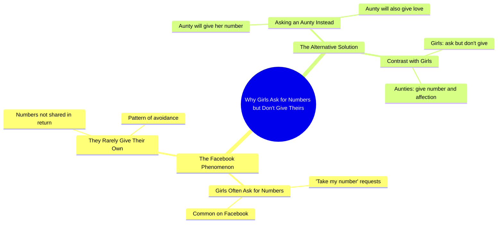

# Punjabi Girl Jokes About Aunties Giving Numbers on Facebook

> 🌐 **Read this in:** **English** · [中文](../../zh-CN/2026-09/tiktok-transcript-5-2m-views-142k-reactions-han-btao-kon-hy-everyonehighlights-d414.md)

> **Creator:** [@Nimra Ch](https://www.tiktok.com/@Nimra Ch) · **Views:** 2.0M · **Posted:** 2026-09-28 · **Niche:** entertainment
>
> **TL;DR:** It calls out a common behavior, creating immediate relatability and curiosity.

[Watch original video →](https://www.facebook.com/share/r/1ETmZ75W6q/)

## Why This Went Viral

## Hook (first 3 seconds)
- Verbatim opening: "सब लड़कियां अकसर फेस्बुक पर जूट बोलती हैं के नंबर ले लो, लेकिन वो नंबर नहीं देते हैं" ("All girls on Facebook keep saying 'take my number,' but they never actually give it.")
- Hook pattern: **Contrast / callout** — sets up a familiar frustration, then flips it in the same breath.
- Why it stops the scroll: It names a specific, relatable grievance ("girls say they'll give their number but don't") in the first line, so the viewer feels personally targeted. The unresolved "लेकिन" (but) creates an open loop that demands the next line.

## Emotional Rhythm
- Beat 1 — **Recognition/curiosity**: "सब लड़कियां... नंबर ले लो" mirrors a common experience, pulling the viewer in.
- Beat 2 — **Tension/frustration**: "लेकिन वो नंबर नहीं देते हैं" states the letdown, building mild annoyance.
- Beat 3 — **Twist/pivot**: "कभी मुझ ज़से आंटी से नंबर मांगना" — the speaker reframes herself as "आंटी" (aunty), subverting the expected young-girl dynamic.
- Beat 4 — **Relief/payoff (climax)**: "वो नंबर भी देंगी और प्यार भी करेंगी" — the punchline lands here: not only will she give the number, she'll love you too. This is the emotional peak and the line most likely to be quoted/shared.
- The climax is the final clause; everything before is setup for this reversal.

## Keyword Density
- नंबर (number) — repeated 3x; drives search/algorithmic reach (high-intent, commonly searched term).
- लड़कियां (girls) — audience-targeting keyword; broad emotional pull.
- फेस्बुक (Facebook) — platform-specific anchor; boosts topical relevance and shareability.
- बोलती हैं / देते हैं (say / give) — action verbs that frame the contrast.
- आंटी (aunty) — the twist keyword; carries humor and cultural resonance.
- प्यार (love) — emotional payoff word; the line that gets screenshotted.
- मुझ ज़से (like me) — personalization cue; makes the speaker the relatable "other option."
- Algorithmic drivers: नंबर, फेस्बुक, लड़कियां (searchable, high-volume). Emotional pull: आंटी, प्यार, the say-vs-do contrast.

## Why It Spreads
- **Relatable grievance → instant self-identification**: "सब लड़कियां... नंबर नहीं देते हैं" mirrors a widely shared frustration, so viewers tag friends who've experienced it.
- **Subversion of expectation**: The pivot to "मुझ ज़से आंटी" flips the young-girl trope, creating surprise that rewards watching to the end.
- **Quotable punchline**: "वो नंबर भी देंगी और प्यार भी करेंगी" is short, rhythmic, and meme-ready — ideal for comments, captions, and duets.
- **Cultural humor via "आंटी"**: The aunty persona carries built-in comedic and affectionate connotations in South Asian internet culture, making the line shareable across age groups.
- **Compact loop**: The whole video is one sentence with a setup-payoff structure, so it's easy to rewatch, remix, and quote — the core mechanic of short-form virality.

## What You Can Steal
- **Open with a specific, relatable grievance** in the first 3 seconds ("everyone says X, but they never do Y") to trigger instant recognition.
- **Use a hard pivot mid-sentence** ("but...") to create an open loop that forces viewers to keep watching for the payoff.
- **End on a short, rhythmic punchline** that's easy to quote, caption, or screenshot — design your last line to be the shareable asset.

## Mind Map

## Full Transcript (Generated by [try this transcription tool](https://toktranscript.com/?utm_source=github&utm_medium=breakdown&utm_campaign=tool_attribution))

> 📝 Transcripts on this page are auto-generated and show the first 60%. Want to transcribe any TikTok in 30 seconds and get the full version? [Try TokTranscript free →](https://toktranscript.com/?utm_source=github&utm_medium=breakdown&utm_campaign=transcript_cta)

सब लड़कियां अकसर फेस्बुक पर जूट बोलती हैं के नंबर ले लो, लेकिन वो नंबर नहीं देते हैं, कभी मुझ

*[Read the full transcript on TokTranscript →](https://toktranscript.com/plaza/tiktok-transcript-5-2m-views-142k-reactions-han-btao-kon-hy-everyonehighlights-d414?utm_source=github&utm_medium=breakdown&utm_campaign=transcript_full)*

## Browse More

- All [entertainment](../../by-niche/en/entertainment.md) breakdowns
- All [Callout/Contrast](../../by-pattern/en/hook-callout-contrast.md) examples

## Video Info

| | |
|---|---|
| Creator | [@Nimra Ch](https://www.tiktok.com/@Nimra Ch) |
| Original video | [https://www.facebook.com/share/r/1ETmZ75W6q/](https://www.facebook.com/share/r/1ETmZ75W6q/) |
| Original title | 5.2M views · 142K reactions | Han btao Kon Hy #everyonehighlights #facebookreels #NimraCh #viralreels #facebookvideo #follower #punjabigirl #reels #fyp #everyone | Nimra Ch |
| Views | 2.0M (1962765) |
| Posted | 2026-09-28 |
| Duration | 0s |
| Niche | `entertainment` |
| Hook pattern | `Callout/Contrast` |
| Original language | `en` |
| Available languages | en, zh-CN |
| Generated | 2026-09-29 by [TokTranscript](https://toktranscript.com/) |

---

*This breakdown is for educational analysis under fair use. Original video © [@Nimra Ch](https://www.tiktok.com/@Nimra Ch). All transcripts are auto-generated and may contain errors.*

*Want to analyze your own TikToks like this? [free TikTok transcript generator →](https://toktranscript.com/viral-breakdown?utm_source=github&utm_medium=breakdown&utm_campaign=footer_cta)*