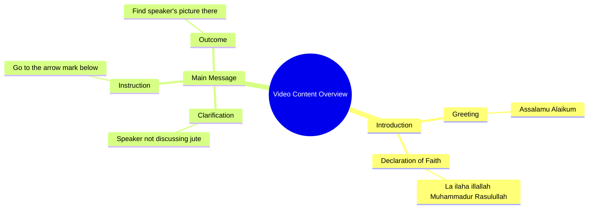

# Islamic Greeting and Shahada Recitation by Sanam

> 🌐 **Read this in:** **English** · [中文](../../zh-CN/2026-09/tiktok-transcript-5-6m-views-150k-reactions-f491.md)

> **Creator:** [@صنم](https://www.tiktok.com/@صنم) · **Views:** 2.0M · **Posted:** 2026-09-23 · **Niche:** other
>
> **TL;DR:** The speaker makes a bold claim that she is not lying, which challenges the viewer's trust and sparks curiosity.

[Watch original video →](https://www.facebook.com/share/r/19MJ7fqYvQ/)

## Why This Went Viral

## Hook (first 3 seconds)
- Opens with "असलाम लेकुम" (Islamic greeting) immediately followed by the Shahada: "ला इलाह इलल्ला मुहम्मद रर्सूल उल्ला" — a sacred declaration of faith delivered in the first breath.
- Hook pattern: **Contrast / Taboo juxtaposition** — sacred religious recitation paired with a mundane, almost flirtatious redirect ("I'm not talking to you, go to the arrow below").
- Viewers stop because the brain hits a pattern interrupt: a religious formula is being used as a *content device*, not a prayer. Curiosity fires instantly — "why is she saying the Shahada here?"

## Emotional Rhythm
- **Beat 1 (0–1s): Curiosity + reverence** — the greeting and Shahada trigger familiarity and respect in Muslim viewers.
- **Beat 2 (1–3s): Confusion / mild tension** — "मैं जूट नहीं बोल रही" ("I'm not lying / not joking") creates ambiguity; is this sincere or bait?
- **Beat 3 (3–5s): Redirect / reveal** — "नीचे तीर के निशान में जाएं, वहां आपको मेरी तस्वीर मिल जाएगी" ("go to the arrow below, you'll find my picture there") flips the tone from sacred to promotional.
- **Climax:** The pivot line about the arrow — the moment the audience realizes the Shahada was a hook, not a sermon. That dissonance *is* the payoff.
- **Resonance:** For religious viewers, the mix of devotion and self-promotion lands as either funny, audacious, or offensive — all three drive comments.

## Keyword Density
- **असलाम लेकुम** (greeting) — emotional pull, in-group recognition
- **ला इलाह इलल्ला मुहम्मद रर्सूल उल्ला** (Shahada) — the algorithmic and emotional spike; high-comment trigger
- **जूट नहीं बोल रही** ("not lying/joking") — credibility marker, tension builder
- **नीचे तीर के निशान** ("arrow below") — CTA, drives watch-through and profile clicks
- **तस्वीर** ("picture") — curiosity gap, promises a reveal
- **मैं / आपको** (I / you) — direct address, parasocial pull
- Algorithmic drivers: Shahada + greeting (high search/comment volume in Muslim content niches). Emotional drivers: "मेरी तस्वीर" (my picture) — personal reveal promise.

## Why It Spreads
- **Sacred-meets-mundane shock:** Reciting the Shahada and then pivoting to "go to the arrow for my picture" creates cognitive dissonance that viewers *must* react to — comment sections explode with both defense and amusement.
- **In-group signaling:** "असलाम लेकुम" filters the audience instantly — Muslim viewers feel addressed, non-Muslim viewers feel like voyeurs, both keep watching.
- **Built-in CTA inside the hook:** "नीचे तीर के निशान में जाएं" forces a rewatch or profile tap, boosting watch-time and profile-visit signals.
- **Ambiguity engine:** "मैं जूट नहीं बोल रही" leaves viewers unsure if it's satire, sincerity, or bait — ambiguity = comments = reach.
- **Short and loopable:** The whole clip is under 10 seconds, so it loops cleanly and inflates average watch percentage.

## What You Can Steal
- **Open with a high-recognition phrase from your niche** (a greeting, a slogan, a famous line) — it buys you 1–2 seconds of attention before the pivot.
- **Insert one deliberate tonal whiplash** between the sacred/serious opening and the casual CTA — the dissonance is the share trigger.
- **Bury the CTA inside the hook itself** ("go to the arrow below") so the viewer has to act or rewatch before they even decide to keep watching.

## Mind Map

## Full Transcript (Generated by [try this transcription tool](https://toktranscript.com/?utm_source=github&utm_medium=breakdown&utm_campaign=tool_attribution))

> 📝 Transcripts on this page are auto-generated and show the first 60%. Want to transcribe any TikTok in 30 seconds and get the full version? [Try TokTranscript free →](https://toktranscript.com/?utm_source=github&utm_medium=breakdown&utm_campaign=transcript_cta)

असलाम लेकुम, सुनो ला इलाह इलल्ला मुहम्मद रर्सूल उल्ला, मैं जूट नहीं बोल रही, नीचे

*[Read the full transcript on TokTranscript →](https://toktranscript.com/plaza/tiktok-transcript-5-6m-views-150k-reactions-f491?utm_source=github&utm_medium=breakdown&utm_campaign=transcript_full)*

## Browse More

- All [other](../../by-niche/en/other.md) breakdowns
- All [Controversial Statement](../../by-pattern/en/hook-controversial-statement.md) examples

## Video Info

| | |
|---|---|
| Creator | [@صنم](https://www.tiktok.com/@صنم) |
| Original video | [https://www.facebook.com/share/r/19MJ7fqYvQ/](https://www.facebook.com/share/r/19MJ7fqYvQ/) |
| Original title | 5.6M views · 150K reactions | اسلام علیکم لاء لاالہ الااللہ | صنم |
| Views | 2.0M (2009368) |
| Posted | 2026-09-23 |
| Duration | 0s |
| Niche | `other` |
| Hook pattern | `Controversial Statement` |
| Original language | `en` |
| Available languages | en, zh-CN |
| Generated | 2026-09-25 by [TokTranscript](https://toktranscript.com/) |

---

*This breakdown is for educational analysis under fair use. Original video © [@صنم](https://www.tiktok.com/@صنم). All transcripts are auto-generated and may contain errors.*

*Want to analyze your own TikToks like this? [TokTranscript.com →](https://toktranscript.com/viral-breakdown?utm_source=github&utm_medium=breakdown&utm_campaign=footer_cta)*