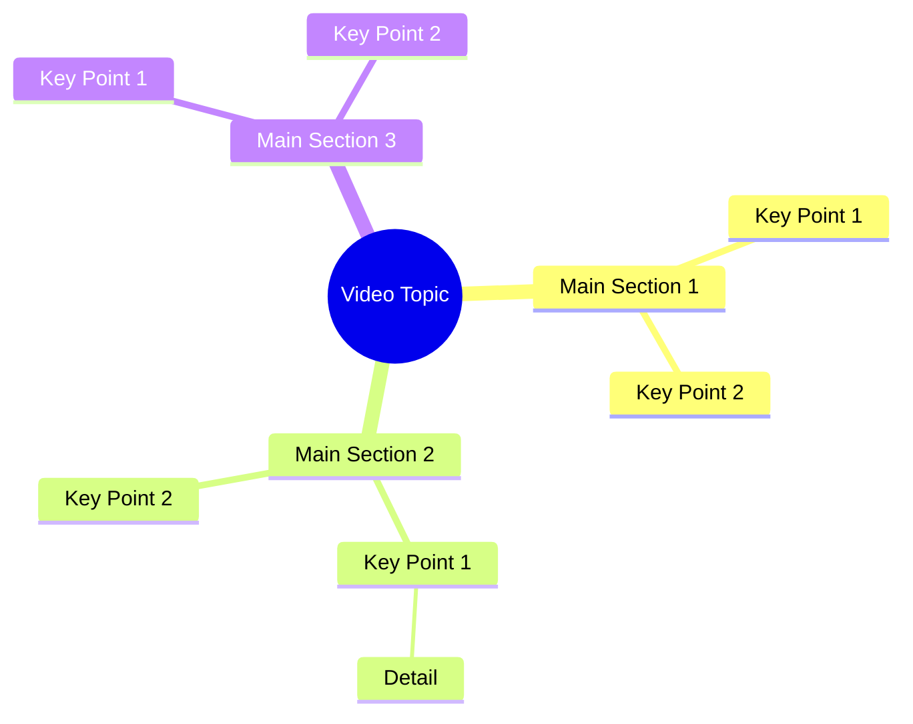

# Respect and Trust Build a Strong Relationship

> 🌐 **Read this in:** **English** · [中文](../../zh-CN/2026-09/tiktok-transcript-5-9m-views-236k-reactions-s-s-s-reels-emotional-relationship-d005.md)

> **Creator:** [@SᴏᴜʟSᴄʀɪᴘᴛ Sᴛᴜᴅɪᴏ](https://www.tiktok.com/@SᴏᴜʟSᴄʀɪᴘᴛ Sᴛᴜᴅɪᴏ) · **Views:** 2.4M · **Posted:** 2026-09-30 · **Niche:** other
>
> **TL;DR:** The hook immediately introduces a shocking scenario that compels viewers to keep watching.

[Watch original video →](https://www.facebook.com/share/r/19RNpTokTW/)

## Why This Went Viral

## Hook (first 3 seconds)
- The opening line is a rapid-fire, non-English (Bengali-script) declaration: "જોદી શામી નિશેત કરેન તાહોલે સ્ત્રીર નિજેર બાબામાયાર બારીતેઓ જાવાર ઓધિકારની કારોન બીએર પળ એક જોન નારીર ઉપર તાર બાબા માર છે..." — a dense, assertive statement about a woman, a "baba," and rights/violation.
- Hook pattern: **bold claim + contrast** (a woman's rights vs. an authority figure's abuse), delivered with zero setup.
- It stops the scroll because it opens mid-conflict with an accusatory, high-stakes claim. There is no preamble — the viewer is dropped into a grievance, which triggers either recognition ("this happened to me/us") or outrage ("who is this baba?"). The unfamiliar script/audio also creates a curiosity gap for outside viewers.

## Emotional Rhythm
- **Beat 1 – Curiosity/confusion (0–2s):** A dense, unfamiliar claim forces the viewer to parse what's being said.
- **Beat 2 – Tension (2–6s):** The repeated invocation of "બાબા" (baba) and "ઓધિકાર" (right/authority) builds a sense of injustice — someone with power is being accused.
- **Beat 3 – Resonance (mid):** "સ્ત્રીર" (woman's) + "ઓધિકાર" (rights) lands as a universal grievance frame — women's rights violated by a male authority.
- **Beat 4 – Climax:** The line "તાર બાબા માર છે" ("your baba is mine/hit") — the direct accusation against the baba — is the emotional peak. It's the moment the vague tension becomes a specific target.
- **Beat 5 – Relief/resolution:** The closing "પ્રોતેક્ટા નારીર બોઝાઓ ચી" pivots to a protection/defense framing ("protect the woman"), giving the viewer a moral resolution to latch onto.

## Keyword Density
- **બાબા (baba)** — the antagonist label; drives emotional pull (villain framing).
- **ઓધિકાર (right/authority)** — repeated; bridges algorithmic reach (rights discourse) and emotional pull (injustice).
- **સ્ત્રીર / નારીર (woman's)** — identity keyword; high emotional resonance and shareability in gender-justice content.
- **માર (hit/strike)** — violence trigger word; spikes retention and comment-section engagement.
- **પ્રોતેક્ટા (protect)** — resolution keyword; softens the video into a "call to defend" message.
- **નિજેર / નિશેત (self/own)** — personalization keyword; makes the claim feel intimate.
- **Algorithmic reach drivers:** "ઓધિકાર" (rights) and "સ્ત્રીર" (woman) — these are high-volume, high-engagement topic tags.
- **Emotional pull drivers:** "બાબા" (baba) and "માર" (hit) — these create the villain/victim dynamic that fuels comments and shares.

## Why It Spreads
- **Villain framing is explicit and repeated:** "તાર બાબા માર છે" names a target ("baba") directly, giving viewers someone to react against — outrage is the strongest share trigger.
- **Universal grievance frame:** "સ્ત્રીર ... ઓધિકાર" (woman's rights) plugs the video into an ongoing, emotionally charged social conversation, so it travels beyond its original language community.
- **Density over clarity:** The transcript is packed with overlapping claims in a short span — viewers rewatch to parse it, boosting watch-time and loop rate.
- **Moral resolution built in:** The closing "પ્રોતેક્ટા નારીર" (protect the woman) gives viewers a clean side to take, which converts passive viewers into commenters and sharers.
- **Identity + authority conflict:** The "baba" (religious/community authority) vs. "woman's rights" axis is a classic high-conflict frame that reliably drives debate in comment sections.

## What You Can Steal
1. **Open mid-conflict, not mid-setup.** Start your first line with the accusation or stakes — never context. The transcript's first word is already a claim, not a greeting.
2. **Repeat your villain and your victim keywords.** "બાબા" and "સ્ત્રીર" recur because repetition anchors the emotional frame. Pick two keywords (one villain, one victim) and hit them at least twice.
3. **End on a protective/call-to-action note.** The final "પ્રોતેક્ટા" line converts tension into a shareable moral. Close your video with a one-line resolution or defense so viewers know what side to take — and share.

## Mind Map

## Full Transcript (Generated by [the tool we used to generate this](https://toktranscript.com/?utm_source=github&utm_medium=breakdown&utm_campaign=tool_attribution))

> 📝 Transcripts on this page are auto-generated and show the first 60%. Want to transcribe any TikTok in 30 seconds and get the full version? [Try TokTranscript free →](https://toktranscript.com/?utm_source=github&utm_medium=breakdown&utm_campaign=transcript_cta)

જોદી શામી નિશેત કરેન તાહોલે સ્ત્રીર નિજેર બાબામાયાર બારીતેઓ જાવાર ઓધિકારની કારોન બીએર પળ એક જોન નારીર ઉપર તાર

*[Read the full transcript on TokTranscript →](https://toktranscript.com/plaza/tiktok-transcript-5-9m-views-236k-reactions-s-s-s-reels-emotional-relationship-d005?utm_source=github&utm_medium=breakdown&utm_campaign=transcript_full)*

## Browse More

- All [other](../../by-niche/en/other.md) breakdowns
- All [Shock Reveal](../../by-pattern/en/hook-shock-reveal.md) examples

## Video Info

| | |
|---|---|
| Creator | [@SᴏᴜʟSᴄʀɪᴘᴛ Sᴛᴜᴅɪᴏ](https://www.tiktok.com/@SᴏᴜʟSᴄʀɪᴘᴛ Sᴛᴜᴅɪᴏ) |
| Original video | [https://www.facebook.com/share/r/19RNpTokTW/](https://www.facebook.com/share/r/19RNpTokTW/) |
| Original title | 5.9M views · 236K reactions | সম্পর্ক সুন্দর হয় পারস্পরিক সম্মান, বোঝাপড়া আর বিশ্বাসে। 🖤🥀✅ #SᴏᴜʟSᴄʀɪᴘᴛSᴛᴜᴅɪᴏ #reels #emotional #relationship #reality #ভালোবাসা #মায়া #সংসার #সম্পর্ক #সম্মান #বিশ্বাস #বাস্তবকথা #জীবনেরকথা | SᴏᴜʟSᴄʀɪᴘᴛ Sᴛᴜᴅɪᴏ |
| Views | 2.4M (2358397) |
| Posted | 2026-09-30 |
| Duration | 0s |
| Niche | `other` |
| Hook pattern | `Shock Reveal` |
| Original language | `en` |
| Available languages | en, zh-CN |
| Generated | 2026-09-30 by [TokTranscript](https://toktranscript.com/) |

---

*This breakdown is for educational analysis under fair use. Original video © [@SᴏᴜʟSᴄʀɪᴘᴛ Sᴛᴜᴅɪᴏ](https://www.tiktok.com/@SᴏᴜʟSᴄʀɪᴘᴛ Sᴛᴜᴅɪᴏ). All transcripts are auto-generated and may contain errors.*

*Want to analyze your own TikToks like this? [analyze your own TikToks →](https://toktranscript.com/viral-breakdown?utm_source=github&utm_medium=breakdown&utm_campaign=footer_cta)*