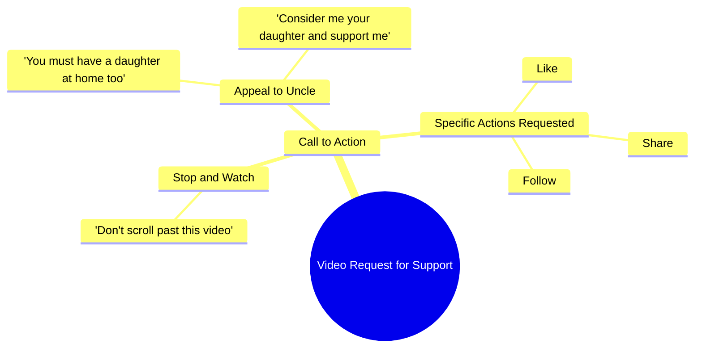

# Uncle, Please Support Me Like Your Own Daughter

> 🌐 **Read this in:** **English** · [中文](../../zh-CN/2026-09/tiktok-transcript-6-2m-views-460k-reactions-03045658506-b71d.md)

> **Creator:** [@03045658506](https://www.tiktok.com/@03045658506) · **Views:** 2.4M · **Posted:** 2026-09-21 · **Niche:** entertainment
>
> **TL;DR:** The hook stops the scroll by directly addressing 'chacha' and invoking a universal emotional trigger about having a daughter.

[Watch original video →](https://www.facebook.com/reel/1731520928144624/?app=fbl)

## Why This Went Viral

## Hook (first 3 seconds)
- **Verbatim opening:** "सुनो चाचा एक मिनिट रुख जो वीडियो आगे मत करो" ("Listen uncle, wait a minute — don't scroll past this video")
- **Hook pattern:** Direct command + interruption ("रुख जो" = stop right there) aimed at a specific person ("चाचा" = uncle).
- **Why it stops the scroll:** It breaks the fourth wall and issues an imperative. The viewer is personally addressed as "चाचा," creating instant familiarity. The command "don't scroll" triggers reactance — the brain pauses to check *why* it's being told to stop. It's a pattern-interrupt disguised as a personal plea.

## Emotional Rhythm
- **Beat 1 — Interruption/Curiosity (0–2s):** "सुनो चाचा एक मिनिट रुख" — abrupt stop, mild command tone. Viewer wonders: who is this, why me?
- **Beat 2 — Emotional escalation (2–5s):** "आपके घर में भी बेटी होगी ना" — pivots to a shared emotional truth (you too have a daughter). Curiosity converts to empathy.
- **Beat 3 — Vulnerability/Resonance (5–7s):** "मुझे भी अपनी बेटी समझ कर सपोर्ट करो" — self-lowering ("treat me like your daughter"). This is the **climax** — the emotional peak where the creator reframes themselves as a child asking for help.
- **Beat 4 — Relief/Action (7–9s):** "बस एक लाइक एक शेयर एक फॉलो कर दो प्लीज चाचा" — softens into a tiny, low-cost ask. Tension resolves into a clear CTA.
- **Twist landing:** The twist is the role reversal — a creator positioning themselves as the viewer's *daughter*, not a content-maker. That reframe is what makes the plea land emotionally rather than feeling like begging.

## Keyword Density
- **चाचा (uncle)** — relational anchor, drives familiarity and comment-section engagement.
- **बेटी (daughter)** — highest emotional-pull keyword; triggers protective instinct.
- **सपोर्ट (support)** — soft, non-demanding ask; algorithmically neutral but emotionally warm.
- **लाइक / शेयर / फॉलो** — pure algorithmic-reach keywords; explicit engagement signals.
- **प्लीज (please)** — humility marker; lowers viewer resistance.
- **वीडियो आगे मत करो (don't scroll)** — retention trigger; directly targets watch-time metric.
- **घर (home)** — intimacy word; makes the plea feel domestic, not commercial.

**Algorithmic vs. emotional split:** *लाइक, शेयर, फॉलो, वीडियो आगे मत करो* drive reach (they map to engagement and retention signals). *चाचा, बेटी, घर, सपोर्ट* drive emotional pull — they're what make a viewer *want* to comply rather than just see the CTA.

## Why It Spreads
- **Weaponized relatability via kinship terms.** "चाचा" and "बेटी" turn a stranger into family in under 5 seconds. Viewers share it because it feels like helping a relative, not boosting a creator.
- **Guilt-free reciprocity.** "आपके घर में भी बेटी होगी ना" creates a mirror — the viewer imagines their own daughter in this position. Sharing becomes a moral act, not a favor.
- **Micro-commitment CTA.** "बस एक लाइक एक शेयर एक फॉलो" — the word "बस" (just/only) shrinks the ask to near-zero effort. Low friction = high conversion.
- **Retention-by-command.** "वीडियो आगे मत करो" directly attacks the scroll reflex, boosting average watch time — the single strongest ranking signal on short-form platforms.
- **Emotional cliffhanger structure.** The viewer doesn't know *why* they're being stopped until second 3–4. That unresolved "why" keeps them watching to the end, where the ask finally arrives.

## What You Can Steal
- **Open with a direct command to a specific person.** "रुख जो" / "Wait, don't scroll" outperforms generic intros because it feels personal and interrupts autopilot.
- **Reframe your ask as a family favor, not a CTA.** Swap "please like and subscribe" for a relational frame ("treat me like your [son/daughter/neighbor]") — it converts guilt into warmth.
- **Delay the ask until after the emotional beat.** This video earns the CTA with empathy first, then asks. Leading with "like and follow" kills retention; leading with emotion earns the click.

## Mind Map

## Full Transcript (Generated by [TokTranscript](https://toktranscript.com/?utm_source=github&utm_medium=breakdown&utm_campaign=tool_attribution))

> 📝 Transcripts on this page are auto-generated and show the first 60%. Want to transcribe any TikTok in 30 seconds and get the full version? [Try TokTranscript free →](https://toktranscript.com/?utm_source=github&utm_medium=breakdown&utm_campaign=transcript_cta)

सुनो चाचा एक मिनिट रुख जो वीडियो आगे मत करो आपके घर में भी बेटी होगी ना मुझे भी अपनी बेटी 

*[Read the full transcript on TokTranscript →](https://toktranscript.com/plaza/tiktok-transcript-6-2m-views-460k-reactions-03045658506-b71d?utm_source=github&utm_medium=breakdown&utm_campaign=transcript_full)*

## Browse More

- All [entertainment](../../by-niche/en/entertainment.md) breakdowns
- All [Emotional Appeal + Direct Address](../../by-pattern/en/hook-emotional-appeal-direct-address.md) examples

## Video Info

| | |
|---|---|
| Creator | [@03045658506](https://www.tiktok.com/@03045658506) |
| Original video | [https://www.facebook.com/reel/1731520928144624/?app=fbl](https://www.facebook.com/reel/1731520928144624/?app=fbl) |
| Original title | 6.2M views · 460K reactions | سنو چاچا | 03045658506 |
| Views | 2.4M (2394551) |
| Posted | 2026-09-21 |
| Duration | 0s |
| Niche | `entertainment` |
| Hook pattern | `Emotional Appeal + Direct Address` |
| Original language | `en` |
| Available languages | en, zh-CN |
| Generated | 2026-09-22 by [TokTranscript](https://toktranscript.com/) |

---

*This breakdown is for educational analysis under fair use. Original video © [@03045658506](https://www.tiktok.com/@03045658506). All transcripts are auto-generated and may contain errors.*

*Want to analyze your own TikToks like this? [TokTranscript.com →](https://toktranscript.com/viral-breakdown?utm_source=github&utm_medium=breakdown&utm_campaign=footer_cta)*