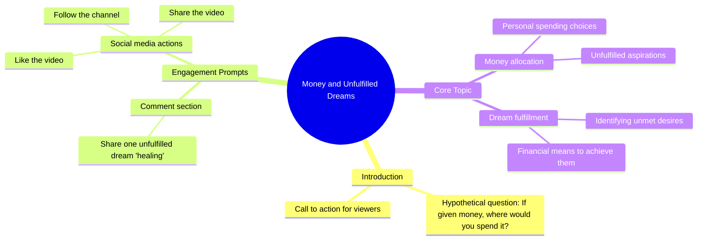

# Laptop Giveaway Comment to Win

> 🌐 **Read this in:** **English** · [中文](../../zh-CN/2026-09/tiktok-transcript-655k-views-27k-reactions-comment-nyo-na-mga-boss-baka-sa-iny-d5f1.md)

> **Creator:** [@𝐌𝟎𝐧𝐚 𝐀𝐥𝐚𝐰𝐢 𝐅𝐚𝐧𝐬..gmrs](https://www.tiktok.com/@𝐌𝟎𝐧𝐚 𝐀𝐥𝐚𝐰𝐢 𝐅𝐚𝐧𝐬..gmrs) · **Views:** 305.9K · **Posted:** 2026-09-05 · **Niche:** other
>
> **TL;DR:** The hook immediately engages viewers by offering a hypothetical windfall, prompting them to imagine and comment.

[Watch original video →](https://www.facebook.com/share/r/1MvTr1sDqK/?mibextid=wwXIfr)

## Why This Went Viral

## Hook (first 3 seconds)
- **Verbatim opening line:** "Kung bibigyan kita ng pera, saan mo ito gagamitin?" ("If I gave you money, where would you use it?")
- **Hook pattern:** Question + hypothetical scenario (conditional "if" + direct address)
- **Why it stops the scroll:** It forces an instant mental simulation. The viewer doesn't just watch—they answer. It's a low-stakes, high-imagination prompt that feels personal (you, kita) and taps into aspiration. The question is open-ended enough to trigger curiosity but specific enough to create an immediate internal response before they even decide to watch.

## Emotional Rhythm
- **Beat 1 – Curiosity (0–1s):** The question interrupts passive scrolling. The brain auto-completes: "What would I do?"
- **Beat 2 – Anticipation (1–3s):** The viewer waits for the next instruction—what's the catch? What's the context?
- **Beat 3 – Tension/Engagement (3–5s):** The call-to-action ("Isulat sa comment section") creates a moment of decision. Will they engage or not? This is a micro-commitment moment.
- **Beat 4 – Social Obligation/Resonance (5–7s):** The phrase "mga hindi pa natutupad na healing" (unfulfilled healings) shifts the tone from playful to emotional. It reframes money as a tool for healing, not just spending—this resonates deeply in a culture where financial struggle and family obligation are common.
- **Beat 5 – Climax (final line):** The triple ask (follow, like, share) lands as the release. The emotional peak is actually the *invitation to participate*, not a narrative twist. The climax is the moment the viewer realizes their comment could be seen and validated.
- **No visual twist or reveal—the emotional arc is entirely built on self-projection and the promise of community interaction.**

## Keyword Density
- **Pera (money)** – 1x but implied throughout. Drives the core fantasy/aspiration.
- **Saan (where)** – 1x. The spatial/action word that forces specificity.
- **Gagamitin (use/will use)** – 1x. Action-oriented, practical.
- **Comment section** – 1x. The algorithmic trigger word for engagement.
- **Hindi pa natutupad (unfulfilled)** – 1x. The emotional heavyweight—signals unmet desires, regret, hope.
- **Healing** – 1x. A culturally resonant term (mental health, family trauma, financial healing) that elevates the video from "money talk" to "personal growth."
- **Follow / Like / Share** – 3x. Direct algorithmic commands.

**Algorithmic reach:** "Comment," "follow," "like," "share" are explicit engagement signals that boost the video in recommendation systems.
**Emotional pull:** "Healing" and "hindi pa natutupad" are the words that make people *feel* seen, not just entertained.

## Why It Spreads
- **Universal question, personal answer:** "Kung bibigyan kita ng pera" is a fantasy everyone has entertained. It doesn't require niche knowledge—anyone can answer, which widens the potential comment pool. The question is a *gateway* to self-expression.
- **The "healing" reframe is the secret sauce:** It's not "what would you buy?" It's "what would you heal?" This shifts the video from materialistic to emotional, making it shareable because it feels meaningful, not shallow. Viewers tag friends who "need healing" or who have unfulfilled dreams.
- **Comment-section as content:** The video is designed to generate a thread of personal stories. Each comment is a mini-video that extends the lifespan of the original post. The creator doesn't need to deliver value—the audience creates it for each other.
- **Low production, high psychological trigger:** The transcript is purely verbal. There's no visual dependency, which means it works in any format (text overlay, voiceover, or even a static image). It's a template that can be endlessly remixed.
- **Cultural specificity with universal appeal:** The Tagalog phrase "hindi pa natutupad na healing" taps into a Filipino cultural context (family utang na loob, financial sacrifice) but the core question translates across languages—making it a format that can be localized and re-shared globally.

## What You Can Steal
- **Ask a question that forces a personal, specific answer—not a generic opinion.** "Saan mo gagamitin?" is better than "Do you want money?" because it forces the viewer to visualize a scenario. Use "where/what/who" questions, not "yes/no."
- **Reframe a common topic with an emotional lens.** Don't ask "What would you buy?" Ask "What would you heal?" or "What would you fix?" This adds depth and makes the content feel less transactional and more human—which increases shareability.
- **Design the video as a comment-bait engine, not a monologue.** End with a direct instruction that invites storytelling ("Isulat sa comment section ang isa sa iyong mga hindi pa natutupad na healing"). The goal is to make the audience the content, not just the consumer.

## Mind Map

## Full Transcript (Generated by [analyze your own TikToks](https://toktranscript.com/?utm_source=github&utm_medium=breakdown&utm_campaign=tool_attribution))

> 📝 Transcripts on this page are auto-generated and show the first 60%. Want to transcribe any TikTok in 30 seconds and get the full version? [Try TokTranscript free →](https://toktranscript.com/?utm_source=github&utm_medium=breakdown&utm_campaign=transcript_cta)

Kung bibigyan kita ng pera, saan mo ito gagamitin? Isulat sa comment section ang isa sa iyong mga hindi pa natutupad

*[Read the full transcript on TokTranscript →](https://toktranscript.com/plaza/tiktok-transcript-655k-views-27k-reactions-comment-nyo-na-mga-boss-baka-sa-iny-d5f1?utm_source=github&utm_medium=breakdown&utm_campaign=transcript_full)*

## Browse More

- All [other](../../by-niche/en/other.md) breakdowns
- All [Hypothetical question](../../by-pattern/en/hook-hypothetical-question.md) examples

## Video Info

| | |
|---|---|
| Creator | [@𝐌𝟎𝐧𝐚 𝐀𝐥𝐚𝐰𝐢 𝐅𝐚𝐧𝐬..gmrs](https://www.tiktok.com/@𝐌𝟎𝐧𝐚 𝐀𝐥𝐚𝐰𝐢 𝐅𝐚𝐧𝐬..gmrs) |
| Original video | [https://www.facebook.com/share/r/1MvTr1sDqK/?mibextid=wwXIfr](https://www.facebook.com/share/r/1MvTr1sDqK/?mibextid=wwXIfr) |
| Original title | 655K views · 27K reactions | Comment nyo na mga boss baka sa inyo na sunod! 😱🥳 #ivanaalawi #laptopwarehouse #lapag #dailyvlog #laptop #bossa #BossA #Pamorma #CrisHippers #Kuyamoboss #fistbump | 𝐌𝟎𝐧𝐚 𝐀𝐥𝐚𝐰𝐢 𝐅𝐚𝐧𝐬..gmrs |
| Views | 305.9K (305890) |
| Posted | 2026-09-05 |
| Duration | 0s |
| Niche | `other` |
| Hook pattern | `Hypothetical question` |
| Original language | `en` |
| Available languages | en, zh-CN |
| Generated | 2026-09-05 by [TokTranscript](https://toktranscript.com/) |

---

*This breakdown is for educational analysis under fair use. Original video © [@𝐌𝟎𝐧𝐚 𝐀𝐥𝐚𝐰𝐢 𝐅𝐚𝐧𝐬..gmrs](https://www.tiktok.com/@𝐌𝟎𝐧𝐚 𝐀𝐥𝐚𝐰𝐢 𝐅𝐚𝐧𝐬..gmrs). All transcripts are auto-generated and may contain errors.*

*Want to analyze your own TikToks like this? [TokTranscript →](https://toktranscript.com/viral-breakdown?utm_source=github&utm_medium=breakdown&utm_campaign=footer_cta)*