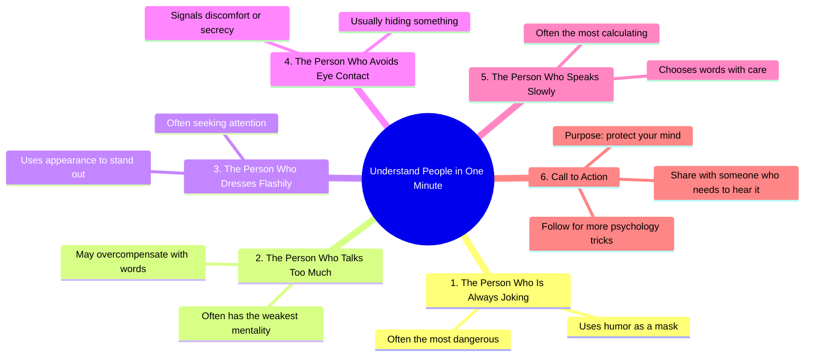

# 5 Behaviors That Reveal True Personality

> 🌐 **Read this in:** **English** · [中文](../../zh-CN/2026-09/tiktok-transcript-662k-views-27k-reactions-5-human-behaviors-that-expose-someo-49c6.md)

> **Creator:** [@Psygena](https://www.tiktok.com/@Psygena) · **Views:** 302.1K · **Posted:** 2026-09-03 · **Niche:** other
>
> **TL;DR:** The hook promises a quick, valuable skill and immediately subverts expectations with a dark twist, triggering curiosity.

[Watch original video →](https://www.facebook.com/share/r/1HcWUuXR3d/)

## Why This Went Viral

## Hook (first 3 seconds)
- **Verbatim opening:** "Understand people in one minute."
- **Hook pattern:** Bold promise + time constraint ("one minute") + direct value proposition.
- **Why it stops the scroll:** It offers instant, low-cost psychological insight. The viewer is promised a complete skill upgrade in under 60 seconds, triggering the brain's "quick win" reward anticipation. It also taps into the universal desire to decode others' hidden motives.

## Emotional Rhythm
1. **Curiosity (0–3s):** The promise of "understanding people" activates a desire for social power.
2. **Mild Tension (each numbered point):** Every "Number X" creates a micro-suspense loop — "Is this about me? Is this about my enemy?" The viewer mentally scans their social circle.
3. **Recognition/Validation (points 1–4):** Each statement feels like a secret truth, giving the viewer a sense of superiority over others.
4. **Twist/Resonance (point 5):** "Speaks slowly = most calculating" is the least intuitive, landing as a final "aha" that reframes someone the viewer may have dismissed.
5. **Protective Urgency (closing):** "Protect your mind" shifts emotion from curiosity to self-defense, creating a mild fear-based motivation to act.
6. **Climax:** Point 5 — the slow speaker reveal — is the peak because it contradicts common perception and feels like insider knowledge.

## Keyword Density
- **"Person who"** (5x) — Structural anchor, drives listicle format retention.
- **"Often"** (5x) — Softens claims, making them feel universally true without being absolute (algorithm-safe).
- **"Dangerous"** / **"Hiding"** / **"Calculating"** — Emotional pull words that trigger threat-detection.
- **"Attention"** / **"Mentality"** — Psychographic keywords that align with self-improvement audiences.
- **"Protect your mind"** — Action phrase that converts passive viewing into a share intent.
- **"Follow"** / **"Share"** — Direct algorithmic calls-to-action (boosts reach signals).

## Why It Spreads
- **Pattern interruption via listicle format:** The "Number one, two, three" cadence creates a completion compulsion — viewers stay to the end to check off all five, boosting watch time.
- **Social comparison fuel:** Each point lets the viewer categorize people in their life, making the content interactive without any action. They mentally apply it to a boss, friend, or rival.
- **The "dangerous" twist:** Point 1 ("always joking is dangerous") inverts a likable trait, creating cognitive dissonance that begs to be shared as a warning.
- **Self-protective framing:** "Share this with someone who needs to hear it" is not about entertainment — it positions the sharer as a caring protector, giving social currency.
- **Low-friction CTA stacking:** "Follow" and "Share" are both explicit and embedded, maximizing the chance of algorithmic amplification from two different actions.

## What You Can Steal
- **Use the "numbered reveal" structure:** Open with a bold time-boxed promise, then deliver 5 rapid-fire insights. The numbered format forces retention and makes the content feel skimmable yet complete.
- **Invert a positive trait for shock value:** Pick a commonly liked behavior (joking, friendliness, silence) and attach a dark or calculating motive. This creates the "wait, what?" moment that drives comments and shares.
- **Close with a protective CTA, not a generic one:** Instead of "like and subscribe," say "Share this with someone who needs to hear it" or "Follow to protect your mind." This reframes the action as a favor to others, not self-promotion, dramatically increasing share intent.

## Mind Map

## Full Transcript (Generated by [analyze your own TikToks](https://toktranscript.com/?utm_source=github&utm_medium=breakdown&utm_campaign=tool_attribution))

> 📝 Transcripts on this page are auto-generated and show the first 60%. Want to transcribe any TikTok in 30 seconds and get the full version? [Try TokTranscript free →](https://toktranscript.com/?utm_source=github&utm_medium=breakdown&utm_campaign=transcript_cta)

Understand people in one minute. Number one, the person who is always joking is often the most dangerous. Number two, the person who talks too much often has the weakest mentality. Number three, the person who dresses flashily is often seeking attention.

*[Read the full transcript on TokTranscript →](https://toktranscript.com/plaza/tiktok-transcript-662k-views-27k-reactions-5-human-behaviors-that-expose-someo-49c6?utm_source=github&utm_medium=breakdown&utm_campaign=transcript_full)*

## Browse More

- All [other](../../by-niche/en/other.md) breakdowns
- All [Listicle with shocking claim](../../by-pattern/en/hook-listicle-with-shocking-claim.md) examples

## Video Info

| | |
|---|---|
| Creator | [@Psygena](https://www.tiktok.com/@Psygena) |
| Original video | [https://www.facebook.com/share/r/1HcWUuXR3d/](https://www.facebook.com/share/r/1HcWUuXR3d/) |
| Original title | 662K views · 27K reactions | 5 Human Behaviors That Expose Someone’s True Personality. Most people hide their true intentions with words… but their behavior always exposes them. In this video, discover the hidden psychology behind human actions, body language, and subconscious behavior patterns through the wisdom of Niccolò Machiavelli and modern psychology. If you understand behavior, you understand power. Watch till the end — the final sign is the most dangerous. #psychology #humanbehavior #mindgames #bodylanguage #darkpsychology #machiavelli | Psygena |
| Views | 302.1K (302130) |
| Posted | 2026-09-03 |
| Duration | 0s |
| Niche | `other` |
| Hook pattern | `Listicle with shocking claim` |
| Original language | `en` |
| Available languages | en, zh-CN |
| Generated | 2026-09-04 by [TokTranscript](https://toktranscript.com/) |

---

*This breakdown is for educational analysis under fair use. Original video © [@Psygena](https://www.tiktok.com/@Psygena). All transcripts are auto-generated and may contain errors.*

*Want to analyze your own TikToks like this? [TokTranscript →](https://toktranscript.com/viral-breakdown?utm_source=github&utm_medium=breakdown&utm_campaign=footer_cta)*