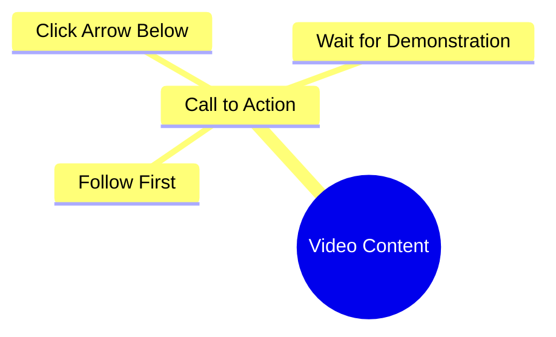

# Wafa World Reel: Follow for Friendship Content

> 🌐 **Read this in:** **English** · [中文](../../zh-CN/2026-09/tiktok-transcript-7-1m-views-90k-reactions-wafa-world-facebookreels-reels-tren-21a6.md)

> **Creator:** [@Sonlika Tudu](https://www.tiktok.com/@Sonlika Tudu) · **Views:** 3.3M · **Posted:** 2026-09-24 · **Niche:** entertainment
>
> **TL;DR:** Creates immediate curiosity by claiming to know the viewer's desire, then demands a follow and click to reveal the payoff.

[Watch original video →](https://www.facebook.com/share/r/19nXrTCjkM/)

## Why This Went Viral

## Hook (first 3 seconds)
- Verbatim: "मुझे पता है आपको क्या चाहिए पहले फॉलो करो और नीचे जो तीर का निसान है वहाँ पे आओ फिर दिखाती हूँ" ("I know what you want — first follow, then come to the arrow mark below, then I'll show you")
- Pattern: **Command + withheld reveal** (a gatekeeping/curiosity-gap hook, not a claim or question)
- Why it stops the scroll: It opens with "I know what you want" — a personal mind-read that makes the viewer feel targeted — then immediately imposes a condition (follow + tap the arrow) before delivering the payoff. The unresolved promise creates an open loop the brain wants to close.

## Emotional Rhythm
- **Beat 1 – Recognition (0–1s):** "I know what you want" → flattery/being seen.
- **Beat 2 – Micro-friction (1–3s):** Two commands (follow, tap arrow) → small resistance, but the reward is dangled.
- **Beat 3 – Suspense plateau (3s–end):** "फिर दिखाती हूँ" ("then I'll show you") → the reveal is deferred, not delivered.
- **Climax:** The phrase "फिर दिखाती हूँ" itself — the promise of a payoff is the peak, not any actual content.
- **Twist:** There is no twist and no payoff inside the clip; the "reward" is the act of following. The video's tension is deliberately never resolved on-screen.

## Keyword Density
- **फॉलो** (follow) — primary algorithmic driver; directly signals engagement intent to the platform.
- **आपको / आप** (you) — emotional pull; second-person address personalizes the command.
- **क्या चाहिए** (what you want) — curiosity driver; frames the viewer as having an unmet need.
- **नीचे** (below) — directional CTA; pushes attention to the UI element.
- **तीर का निसान** (arrow mark) — spatial instruction; reinforces the tap target.
- **आओ** (come) — imperative pull; movement command.
- **दिखाती हूँ** (I'll show) — deferred-payoff keyword; sustains the open loop.
- Algorithmic reach: फॉलो, नीचे, तीर का निसान (engagement/UI actions). Emotional pull: आपको, क्या चाहिए, दिखाती हूँ (personalization + promise).

## Why It Spreads
- **Zero-cost open loop:** "फिर दिखाती हूँ" promises a reveal that never comes in the clip — viewers rewatch or comment asking "what was it?", feeding the algorithm.
- **Direct second-person targeting:** "मुझे पता है आपको क्या चाहिए" makes every viewer feel individually addressed, raising completion and rewatch rates.
- **Built-in engagement instruction:** "पहले फॉलो करो" and "नीचे... तीर का निसान" literally script the follow + tap actions, converting passive viewers into measurable signals.
- **Comment-bait by omission:** The missing payoff is the comment section's job to demand — "kya dikhana tha?" comments spike interaction.
- **Low production, high transferability:** The entire clip is one spoken CTA, so it's endlessly remixable/duetable, multiplying distribution.

## What You Can Steal
1. **Open with a mind-read, not a claim:** Lead with "I know what you want" / "You've been doing X wrong" to make the viewer feel personally seen in under 1 second.
2. **Gate the payoff behind one micro-action:** Ask for a single, specific UI action (follow, tap the arrow, save) before revealing — but keep it to one ask so it doesn't feel like begging.
3. **Defer the reveal, don't cancel it:** End on "then I'll show you" and deliver the actual payoff in the next clip or pinned comment — this turns one video into a follow-triggering series.

## Mind Map

## Full Transcript (Generated by [TokTranscript.com](https://toktranscript.com/?utm_source=github&utm_medium=breakdown&utm_campaign=tool_attribution))

> 📝 Transcripts on this page are auto-generated and show the first 60%. Want to transcribe any TikTok in 30 seconds and get the full version? [Try TokTranscript free →](https://toktranscript.com/?utm_source=github&utm_medium=breakdown&utm_campaign=transcript_cta)

मुझे पता है आपको क्या चाहिए पहले फॉलो करो और नीचे जो तीर

*[Read the full transcript on TokTranscript →](https://toktranscript.com/plaza/tiktok-transcript-7-1m-views-90k-reactions-wafa-world-facebookreels-reels-tren-21a6?utm_source=github&utm_medium=breakdown&utm_campaign=transcript_full)*

## Browse More

- All [entertainment](../../by-niche/en/entertainment.md) breakdowns
- All [Curiosity Gap + Direct Command](../../by-pattern/en/hook-curiosity-gap-direct-command.md) examples

## Video Info

| | |
|---|---|
| Creator | [@Sonlika Tudu](https://www.tiktok.com/@Sonlika Tudu) |
| Original video | [https://www.facebook.com/share/r/19nXrTCjkM/](https://www.facebook.com/share/r/19nXrTCjkM/) |
| Original title | 7.1M views · 90K reactions | Wafa World 🥀 #FacebookReels #Reels #TrendingReels #ReelsVideo #ShortVideo #ViralVideo #Explore #ForYou #Dosti #Friendship #OnlineDosti #DesiVibes #UrduPosts #followformore | Sonlika Tudu |
| Views | 3.3M (3296128) |
| Posted | 2026-09-24 |
| Duration | 0s |
| Niche | `entertainment` |
| Hook pattern | `Curiosity Gap + Direct Command` |
| Original language | `en` |
| Available languages | en, zh-CN |
| Generated | 2026-09-25 by [TokTranscript](https://toktranscript.com/) |

---

*This breakdown is for educational analysis under fair use. Original video © [@Sonlika Tudu](https://www.tiktok.com/@Sonlika Tudu). All transcripts are auto-generated and may contain errors.*

*Want to analyze your own TikToks like this? [the tool we used to generate this →](https://toktranscript.com/viral-breakdown?utm_source=github&utm_medium=breakdown&utm_campaign=footer_cta)*