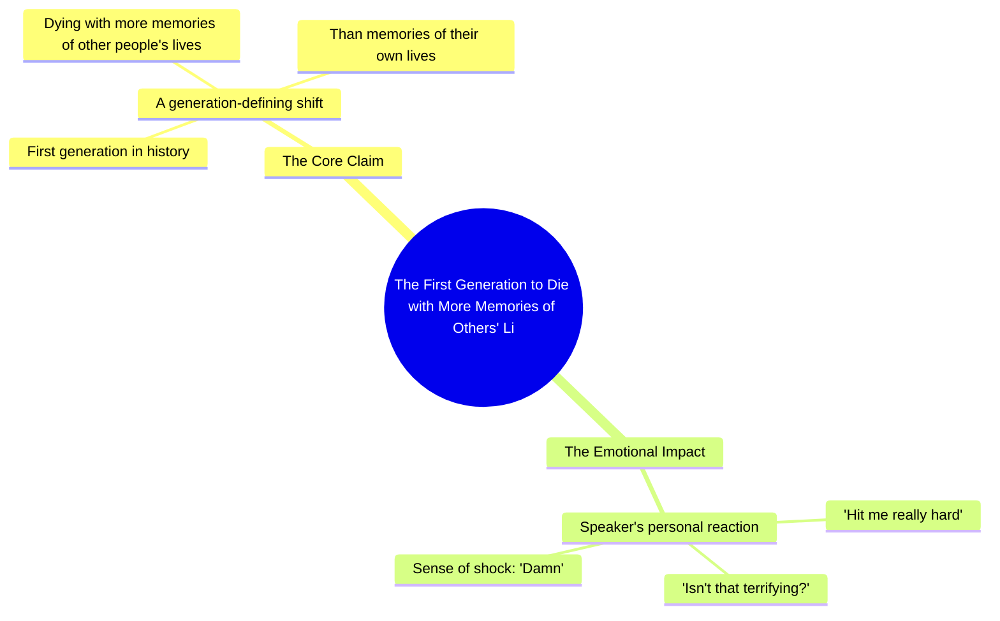

# Generation Living Through Others' Memories, Not Their Own

> 🌐 **Read this in:** **English** · [中文](../../zh-CN/2026-09/tiktok-transcript-7-5m-views-116k-reactions-go-live-your-life-dietstartsmonday-78c8.md)

> **Creator:** [@Diet Starts Monday](https://www.tiktok.com/@Diet Starts Monday) · **Views:** 3.5M · **Posted:** 2026-09-11 · **Niche:** entertainment
>
> **TL;DR:** It makes a bold, unsettling claim about a generation, immediately grabbing attention and provoking thought.

[Watch original video →](https://www.facebook.com/share/r/19SQmVcgU6/)

## Why This Went Viral

## Hook (first 3 seconds)
- **Verbatim opening line:** "This generation will be the first to die with more memories of other people's lives than of their own."
- **Hook pattern:** Bold claim / prophecy + contrast (your life vs. others' lives) — a "dark prediction" hook.
- **Why it stops the scroll:** It's a complete, self-contained, uncomfortable thesis delivered in one breath. It triggers existential self-audit ("is that me?") before the viewer can decide to leave. The word "die" adds mortality stakes, and "first" implies a historical rupture you're part of.

## Emotional Rhythm
- **Beat 1 — Cold open / prophecy (0–3s):** Declarative, no setup. Lands as a statement of fact, not an opinion. Creates instant unease.
- **Beat 2 — Validation ("Yeah."):** A one-word agreement beat. Functions as a pause and a mirror — the creator agrees with the horror, pulling the viewer into a shared "we're all screwed" space.
- **Beat 3 — Direct question ("Isn't that terrifying?"):** Shifts from statement to interrogation. Forces internal response, which is the engagement trigger.
- **Beat 4 — Personal confession ("Hit me really hard. I was like, damn."):** Vulnerability drop. Breaks the lecture tone and makes it human. This is the **resonance beat** — the moment viewers comment "same."
- **Climax:** The opening line itself is the climax. Everything after is aftershock. This is a "front-loaded" video — the peak is at second 1, and the rest is emotional confirmation.

## Keyword Density
- **"generation"** — identity marker; makes it feel like a generational diagnosis you're implicated in.
- **"first"** — novelty/historical framing; drives algorithmic curiosity ("first to what?").
- **"die" / "memories"** — mortality + memory; the emotional core. High dwell-time words.
- **"other people's lives"** — the contrast anchor; the phrase people repeat when sharing.
- **"terrifying"** — emotional label; tells viewers how to feel, which increases comment volume.
- **"hit me really hard" / "damn"** — relatability keywords; convert a thesis into a personal reaction.

**Algorithmic reach drivers:** "generation," "first," "die" — broad, high-search, high-share terms.
**Emotional pull drivers:** "memories," "other people's lives," "terrifying" — these are what people quote in comments and reposts.

## Why It Spreads
- **It's a shareable sentence, not a shareable video.** The opening line is quotable verbatim. People screenshot it, tweet it, and caption their own posts with it — the transcript *is* the meme.
- **It assigns collective guilt/identity.** "This generation" makes the viewer a participant, not an observer. Sharing it becomes a form of self-labeling ("this is so us").
- **The "Yeah." and "Isn't that terrifying?" create a call-and-response.** The video asks a question the viewer answers internally, and the pause invites them to answer in the comments — a direct engagement mechanic.
- **The personal confession ("Hit me really hard. I was like, damn.") lowers the barrier to reply.** It models vulnerability, so commenters feel licensed to share their own "damn" moment.
- **It's short enough to loop and re-watch.** The whole payload fits in ~10 seconds, so completion rate and replays spike — two of the strongest distribution signals.

## What You Can Steal
1. **Front-load a complete, uncomfortable thesis in one sentence.** Don't build to the point — open with the point. Make it quotable in isolation, with no context needed.
2. **Use "this generation / this era / we" framing.** Collective identity language turns passive viewers into implicated participants, which drives shares and self-labeling comments.
3. **Follow the thesis with a validation beat + direct question + personal confession.** The pattern "Yeah. Isn't that terrifying? Hit me really hard." is a reusable emotional arc: agree → interrogate → confess. It converts a statement into a conversation.

## Mind Map

## Full Transcript (Generated by [try this transcription tool](https://toktranscript.com/?utm_source=github&utm_medium=breakdown&utm_campaign=tool_attribution))

> 📝 Transcripts on this page are auto-generated and show the first 60%. Want to transcribe any TikTok in 30 seconds and get the full version? [Try TokTranscript free →](https://toktranscript.com/?utm_source=github&utm_medium=breakdown&utm_campaign=transcript_cta)

This generation will be the first to die with more memories of other people's lives than of their own

*[Read the full transcript on TokTranscript →](https://toktranscript.com/plaza/tiktok-transcript-7-5m-views-116k-reactions-go-live-your-life-dietstartsmonday-78c8?utm_source=github&utm_medium=breakdown&utm_campaign=transcript_full)*

## Browse More

- All [entertainment](../../by-niche/en/entertainment.md) breakdowns
- All [Provocative Prediction](../../by-pattern/en/hook-provocative-prediction.md) examples

## Video Info

| | |
|---|---|
| Creator | [@Diet Starts Monday](https://www.tiktok.com/@Diet Starts Monday) |
| Original video | [https://www.facebook.com/share/r/19SQmVcgU6/](https://www.facebook.com/share/r/19SQmVcgU6/) |
| Original title | 7.5M views · 116K reactions | Go live your life. #dietstartsmonday #podcast #generation #socialmedia | Diet Starts Monday |
| Views | 3.5M (3477323) |
| Posted | 2026-09-11 |
| Duration | 0s |
| Niche | `entertainment` |
| Hook pattern | `Provocative Prediction` |
| Original language | `en` |
| Available languages | en, zh-CN |
| Generated | 2026-09-12 by [TokTranscript](https://toktranscript.com/) |

---

*This breakdown is for educational analysis under fair use. Original video © [@Diet Starts Monday](https://www.tiktok.com/@Diet Starts Monday). All transcripts are auto-generated and may contain errors.*

*Want to analyze your own TikToks like this? [free TikTok transcript generator →](https://toktranscript.com/viral-breakdown?utm_source=github&utm_medium=breakdown&utm_campaign=footer_cta)*