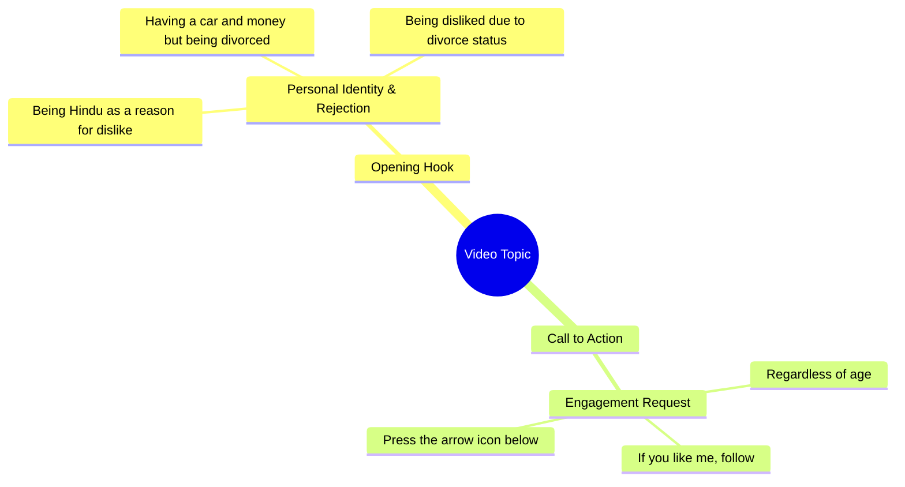

# Divorced Man Says Nobody Likes Him for Being Hindu

> 🌐 **Read this in:** **English** · [中文](../../zh-CN/2026-09/tiktok-transcript-8-1m-views-217k-reactions-wafa-world-facebookreels-reels-tre-46ee.md)

> **Creator:** [@Diya Sinha ](https://www.tiktok.com/@Diya Sinha ) · **Views:** 3.1M · **Posted:** 2026-09-23 · **Niche:** entertainment
>
> **TL;DR:** Opens with a bold religious identity statement that immediately provokes curiosity and debate.

[Watch original video →](https://www.facebook.com/share/r/1DwK9gS5RF/)

## Why This Went Viral

## Hook (first 3 seconds)
- **Verbatim opening line:** "हिंदू हूँ इसलिए पसंद नहीं करते" ("I'm Hindu, so they don't like me")
- **Hook pattern:** Bold claim + identity-based rejection (a "rejection confession" hook)
- **Why it stops the scroll:** It opens on a raw, controversial social verdict — religious identity as a reason for being unwanted. It triggers instant curiosity ("why would that matter?") and tribal defensiveness (viewers either agree, object, or feel seen), forcing a pause before they can judge.

## Emotional Rhythm
- **Beat 1 — Curiosity/Shock:** "हिंदू हूँ इसलिए पसंद नहीं करते" — an identity rejected.
- **Beat 2 — Escalation (status vs. loneliness):** "गाड़ी है, पैसा है" — material success stacked up.
- **Beat 3 — Tension/twist:** "लेकिन तलाक शुदा हूँ इसलिए कोई मुझे पसंद नहीं करता" — the real wound revealed: divorced, unwanted.
- **Beat 4 — Universal resonance:** "उम्र कितनी भी हो" — age-proof insecurity, widens relatability.
- **Climax:** "अगर मैं आपको पसंद हूँ" — the pivot from rejection to direct appeal, turning the viewer into the judge/validator.
- **Resolution/CTA:** "फॉलो करके नीचे तीर के निशान पे दबाओ" — converts emotion into an action.
- **Climax moment:** The line "अगर मैं आपको पसंद हूँ" — the whole video exists to earn that one conditional.

## Keyword Density
- **हिंदू** (Hindu) — algorithmic reach (identity/religion = high-engagement trigger)
- **पसंद नहीं करते / पसंद** (don't like / like) — emotional pull (rejection + validation loop)
- **तलाक शुदा** (divorced) — emotional pull (stigma, vulnerability)
- **गाड़ी / पैसा** (car / money) — algorithmic + aspirational reach (status markers)
- **उम्र** (age) — emotional pull (universal insecurity)
- **कोई मुझे** (nobody / me) — emotional pull (self-pity framing)
- **फॉलो करके** (follow) — algorithmic reach (direct engagement signal)
- **तीर के निशान** (arrow mark) — algorithmic reach (UI action cue)

**Drivers:** "हिंदू," "गाड़ी," "पैसा," "फॉलो" push distribution via identity + aspiration + explicit CTA. "पसंद," "तलाक शुदा," "उम्र" drive the emotional pull that makes people comment.

## Why It Spreads
- **Identity-bait opener** — "हिंदू हूँ इसलिए पसंद नहीं करते" forces a stance; viewers comment to agree or argue, and comments are the strongest ranking signal.
- **Status-vs-loneliness contrast** — "गाड़ी है, पैसा है लेकिन..." creates a paradox people screenshot and share as a "money can't buy love" truth.
- **Stigma confession** — "तलाक शुदा हूँ" taps a large, underserved audience who rarely see their story; they share it as representation.
- **Universal self-pity bridge** — "उम्र कितनी भी हो" makes the specific story feel like everyone's story, broadening the share pool.
- **Direct validation CTA** — "अगर मैं आपको पसंद हूँ तो फॉलो करके..." turns sympathy into a frictionless follow, spiking completion + follow rate.

## What You Can Steal
1. **Open with a rejection, not an introduction.** Lead with the sentence people would say *about* you ("X हूँ इसलिए पसंद नहीं करते") — it creates instant tension and a comment trigger.
2. **Stack status against a wound.** Pair what you have (गाड़ी, पैसा) with what you lack (love, acceptance) — the contrast is what gets screenshotted and shared.
3. **Make the viewer the validator, then give a tiny CTA.** End on a conditional ("अगर मैं आपको पसंद हूँ...") and attach one low-effort action (follow / tap the arrow) so emotion converts directly into engagement.

## Mind Map

## Full Transcript (Generated by [free TikTok transcript generator](https://toktranscript.com/?utm_source=github&utm_medium=breakdown&utm_campaign=tool_attribution))

> 📝 Transcripts on this page are auto-generated and show the first 60%. Want to transcribe any TikTok in 30 seconds and get the full version? [Try TokTranscript free →](https://toktranscript.com/?utm_source=github&utm_medium=breakdown&utm_campaign=transcript_cta)

हिंदू हूँ इसलिए पसंद नहीं करते, गाड़ी है, पैसा है लेकिन तलाक शुदा हूँ इसलिए कोई मुझे पसंद नहीं करता, उम्र क

*[Read the full transcript on TokTranscript →](https://toktranscript.com/plaza/tiktok-transcript-8-1m-views-217k-reactions-wafa-world-facebookreels-reels-tre-46ee?utm_source=github&utm_medium=breakdown&utm_campaign=transcript_full)*

## Browse More

- All [entertainment](../../by-niche/en/entertainment.md) breakdowns
- All [Controversial Confession](../../by-pattern/en/hook-controversial-confession.md) examples

## Video Info

| | |
|---|---|
| Creator | [@Diya Sinha ](https://www.tiktok.com/@Diya Sinha ) |
| Original video | [https://www.facebook.com/share/r/1DwK9gS5RF/](https://www.facebook.com/share/r/1DwK9gS5RF/) |
| Original title | 8.1M views · 217K reactions | Wafa World 🥀 #FacebookReels #Reels #TrendingReels #ReelsVideo #ShortVideo #ViralVideo #Explore #ForYou #Dosti #Friendship #OnlineDosti #DesiVibes | Diya Sinha |
| Views | 3.1M (3074595) |
| Posted | 2026-09-23 |
| Duration | 0s |
| Niche | `entertainment` |
| Hook pattern | `Controversial Confession` |
| Original language | `en` |
| Available languages | en, zh-CN |
| Generated | 2026-09-24 by [TokTranscript](https://toktranscript.com/) |

---

*This breakdown is for educational analysis under fair use. Original video © [@Diya Sinha ](https://www.tiktok.com/@Diya Sinha ). All transcripts are auto-generated and may contain errors.*

*Want to analyze your own TikToks like this? [TokTranscript →](https://toktranscript.com/viral-breakdown?utm_source=github&utm_medium=breakdown&utm_campaign=footer_cta)*