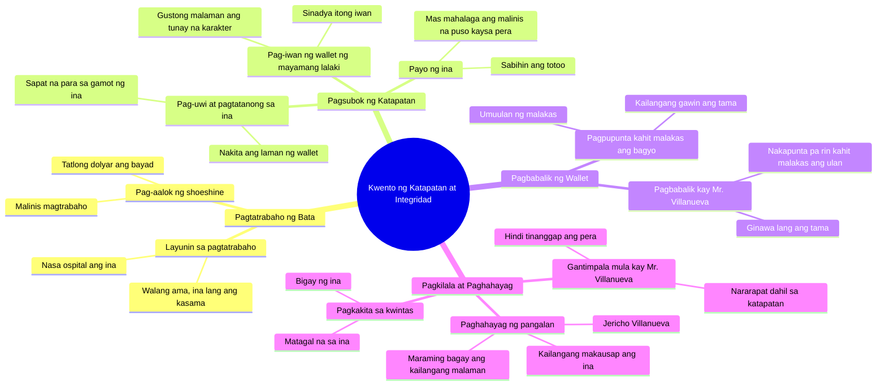

# Jericho's Honest Shoeshine Earns Praise

> 🌐 **Read this in:** **English** · [中文](../../zh-CN/2026-09/tiktok-transcript-8-1m-views-249k-reactions-ang-malinis-na-trabaho-ni-jericho-acc3.md)

> **Creator:** [@Karlos](https://www.tiktok.com/@Karlos) · **Views:** 4.5M · **Posted:** 2026-09-12 · **Niche:** entertainment
>
> **TL;DR:** The hook instantly creates tension by introducing a poor shoeshine boy and a wealthy man's dismissive companion, setting up a classic underdog vs. elite dynamic.

[Watch original video →](https://www.facebook.com/share/v/1KyvBqoChS/)

## Why This Went Viral

## Hook (first 3 seconds)
- **Verbatim:** "Sir, do you need a shoeshine?" — a boy offering his service on the street.
- **Hook pattern:** *Scene + question* (in-media-res situation with a direct question to "sir").
- **Why viewers stop:** It immediately sets up a power dynamic (wealthy vs. poor child) and the brain asks: *"What will happen to this boy?"* The simple question becomes a doorway into a moral story.

## Emotional Rhythm
- **Curiosity (0–5s):** Shoeshine offer → who is the boy, why is he working?
- **Tension #1 (5–15s):** "That kid is probably just after alms" — the contempt of Mr. Villanueva's companion. A villain appears immediately.
- **Resonance (15–25s):** "Mama is in the hospital… Mama is all I have." — heartbreak beat. This is where sympathy takes hold.
- **Setup of the test (25–40s):** The wallet is left behind — "Let's see how honest you are when no one is watching." Suspense: will he take it or return it?
- **Tension #2 (40–60s):** Wallet at home, Mama's advice: *"A clean heart is more important than money."* Storm rolls in — literal and moral tension.
- **Climax (60–75s):** A storm is raging, Jericho arrives to return the wallet. *"I need to do what's right."* This is where the emotion explodes.
- **Twist (75–90s):** Necklace → "Jericho Villanueva" → *"Villanueva…"* — the boy turns out to be related to Mr. Villanueva. This is the **plot twist** that makes shares explode.

## Keyword Density
- **"Mama"** — emotional anchor, mentioned repeatedly.
- **"Honest / honesty"** — core theme, algorithmic hook.
- **"Right / do what's right"** — the story's moral compass.
- **"Money"** — contrast with "clean heart."
- **"Villanueva"** — twist keyword, connects the beginning and the end.
- **"Wallet"** — MacGuffin, plot driver.
- **"Necklace"** — revelation device.
- **"Rain / storm"** — symbolic tension amplifier.

**Algorithmic drivers:** *"Honest," "Mama," "Villanueva"* — high search and replay value. **Emotional pull:** *"Mama," "heart," "right"* — triggers comments and shares ("I cried").

## Why It Spreads
- **Moral test formula:** "Let's see how honest you are when no one is watching" — a classic dilemma people watch to find out the answer to.
- **Reversal of expectations:** Everyone thought the boy was just after alms; it became an honesty test. Mr. Villanueva's companion's contempt serves as a foil.
- **Sacrifice under pressure:** He still came despite the storm — *"I need to do what's right."* Emotion peaks before the twist.
- **Twist that changes everything:** *"Jericho Villanueva… Villanueva."* Just one name rewired the entire story — this is the share-trigger.
- **Family + poverty + integrity:** Universal Filipino values (family, hardship, dignity) — relatable to the masses, which is why comments and shares are high.

## What You Can Steal
1. **Set up a moral test in the first 30 seconds.** A dilemma with a clear right/wrong — people watch to find out the answer.
2. **Use one word as a twist trigger.** A name, object, or line that changes the entire meaning (like "Villanueva" or the necklace).
3. **Layer literal and symbolic tension.** Storm outside + moral pressure inside — double the emotional impact.

## Mind Map

## Full Transcript (Generated by [TokTranscript](https://toktranscript.com/?utm_source=github&utm_medium=breakdown&utm_campaign=tool_attribution))

> 📝 Transcripts on this page are auto-generated and show the first 60%. Want to transcribe any TikTok in 30 seconds and get the full version? [Try TokTranscript free →](https://toktranscript.com/?utm_source=github&utm_medium=breakdown&utm_campaign=transcript_cta)

Sir, kailangan niyo po ba ng shoeshine? Hayaan mo na, Mr. Villanueva. Baka limos lang ang habol niyan. Hindi po, sir. Nagtatrabaho po ako para kumita. Magkano? Tatlong dolyar lang po. Magmumukhang bago ang sapatos niyo. Malinis kang magtrabaho, iho. Sabi po ni Mama, kahit maliit na trabaho, dapat malaki ang effort. Bakit ka nagtatrabaho sa ganitong panahon? Nasa ospital po si Mama. At ang tatay mo? Si mama lang po ang meron ako. Sir, sobra naman po ito. Punin mo. Para sa mama mo. Tingnan natin kung gaano ka katapat kapag walang nakakakita. Sir, naiwan niyo po ang wallet niyo. Alam ko. Sinadya niyo? Gusto kong malaman kung sino talaga ang binatang yun. Sir, shoeshine worker lang naman siya. Mr. Villanueva? Aalis na pala sila. Hindi ito sa akin. Kailangan kong tanungin si Mama kung ano ang gagawin. Jericho, ano yan? Iniwan po nung mayamang lalaki kanina. Tinignan mo ba? Hindi po Mabuti Tingnan natin ang magkasama Ma pwede nitong bayaran lahat ng gamot mo Totoo. Pero kailangan natin ng pera. Anak, mas mahalaga ang malinis na puso kaysa pera. Paano kong isipin niyang kinuha ko? Sabihin mo ang totoo. Babalik ko po bukas

*[Read the full transcript on TokTranscript →](https://toktranscript.com/plaza/tiktok-transcript-8-1m-views-249k-reactions-ang-malinis-na-trabaho-ni-jericho-acc3?utm_source=github&utm_medium=breakdown&utm_campaign=transcript_full)*

## Browse More

- All [entertainment](../../by-niche/en/entertainment.md) breakdowns
- All [Immediate Conflict & Misjudgment](../../by-pattern/en/hook-immediate-conflict-misjudgment.md) examples

## Video Info

| | |
|---|---|
| Creator | [@Karlos](https://www.tiktok.com/@Karlos) |
| Original video | [https://www.facebook.com/share/v/1KyvBqoChS/](https://www.facebook.com/share/v/1KyvBqoChS/) |
| Original title | 8.1M views · 249K reactions | Ang Malinis na Trabaho ni Jericho #DramaSeries #kindnessmatters #LifeLesson | Karlos |
| Views | 4.5M (4472239) |
| Posted | 2026-09-12 |
| Duration | 0s |
| Niche | `entertainment` |
| Hook pattern | `Immediate Conflict & Misjudgment` |
| Original language | `tl` (this page translated by AI) |
| Available languages | en, zh-CN |
| Generated | 2026-09-13 by [TokTranscript](https://toktranscript.com/) |

---

*This breakdown is for educational analysis under fair use. Original video © [@Karlos](https://www.tiktok.com/@Karlos). All transcripts are auto-generated and may contain errors.*

*Want to analyze your own TikToks like this? [the tool we used to generate this →](https://toktranscript.com/viral-breakdown?utm_source=github&utm_medium=breakdown&utm_campaign=footer_cta)*