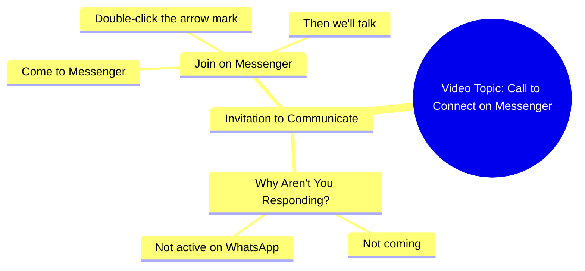

# Why Don't You Come Talk on Messenger

> 🌐 **Read this in:** **English** · [中文](../../zh-CN/2026-09/tiktok-transcript-8-9m-views-237k-reactions-03045658506-740c.md)

> **Creator:** [@03045658506](https://www.tiktok.com/@03045658506) · **Views:** 2.7M · **Posted:** 2026-09-21 · **Niche:** other
>
> **TL;DR:** The hook directly questions the audience, creating immediate engagement and curiosity.

[Watch original video →](https://www.facebook.com/share/r/1FSTNPFtH1/)

## Why This Went Viral

## Hook (first 3 seconds)
- Verbatim opening: "आप लोग क्यों नहीं आते हो, WhatsApp पे तो नहीं आ रहे हो, Messenger पे तो आ जाओ…" — a direct, wounded-sounding plea to an absent audience.
- Hook pattern: **Direct accusation + emotional plea** (a variant of the "callout/confrontation" hook), immediately followed by a CTA.
- Why it stops the scroll: It breaks the fourth wall and addresses the viewer as if they personally ghosted the creator. The accusatory "आप लोग क्यों नहीं आते हो" triggers guilt/curiosity ("is he talking to me?"), and the rapid pivot to a platform instruction creates confusion that demands resolution — the brain stays to find out what's actually being asked.

## Emotional Rhythm
- **Beat 1 – Confrontation/guilt (0–1s):** "आप लोग क्यों नहीं आते हो" — mild accusation, viewer feels singled out.
- **Beat 2 – Escalating complaint (1–3s):** "WhatsApp पे तो नहीं आ रहे हो" — repeated grievance, builds a "he's been waiting" narrative.
- **Beat 3 – Pivot to instruction (3–5s):** "Messenger पे तो आ जाओ, तीर के निशान पे दो बार क्लिक करो" — tension converts into a concrete action.
- **Beat 4 – Resolution/promise (final line):** "फिर बात करते हैं" — soft, intimate payoff ("then we'll talk"), relief + reward.
- **Climax:** The instruction "तीर के निशान पे दो बार क्लिक करो" — the emotional build-up collapses into a single physical action, which is the whole point of the video.
- Suspense lands on *why* he's upset; resonance lands on the "फिर बात करते हैं" intimacy; the twist is that the "emotional crisis" is actually a funnel to a follow/redirect.

## Keyword Density
- **आप लोग** (you people) — direct address, emotional pull
- **क्यों नहीं आते हो** (why don't you come) — guilt trigger, emotional pull
- **WhatsApp / Messenger** — platform names, algorithmic + search reach
- **आ जाओ / आ रहे हो** (come / aren't coming) — repetition creates rhythm and urgency
- **तीर के निशान** (the arrow icon) — the literal CTA object, drives the intended action
- **दो बार क्लिक करो** (click twice) — imperative verb, action-driving
- **फिर बात करते हैं** (then we'll talk) — intimacy/reward keyword, emotional pull
- **Algorithmic drivers:** "WhatsApp," "Messenger," "क्लिक करो" — platform + action words surface the video to users already engaging with messaging apps and boost comment/share signals.
- **Emotional drivers:** "आप लोग क्यों नहीं आते हो" and "फिर बात करते हैं" — these carry the parasocial weight that makes people reply, tag friends, and rewatch.

## Why It Spreads
- **It weaponizes parasocial guilt.** "आप लोग क्यों नहीं आते हो" makes each viewer feel personally addressed and slightly accused — the strongest driver of comments ("sorry bhai aa raha hoon") and shares.
- **It's a disguised CTA.** The entire emotional arc exists to deliver one instruction: "तीर के निशान पे दो बार क्लिक करो." Viewers who comply generate the follow/click signal the algorithm rewards, and the video's purpose is invisible until the end.
- **It's short enough to loop and re-share as a joke.** The whole thing is one breath — people send it to friends as "he's talking about you," turning the video into a social prop.
- **Platform names act as reach bait.** "WhatsApp" and "Messenger" are high-frequency search/interest terms; the video gets surfaced to anyone whose feed is messaging-app-adjacent.
- **The closing line invites reciprocity.** "फिर बात करते हैं" promises a two-way relationship, which converts passive viewers into commenters and DM-ers — engagement signals that push the video further.

## What You Can Steal
- **Open with a direct accusation or plea to "you people."** Addressing the audience as if they owe you something ("आप लोग क्यों नहीं आते हो") creates instant guilt-curiosity and stops the scroll within one second.
- **Bury your CTA inside an emotional story.** Don't say "follow me" — build a 5-second mini-drama whose only resolution is the action you want ("तीर के निशान पे दो बार क्लिक करो"). The emotion does the persuading.
- **End on an intimate promise, not a demand.** "फिर बात करते हैं" feels like a relationship, not a transaction — it converts viewers into commenters and gives them a reason to return.

## Mind Map

## Full Transcript (Generated by [TokTranscript](https://toktranscript.com/?utm_source=github&utm_medium=breakdown&utm_campaign=tool_attribution))

> 📝 Transcripts on this page are auto-generated and show the first 60%. Want to transcribe any TikTok in 30 seconds and get the full version? [Try TokTranscript free →](https://toktranscript.com/?utm_source=github&utm_medium=breakdown&utm_campaign=transcript_cta)

आप लोग क्यों नहीं आते हो, WhatsApp पे तो नहीं आ रहे हो, Messenger पे तो आ जाओ, तीर के निश

*[Read the full transcript on TokTranscript →](https://toktranscript.com/plaza/tiktok-transcript-8-9m-views-237k-reactions-03045658506-740c?utm_source=github&utm_medium=breakdown&utm_campaign=transcript_full)*

## Browse More

- All [other](../../by-niche/en/other.md) breakdowns
- All [Direct Question](../../by-pattern/en/hook-direct-question.md) examples

## Video Info

| | |
|---|---|
| Creator | [@03045658506](https://www.tiktok.com/@03045658506) |
| Original video | [https://www.facebook.com/share/r/1FSTNPFtH1/](https://www.facebook.com/share/r/1FSTNPFtH1/) |
| Original title | 8.9M views · 237K reactions | آپ کیوں نہیں آتے ہو | 03045658506 |
| Views | 2.7M (2663651) |
| Posted | 2026-09-21 |
| Duration | 0s |
| Niche | `other` |
| Hook pattern | `Direct Question` |
| Original language | `en` |
| Available languages | en, zh-CN |
| Generated | 2026-09-22 by [TokTranscript](https://toktranscript.com/) |

---

*This breakdown is for educational analysis under fair use. Original video © [@03045658506](https://www.tiktok.com/@03045658506). All transcripts are auto-generated and may contain errors.*

*Want to analyze your own TikToks like this? [TokTranscript.com →](https://toktranscript.com/viral-breakdown?utm_source=github&utm_medium=breakdown&utm_campaign=footer_cta)*