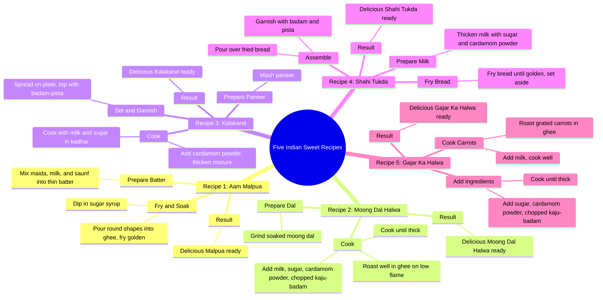

# 3 Easy Indian Mithai Recipes: Malpua and Moong Dal Halwa

> 🌐 **Read this in:** **English** · [中文](../../zh-CN/2026-09/tiktok-transcript-9-5m-views-91k-reactions-viralreels-fbreels-trendingreels-in-e802.md)

> **Creator:** [@Facts Girl](https://www.tiktok.com/@Facts Girl) · **Views:** 4.2M · **Posted:** 2026-09-26 · **Niche:** food
>
> **TL;DR:** Starts with a numbered list, immediately promising multiple recipes, which hooks viewers interested in variety.

[Watch original video →](https://www.facebook.com/share/r/1CWa5xbmmv/)

## Why This Went Viral

## Hook (first 3 seconds)
- Opens with "नमबर एक, आम मालपुआ" (Number one, Aam Malpua) — a numbered list entry, not a greeting, not a face, not a question.
- Hook pattern: **numbered list / countdown-style promise** ("Number 1..." implies more coming, creating an open loop).
- It stops the scroll because it instantly signals *utility density* — the viewer knows within one second they're getting multiple recipes, not one, so the perceived value-per-second is high. No wasted intro, no "hi guys," no setup.

## Emotional Rhythm
- **Curiosity** (0–2s): "Number one" + a dish name — brain asks "how many? what are they?"
- **Micro-satisfaction loop** (repeats 5×): each recipe delivers setup → action → payoff ("स्वादिश्ट... तैयार है" / "delicious... is ready"). This is a dopamine cadence, not a story arc.
- **Anticipation/listing tension**: the numbering ("नमबर दो", "नमबर 3", "नमबर चार", "नमबर पांच") keeps a countdown running in the viewer's head — they stay to complete the set.
- **Climax moment**: the final item, "नमबर पांच गाजर का हलवा" — the fifth payoff. The whole video is engineered so the last "तैयार है" closes the loop and triggers the rewatch/save.
- No twist, no conflict — the rhythm is **pure accumulation**, which is why it works as a background/save video rather than a watch-once video.

## Keyword Density
- **नमबर** (number) — structural spine, repeated 5×
- **स्वादिश्ट / स्वादिष्ट** (delicious) — repeated at every payoff
- **तैयार है** (is ready) — the recurring "completion" beat
- **घी** (ghee) — repeated across nearly every recipe
- **दूध** (milk) — repeated across recipes
- **चीनी** (sugar) — repeated
- **इलाइची पाउडर** (cardamom powder) — repeated
- **बादाम / पिस्ता / काजू** (almonds/pistachio/cashew) — repeated garnish cluster
- **हलवा** (halwa) — appears 3× (moong, gajar) plus related sweets

Algorithmic drivers: **नमबर, हलवा, मालपुआ, कलाकंद, गाजर का हलवा** — these are high-search festival/dessert terms, so they feed discovery and related-video surfacing. Emotional pull: **स्वादिश्ट, तैयार है, घी, चीनी** — these carry the sensory/taste promise and the "I can make this" feeling.

## Why It Spreads
- **List format = save-and-return value.** "नमबर एक... नमबर दो... नमबर 3... नमबर चार... नमबर पांच" turns the video into a checklist. Viewers save it to cook later, and saves are a strong ranking signal.
- **Festival/dessert keyword clustering.** Malpua, kalakand, shahi tukda, gajar ka halwa are all classic Indian sweet dishes — the transcript stacks high-demand seasonal keywords, so the algorithm can push it to many related interest clusters at once.
- **Zero-friction pacing.** Every recipe follows the same compressed template (ingredients → cook → "स्वादिश्ट... तैयार है"). No dead air, so retention stays high and completion rate feeds the algorithm.
- **Repetition builds memorability.** The recurring "स्वादिश्ट... तैयार है" acts like a verbal jingle — viewers can recall and repeat it, which drives comments and shares ("which one are you making first?").
- **Low barrier to imitation.** The numbered-list + payoff-line structure is trivially copyable, so other creators duet/remix it, expanding reach.

## What You Can Steal
- **Open with "Number 1" instead of an intro.** Skip greetings; the number itself is the hook and promises a set, not a single payoff.
- **Use one repeating payoff line.** A fixed phrase like "स्वादिश्ट... तैयार है" at every beat creates rhythm, aids recall, and makes the video feel complete and satisfying.
- **Stack searchable keywords inside a list.** Pack multiple high-demand terms (dish names + ingredients) into a numbered structure so one video ranks across several search clusters at once.

## Mind Map

## Full Transcript (Generated by [TokTranscript](https://toktranscript.com/?utm_source=github&utm_medium=breakdown&utm_campaign=tool_attribution))

> 📝 Transcripts on this page are auto-generated and show the first 60%. Want to transcribe any TikTok in 30 seconds and get the full version? [Try TokTranscript free →](https://toktranscript.com/?utm_source=github&utm_medium=breakdown&utm_campaign=transcript_cta)

नमबर एक, आम मालपुआ, मैदा, दूध और सौफ डाल कर पतला घोल तयार करें. इसे घी में गोल-गोल डाल कर सुनहरा तलें और चीनी की चाशनी में डुबोएं. स्वादिश्ट मालपुआ तयार है. नमबर दो, मूंग दाल का हलवा. भिगोई हुई मूंग दाल को पीस कर घी में धीमी आज पर अच्छी तरह भूने इसमें दूध, चीनी, इलाइची पाउडर और कटे हुए काजो बादाम डाल कर गाड़ा होने तक पकाए स्वादिश्ट मूंग दाल का हलवा तैयार है नमबर 3.

*[Read the full transcript on TokTranscript →](https://toktranscript.com/plaza/tiktok-transcript-9-5m-views-91k-reactions-viralreels-fbreels-trendingreels-in-e802?utm_source=github&utm_medium=breakdown&utm_campaign=transcript_full)*

## Browse More

- All [food](../../by-niche/en/food.md) breakdowns
- All [Listicle Hook](../../by-pattern/en/hook-listicle-hook.md) examples

## Video Info

| | |
|---|---|
| Creator | [@Facts Girl](https://www.tiktok.com/@Facts Girl) |
| Original video | [https://www.facebook.com/share/r/1CWa5xbmmv/](https://www.facebook.com/share/r/1CWa5xbmmv/) |
| Original title | 9.5M views · 91K reactions | मीठा खाने का मन हो तो आज कौन-सी मिठाई बनाएं? 😋🍬 #ViralReels #FBReels #TrendingReels #IndianSweets #MithaiRecipes | Facts Girl |
| Views | 4.2M (4189548) |
| Posted | 2026-09-26 |
| Duration | 0s |
| Niche | `food` |
| Hook pattern | `Listicle Hook` |
| Original language | `en` |
| Available languages | en, zh-CN |
| Generated | 2026-09-27 by [TokTranscript](https://toktranscript.com/) |

---

*This breakdown is for educational analysis under fair use. Original video © [@Facts Girl](https://www.tiktok.com/@Facts Girl). All transcripts are auto-generated and may contain errors.*

*Want to analyze your own TikToks like this? [try this transcription tool →](https://toktranscript.com/viral-breakdown?utm_source=github&utm_medium=breakdown&utm_campaign=footer_cta)*