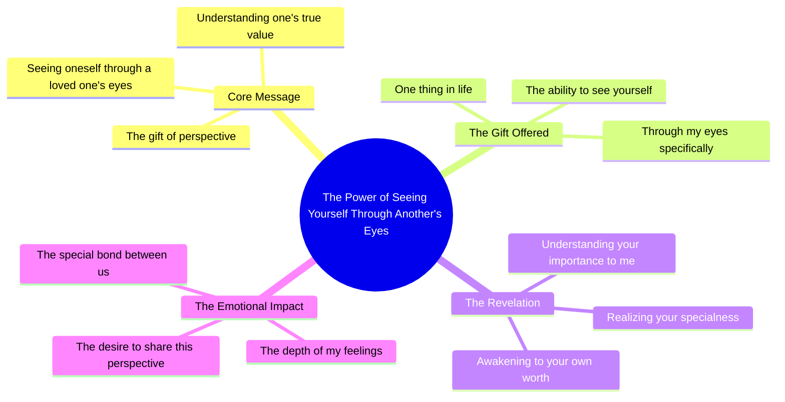

# See Yourself Through My Eyes

> 🌐 **Read this in:** **English** · [中文](../../zh-CN/2026-09/tiktok-transcript-945k-views-27k-reactions-one-thing-i-want-to-give-you-in-lif-5f43.md)

> **Creator:** [@Whisprs "](https://www.tiktok.com/@Whisprs ") · **Views:** 356.2K · **Posted:** 2026-09-03 · **Niche:** other
>
> **TL;DR:** The hook instantly creates an intimate, emotional premise that makes viewers feel personally addressed.

[Watch original video →](https://www.facebook.com/share/r/1EPqQe15yE/)

## Why This Went Viral

## Hook (first 3 seconds)
- **Verbatim opening**: "If I could give you one thing in life, I would give you the ability to see yourself through my eyes."
- **Hook pattern**: Emotional contrast + hypothetical gift (not a question, not a bold claim — an intimate, unexpected premise).
- **Why it stops the scroll**: It flips the standard "I love you" cliché into a concrete, visual metaphor. The viewer instantly wants to know *what* the speaker sees, creating immediate personal relevance. It feels like a private confession, not a performance.

## Emotional Rhythm
1. **Curiosity** — "If I could give you one thing…" sets up a riddle.
2. **Tension** — "…the ability to see yourself through my eyes" introduces vulnerability and suspense (what's wrong with how they see themselves?).
3. **Resonance** — "Only then would you realize how special you are to me" lands the emotional payoff — self-worth, love, and validation in one line.
4. **Climax** — The final word "me" shifts the focus from the viewer's insecurity to the speaker's devotion, creating a sharp emotional spike.
5. **Afterglow** — The silence/visual after the line lets the feeling settle; no hard cut, no call-to-action.

## Keyword Density
- **"see yourself"** (×2 implied) — drives emotional pull; triggers self-reflection and identity.
- **"through my eyes"** — the unique phrase; becomes the viral hook and shareable quote.
- **"give you"** (×2) — frames love as an active gift, not a passive state.
- **"realize"** — algorithmic reach (common in self-improvement/love niches) + emotional pull (epiphany moment).
- **"special"** — high-emotion keyword; universally searched and felt.
- **"one thing"** — scarcity framing; makes the message feel exclusive and urgent.

## Why It Spreads
- **Universal insecurity tap**: The line "see yourself through my eyes" directly addresses the near-universal gap between how people see themselves and how loved ones see them. Viewers tag partners or friends who need to hear it.
- **Quote-ability**: The entire transcript is one clean, screenshot-ready sentence. It functions as a standalone status, caption, or DM — no context needed, so it travels across platforms unchanged.
- **Emotional mirroring**: The viewer doesn't just watch — they *feel* the speaker's perspective. The comment section fills with "I wish someone said this to me" or "I sent this to my girlfriend," turning passive viewers into active distributors.
- **Reverse vulnerability**: The speaker isn't asking for love; they're giving it unconditionally. This creates a "gift" dynamic that compels the viewer to share it forward as a form of emotional currency.
- **Pacing and silence**: The transcript's natural pauses (the ellipsis-like rhythm after "eyes") mimic a real confession, making it feel unscripted and authentic — a key driver for shares from users who distrust polished content.

## What You Can Steal
- **Open with a hypothetical gift, not a statement**: "If I could give you one thing…" forces the viewer to imagine receiving something, which instantly activates their emotional brain. Use this pattern for any niche (e.g., "If I could give you one piece of advice…").
- **Make the second line a visual metaphor**: Don't say "I love you" — describe *how* you see them. Specificity ("through my eyes") beats abstraction every time. Apply this to product benefits or life lessons: "I'd let you see your future self."
- **End on the listener, not the speaker**: The climax word is "me," but the emotional target is "you." Structure your final line so the viewer feels like the hero of the message — that's what makes them hit share.

## Mind Map

## Full Transcript (Generated by [TokTranscript.com](https://toktranscript.com/?utm_source=github&utm_medium=breakdown&utm_campaign=tool_attribution))

> 📝 Transcripts on this page are auto-generated and show the first 60%. Want to transcribe any TikTok in 30 seconds and get the full version? [Try TokTranscript free →](https://toktranscript.com/?utm_source=github&utm_medium=breakdown&utm_campaign=transcript_cta)

If I could give you one thing in life, I would give you the ability to see yourself through m

*[Read the full transcript on TokTranscript →](https://toktranscript.com/plaza/tiktok-transcript-945k-views-27k-reactions-one-thing-i-want-to-give-you-in-lif-5f43?utm_source=github&utm_medium=breakdown&utm_campaign=transcript_full)*

## Browse More

- All [other](../../by-niche/en/other.md) breakdowns
- All [Hypothetical gift](../../by-pattern/en/hook-hypothetical-gift.md) examples

## Video Info

| | |
|---|---|
| Creator | [@Whisprs "](https://www.tiktok.com/@Whisprs ") |
| Original video | [https://www.facebook.com/share/r/1EPqQe15yE/](https://www.facebook.com/share/r/1EPqQe15yE/) |
| Original title | 945K views · 27K reactions | One thing I want to give you in life 🥀🖤 #poetry #quotes #deepthoughts | Whisprs " |
| Views | 356.2K (356162) |
| Posted | 2026-09-03 |
| Duration | 0s |
| Niche | `other` |
| Hook pattern | `Hypothetical gift` |
| Original language | `en` |
| Available languages | en, zh-CN |
| Generated | 2026-09-04 by [TokTranscript](https://toktranscript.com/) |

---

*This breakdown is for educational analysis under fair use. Original video © [@Whisprs "](https://www.tiktok.com/@Whisprs "). All transcripts are auto-generated and may contain errors.*

*Want to analyze your own TikToks like this? [analyze your own TikToks →](https://toktranscript.com/viral-breakdown?utm_source=github&utm_medium=breakdown&utm_campaign=footer_cta)*