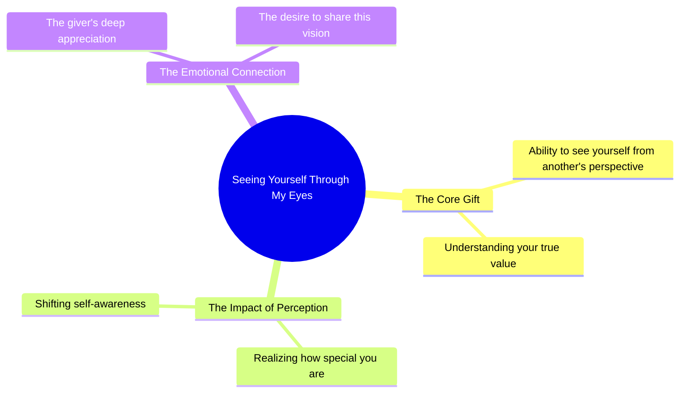

# See Yourself Through My Eyes

> 🌐 **Read this in:** **English** · [中文](../../zh-CN/2026-09/tiktok-transcript-945k-views-27k-reactions-one-thing-i-want-to-give-you-in-lif-b37d.md)

> **Creator:** [@Whisprs "](https://www.tiktok.com/@Whisprs ") · **Views:** 352.2K · **Posted:** 2026-09-03 · **Niche:** other
>
> **TL;DR:** This hook instantly creates an intimate, emotional connection by offering a profound perspective shift.

[Watch original video →](https://www.facebook.com/share/r/1cUT1dHm2W/)

## Why This Went Viral

## Hook (first 3 seconds)
- **Verbatim opening line:** "If I could give you one thing in life, I would give you the ability to see yourself through my eyes."
- **Hook pattern:** Emotional contrast / intimate confession (not a bold claim or question — it's a vulnerable statement that sounds like a private thought made public).
- **Why it stops the scroll:** It opens with a direct, second-person address ("you") that feels personal and unexpected. The phrasing "see yourself through my eyes" is a novel metaphor that creates instant curiosity — the viewer wants to know who is speaking and to whom.

## Emotional Rhythm
- **Beat 1 — Curiosity (0–2s):** The hypothetical "If I could give you one thing" sets up a promise of value, making the viewer lean in.
- **Beat 2 — Intimacy (2–5s):** "The ability to see yourself through my eyes" shifts from generic to deeply personal — the viewer feels like a confidant, not an audience.
- **Beat 3 — Tension (5–8s):** "Only then would you realize..." builds anticipation — the payoff is withheld for a moment.
- **Beat 4 — Resonance (8–10s):** "...how special you are to me" lands as the emotional release. It reframes the entire message as an act of love, not information.
- **Climax moment:** The final word "me" — the twist is that the speaker is not asking for anything; they are offering their own perception as a gift. The vulnerability peaks here.

## Keyword Density
- **"you"** (appears 6 times) — drives algorithmic reach through high engagement (comments, shares) because it feels directly addressed to each viewer.
- **"see yourself"** (2x) — emotional pull; creates a visual/mental image that is shareable as a quote.
- **"through my eyes"** (1x, but thematically central) — the unique phrase that makes the video quotable and repostable.
- **"special"** (1x) — high-emotion word that triggers self-relevance; viewers apply it to their own relationships.
- **"give you"** (2x) — frames the message as a gift, increasing perceived value and shareability.
- **"realize"** (1x) — implies a hidden truth, driving curiosity and repeat views.

**Algorithmic drivers:** "you" and "give" (high engagement verbs).  
**Emotional pull:** "special," "see yourself," "through my eyes."

## Why It Spreads
- **Universality disguised as specificity:** The line "how special you are to me" is vague enough that any viewer can project it onto their own relationship — parent, partner, friend, or even self. It spreads because people tag someone they want to say this to.
- **The "unsent letter" effect:** The transcript reads like a private message that was accidentally made public. This creates a voyeuristic pull — viewers share it because it feels like a confession they want to be associated with.
- **Perfect length for text overlay:** At ~30 words, it fits neatly into a single screen of text. This makes it screenshot-able, repostable on Stories, and easy to turn into a quote graphic.
- **No context needed:** There is no setup, no face, no location — the words carry all the meaning. This means it works across platforms (TikTok, Reels, X, Pinterest) without adaptation.
- **Emotional mirroring:** The viewer who shares it is implicitly saying "this is how I feel about you" — the video becomes a proxy for the sharer's own vulnerability, which is a powerful social currency.

## What You Can Steal
- **Lead with a hypothetical gift:** Start your video with "If I could give you one thing..." — it instantly frames your content as valuable and personal, not promotional.
- **Use second-person throughout:** Replace "I think" with "you will" or "you deserve." Direct address increases dwell time and comment rates.
- **End on a single, resonant word:** The final word "me" is what makes the whole thing land. Structure your script so the last word carries the emotional weight — don't trail off, end on a noun or pronoun that reframes everything before it.

## Mind Map

## Full Transcript (Generated by [TokTranscript](https://toktranscript.com/?utm_source=github&utm_medium=breakdown&utm_campaign=tool_attribution))

> 📝 Transcripts on this page are auto-generated and show the first 60%. Want to transcribe any TikTok in 30 seconds and get the full version? [Try TokTranscript free →](https://toktranscript.com/?utm_source=github&utm_medium=breakdown&utm_campaign=transcript_cta)

If I could give you one thing in life, I would give you the ability to see yourself through m

*[Read the full transcript on TokTranscript →](https://toktranscript.com/plaza/tiktok-transcript-945k-views-27k-reactions-one-thing-i-want-to-give-you-in-lif-b37d?utm_source=github&utm_medium=breakdown&utm_campaign=transcript_full)*

## Browse More

- All [other](../../by-niche/en/other.md) breakdowns
- All [Empathetic wish](../../by-pattern/en/hook-empathetic-wish.md) examples

## Video Info

| | |
|---|---|
| Creator | [@Whisprs "](https://www.tiktok.com/@Whisprs ") |
| Original video | [https://www.facebook.com/share/r/1cUT1dHm2W/](https://www.facebook.com/share/r/1cUT1dHm2W/) |
| Original title | 945K views · 27K reactions | One thing I want to give you in life 🥀🖤 #poetry #quotes #deepthoughts | Whisprs " |
| Views | 352.2K (352152) |
| Posted | 2026-09-03 |
| Duration | 0s |
| Niche | `other` |
| Hook pattern | `Empathetic wish` |
| Original language | `en` |
| Available languages | en, zh-CN |
| Generated | 2026-09-04 by [TokTranscript](https://toktranscript.com/) |

---

*This breakdown is for educational analysis under fair use. Original video © [@Whisprs "](https://www.tiktok.com/@Whisprs "). All transcripts are auto-generated and may contain errors.*

*Want to analyze your own TikToks like this? [TokTranscript.com →](https://toktranscript.com/viral-breakdown?utm_source=github&utm_medium=breakdown&utm_campaign=footer_cta)*