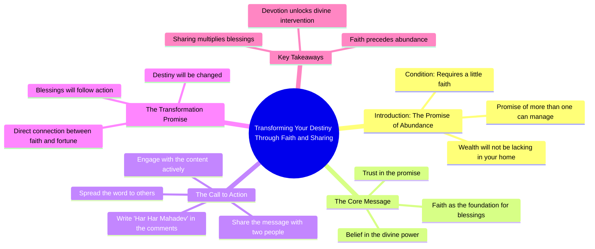

# Sheetal Devi Wins Gold at Khelo India Para Games

> 🌐 **Read this in:** **English** · [中文](../../zh-CN/2026-09/tiktok-transcript-984k-views-207k-reactions-jammu-and-kashmir-s-armless-archer-7e40.md)

> **Creator:** [@हर हर शंभू](https://www.tiktok.com/@हर हर शंभू) · **Views:** 255.9K · **Posted:** 2026-09-01 · **Niche:** other
>
> **TL;DR:** Opens with a direct, personal promise of wealth that immediately grabs attention and creates curiosity.

[Watch original video →](https://www.facebook.com/share/r/1J8P48b4CZ/)

## Why This Went Viral

## Hook (first 3 seconds)
- **Verbatim opening line:** "तेरे घर में धन की कमी नहीं रहेगी, इतना दूंगा की समाल नहीं पाएगा" ("There will be no lack of wealth in your house, I will give so much you won't be able to handle it")
- **Hook pattern:** Bold claim + direct address (uses "तेरे/तेरी" — intimate "you" form)
- **Why it stops scroll:** It's a supernatural promise of unlimited wealth spoken in a commanding, god-like tone. The word "समाल नहीं पाएगा" (won't be able to handle it) creates an instant "how?" curiosity gap. The intimate "तेरे" makes it feel personal, not generic.

## Emotional Rhythm
1. **Temptation (0–2s):** Wealth promise — instant reward anticipation
2. **Curiosity (2–4s):** "इतना दूंगा" (I'll give so much) — scale is unspecified, brain fills in the gap
3. **Condition/Challenge (4–6s):** "अगर मुझ पर थोड़ा सा भी विश्वास है" (if you have even a little faith) — creates a test, viewer feels judged
4. **Action Demand (6–8s):** "शेयर कर दें, कमेंट में हर-हर महरेव लिख दें" — urgency, direct command
5. **Climax (8–10s):** "फिर देख, मैं तेरी किसमत कैसे बदलता हूँ" (then watch how I change your fate) — final promise, closes the loop with a challenge

**Climax moment:** The final line — it's a dare. The viewer is now invested because they've been told to *watch* something happen.

## Keyword Density
- **धन (wealth)** — 1x but positioned as the very first word; anchors the entire video's promise
- **दूंगा (I will give)** — 2x; reinforces the giver's power
- **विश्वास (faith)** — 1x; triggers religious/emotional pull
- **किसमत (fate/destiny)** — 1x; ties to cultural belief systems
- **बदलता (change)** — 1x; implies transformation, a core desire
- **शेयर (share)** — 1x; direct algorithmic call-to-action
- **हर-हर महरेव** — 1x; religious chant, drives community identity

**Algorithmic drivers:** "शेयर" (share) is the only direct engagement keyword. "कमेंट" is implied. These are low-density but high-impact because they're explicit commands.

**Emotional pull drivers:** धन, विश्वास, किसमत — these tap into deep cultural and spiritual anxieties. They don't need repetition; they're loaded words.

## Why It Spreads
- **Reciprocity trap:** "I'll give you wealth IF you share" — the viewer is psychologically conditioned to complete the action to receive the promised reward. The share isn't a favor; it's a transaction.
- **Religious identity trigger:** "हर-हर महरेव" is a specific devotional phrase. Commenting it creates in-group belonging. Users share to signal their faith community, not just the video.
- **Low-cost, high-stakes action:** The barrier is minimal (one share, one comment) but the promised payoff is maximal (unlimited wealth). This asymmetry drives impulse engagement.
- **Direct address creates ownership:** "तेरे/तेरी" (your) makes every viewer feel personally selected. This isn't a mass message; it's a one-on-one promise.
- **Unverifiable outcome = infinite loop:** "फिर देख" (then watch) sets up a future payoff. When nothing visibly happens, the viewer re-watches, re-shares, or comments asking "when?" — each action feeds the algorithm.

## What You Can Steal
- **Open with a promise, not a problem:** Start with the reward ("I'll give you X") before the condition. Viewers decide in 1 second whether to stay; lead with what they get, not what you need.
- **Use conditional commands:** Structure your CTA as "IF you do this, THEN this happens." It converts a passive viewer into an active participant because they feel they're unlocking something.
- **Anchor to a shared identity phrase:** Pick a word or chant your audience already uses (religious, cultural, or niche-specific). When you make *that* the comment trigger, you're not asking for engagement — you're inviting them to affirm who they are.

## Mind Map

## Full Transcript (Generated by [TokTranscript.com](https://toktranscript.com/?utm_source=github&utm_medium=breakdown&utm_campaign=tool_attribution))

> 📝 Transcripts on this page are auto-generated and show the first 60%. Want to transcribe any TikTok in 30 seconds and get the full version? [Try TokTranscript free →](https://toktranscript.com/?utm_source=github&utm_medium=breakdown&utm_campaign=transcript_cta)

तेरे घर में धन की कमी नहीं रहेगी, इतना दूंगा की समाल नहीं पाएगा, अगर मुझ पर थोड़ा सा भी विश्वास है, तो मेरी बात माल लें, सिर्फ दो लो

*[Read the full transcript on TokTranscript →](https://toktranscript.com/plaza/tiktok-transcript-984k-views-207k-reactions-jammu-and-kashmir-s-armless-archer-7e40?utm_source=github&utm_medium=breakdown&utm_campaign=transcript_full)*

## Browse More

- All [other](../../by-niche/en/other.md) breakdowns
- All [Promise of transformation](../../by-pattern/en/hook-promise-of-transformation.md) examples

## Video Info

| | |
|---|---|
| Creator | [@हर हर शंभू](https://www.tiktok.com/@हर हर शंभू) |
| Original video | [https://www.facebook.com/share/r/1J8P48b4CZ/](https://www.facebook.com/share/r/1J8P48b4CZ/) |
| Original title | 984K views · 207K reactions | "🌹🙏🏻 Jammu and Kashmir's armless archer and Paralympics medallist Sheetal Devi edged out quadruple amputee Payal Nag of Odisha to win the gold in a much-anticipated clash of the Khelo India Para Games on Sunday. In the battle between two teenagers, defending champion Sheetal came from behind to successfully bag her second gold medal of the Games at the Jawaharlal Nehru Stadium. | हर हर शंभू |
| Views | 255.9K (255885) |
| Posted | 2026-09-01 |
| Duration | 0s |
| Niche | `other` |
| Hook pattern | `Promise of transformation` |
| Original language | `en` |
| Available languages | en, zh-CN |
| Generated | 2026-09-02 by [TokTranscript](https://toktranscript.com/) |

---

*This breakdown is for educational analysis under fair use. Original video © [@हर हर शंभू](https://www.tiktok.com/@हर हर शंभू). All transcripts are auto-generated and may contain errors.*

*Want to analyze your own TikToks like this? [TokTranscript.com →](https://toktranscript.com/viral-breakdown?utm_source=github&utm_medium=breakdown&utm_campaign=footer_cta)*