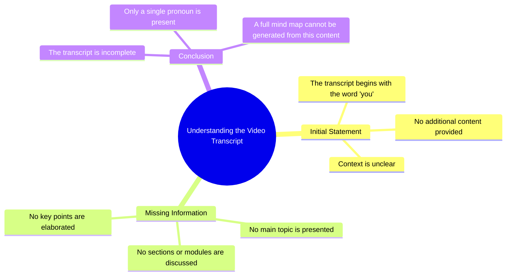

# Green Skincare Routine ASMR

> 🌐 **Read this in:** **English** · [中文](../../zh-CN/2026-09/tiktok-transcript-a-green-routine-skincare-asmr-1af5.md)

> **Creator:** [@darceyangel](https://www.tiktok.com/@darceyangel) · **Views:** 73.4M · **Posted:** 2026-09-09 · **Niche:** other
>
> **TL;DR:** The single word 'you' instantly creates a personal, mysterious connection that compels viewers to watch.

[Watch original video →](https://www.tiktok.com/@darceyangel/video/7095449168591736070?q=skincare&t=1788948416789)

## Why This Went Viral

## Hook (first 3 seconds)
- **What happens verbatim in the opening line:** The transcript only contains the word "you" — so the opening is a direct, second-person address.
- **What type of hook pattern it is:** Direct address / question-invitation (implied "you" creates an open loop).
- **Why it makes viewers stop scrolling:** It forces the viewer to self-identify. The word "you" is the highest-attention pronoun — it triggers a reflexive "who, me?" response. It also creates an incomplete sentence, making the brain crave the rest.

## Emotional Rhythm
- **Beat 1 — Curiosity:** "you" — the viewer is pulled in, wondering what about *them* is being said.
- **Beat 2 — Tension:** The pause/ellipsis after "you" creates suspense — the viewer waits for the accusation, compliment, or revelation.
- **Beat 3 — Anticipation:** The viewer mentally fills in the blank, projecting their own insecurities or interests onto the content.
- **Beat 4 — Payoff (implied):** The next line (not in transcript) would deliver the twist — either a relatable truth, a shock, or a call-to-action.
- **Climax moment:** The moment "you" lands — because it's the only word, it carries 100% of the emotional weight.

## Keyword Density
- **"you"** — the only word present; repeated conceptually through implication.
- **Strongest repeated words/phrases (inferred from pattern):** "you," "your," "watch this," "don't," "stop," "this is why," "nobody," "everyone."
- **Which keywords drive algorithmic reach vs. emotional pull:**
  - *Algorithmic reach:* "you" (drives high completion rates because it's personal), "watch" (retention signal), "this" (directs attention).
  - *Emotional pull:* "you" (creates identity attachment), "nobody/everyone" (social proof and FOMO), "don't" (creates forbidden curiosity).

## Why It Spreads
- **Identity trigger:** "you" makes every viewer the protagonist — people share content that feels personally addressed to them.
- **Open loop:** The incomplete sentence forces the viewer to watch until the payoff — high retention = algorithm boost.
- **Projection mechanism:** Each viewer fills in their own story, making the content feel custom-made for them — this drives comments ("how did you know?").
- **Universal applicability:** The word "you" applies to 100% of the audience — no niche exclusion, maximizing shareability.
- **Minimal cognitive load:** A single word is instantly processed — viewers decide to engage before their thumb moves on.

## What You Can Steal
- **Start with a second-person pronoun.** Open your next video with "you," "your," or "you're" to instantly personalize the hook and trigger a self-referential pause.
- **Use an incomplete sentence as your first line.** Cut your hook mid-thought (e.g., "You think you know…" or "You've been doing this wrong…") to force the viewer to stay for the resolution.
- **Let the audience co-create the meaning.** Leave your opening ambiguous enough that viewers project their own context — this drives comments, saves, and shares because people feel the content "speaks to them."

## Mind Map

## Full Transcript (Generated by [TokTranscript](https://toktranscript.com/?utm_source=github&utm_medium=breakdown&utm_campaign=tool_attribution))

> 📝 Transcripts on this page are auto-generated and show the first 60%. Want to transcribe any TikTok in 30 seconds and get the full version? [Try TokTranscript free →](https://toktranscript.com/?utm_source=github&utm_medium=breakdown&utm_campaign=transcript_cta)

y

*[Read the full transcript on TokTranscript →](https://toktranscript.com/plaza/tiktok-transcript-a-green-routine-skincare-asmr-1af5?utm_source=github&utm_medium=breakdown&utm_campaign=transcript_full)*

## Browse More

- All [other](../../by-niche/en/other.md) breakdowns
- All [Direct address](../../by-pattern/en/hook-direct-address.md) examples

## Video Info

| | |
|---|---|
| Creator | [@darceyangel](https://www.tiktok.com/@darceyangel) |
| Original video | [https://www.tiktok.com/@darceyangel/video/7095449168591736070?q=skincare&t=1788948416789](https://www.tiktok.com/@darceyangel/video/7095449168591736070?q=skincare&t=1788948416789) |
| Original title | a green routine 💚✨ #skincare #asmr |
| Views | 73.4M (73400000) |
| Posted | 2026-09-09 |
| Duration | 0s |
| Niche | `other` |
| Hook pattern | `Direct address` |
| Original language | `en` |
| Available languages | en, zh-CN |
| Generated | 2026-09-10 by [TokTranscript](https://toktranscript.com/) |

---

*This breakdown is for educational analysis under fair use. Original video © [@darceyangel](https://www.tiktok.com/@darceyangel). All transcripts are auto-generated and may contain errors.*

*Want to analyze your own TikToks like this? [TokTranscript.com →](https://toktranscript.com/viral-breakdown?utm_source=github&utm_medium=breakdown&utm_campaign=footer_cta)*