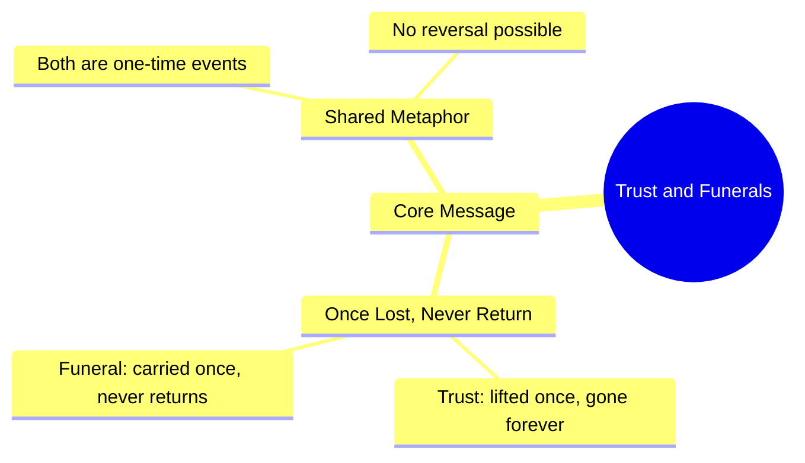

# Trust and Funerals Never Return Once Gone

> 🌐 **Read this in:** **English** · [中文](../../zh-CN/2026-09/tiktok-transcript-beshak-kurulusosman-viral-1millionaudition-turkishseries-bur-63af.md)

> **Creator:** [@burak_king_editx](https://www.tiktok.com/@burak_king_editx) · **Views:** 1.8M · **Posted:** 2026-09-19 · **Niche:** entertainment
>
> **TL;DR:** The hook uses a powerful metaphor comparing trust to a funeral, creating an immediate emotional and thought-provoking impact.

[Watch original video →](https://vt.tiktok.com/ZSq7PhKRy/)

## Why This Went Viral

## Hook (first 3 seconds)
- Verbatim opening line: "بھروسہ اور جنازہ ایک بار اٹھ جانے کے بعد کبھی واپس نہیں آتے" ("Trust and a funeral — once they're carried away, they never come back.")
- Hook pattern: **Contrast / bold claim** — two unrelated nouns (trust, funeral) fused into one irreversible statement.
- Why it stops the scroll: It's a complete, self-contained punch delivered in under 3 seconds. The brain gets a finished thought instantly, which triggers either agreement ("true") or discomfort ("wait, what?"). No setup, no context needed — the viewer is already inside the metaphor before they decide to scroll.

## Emotional Rhythm
- **0–2s — Shock/curiosity:** The funeral comparison lands as an unexpected, slightly dark image.
- **2–5s — Recognition:** Viewer maps "trust" onto a personal memory (a betrayal, a broken promise).
- **5–10s — Tension:** The word "کبھی واپس نہیں آتے" (never come back) closes the door — no hope, no reversal. This is where the emotional weight settles.
- **10–15s — Resonance/relief:** The finality itself becomes comforting — it validates a feeling the viewer already had but couldn't articulate.
- **Climax:** The word "جنازہ" (funeral). It's the twist word — the moment the sentence stops being about relationships and becomes about mortality.

## Keyword Density
- بھروسہ (trust) — the emotional anchor; drives saves and shares
- جنازہ (funeral) — the algorithmic hook word; high stop-rate, high comment rate
- ایک بار (once) — creates the "one-shot" finality
- اٹھ جانے (carried away / lifted) — the action verb that makes it visual
- کبھی واپس نہیں آتے (never come back) — the closing hammer; drives rewatches
- **Algorithmic drivers:** جنازہ, واپس نہیں — unusual + emotional = high watch-time and comment triggers
- **Emotional drivers:** بھروسہ, ایک بار — these make viewers tag someone or quote it in comments

## Why It Spreads
- **It's a complete thought in one breath.** The entire video is essentially one sentence — viewers don't need to wait for a payoff, so completion rate is near 100%, which the algorithm rewards.
- **It weaponizes a universal wound.** "بھروسہ" (trust) is something every viewer has lost at least once. The funeral metaphor gives that private pain a public, quotable form.
- **It's screenshot-ready.** The line fits in a caption, a story, a WhatsApp status. The format (short, text-on-screen, single line) makes it infinitely repostable without attribution loss.
- **It invites debate in the comments.** Some agree, some argue "trust can be rebuilt" — either way, comments spike, and comment velocity is a top ranking signal.
- **The funeral word is a pattern interrupt.** In a feed full of motivational content, "جنازہ" (funeral) is jarring and unexpected — it breaks the scroll pattern and forces a second look.

## What You Can Steal
- **Fuse two unrelated nouns into one irreversible statement.** "Trust and a funeral" works because the pairing is unexpected but instantly logical. Try: "Respect and a mirror — once broken, you only see the cracks."
- **Deliver the whole idea in under 3 seconds.** No intro, no "assalamualaikum," no context. Start with the punchline. Let the viewer's brain do the unpacking.
- **Make the last word the heaviest word.** "واپس نہیں آتے" (never come back) is the hammer. Structure your line so the final 2–3 words carry the emotional and algorithmic weight — that's what drives rewatches and shares.

## Mind Map

## Full Transcript (Generated by [TokTranscript](https://toktranscript.com/?utm_source=github&utm_medium=breakdown&utm_campaign=tool_attribution))

> 📝 Transcripts on this page are auto-generated and show the first 60%. Want to transcribe any TikTok in 30 seconds and get the full version? [Try TokTranscript free →](https://toktranscript.com/?utm_source=github&utm_medium=breakdown&utm_campaign=transcript_cta)

بھروسہ اور جنازہ ایک بار اٹھ جانے ک

*[Read the full transcript on TokTranscript →](https://toktranscript.com/plaza/tiktok-transcript-beshak-kurulusosman-viral-1millionaudition-turkishseries-bur-63af?utm_source=github&utm_medium=breakdown&utm_campaign=transcript_full)*

## Browse More

- All [entertainment](../../by-niche/en/entertainment.md) breakdowns
- All [Metaphorical Comparison](../../by-pattern/en/hook-metaphorical-comparison.md) examples

## Video Info

| | |
|---|---|
| Creator | [@burak_king_editx](https://www.tiktok.com/@burak_king_editx) |
| Original video | [https://vt.tiktok.com/ZSq7PhKRy/](https://vt.tiktok.com/ZSq7PhKRy/) |
| Original title | Beshak 💯😢. #kurulusosman #viral #1millionaudition #turkishseries #bur... |
| Views | 1.8M (1800000) |
| Posted | 2026-09-19 |
| Duration | 0s |
| Niche | `entertainment` |
| Hook pattern | `Metaphorical Comparison` |
| Original language | `en` |
| Available languages | en, zh-CN |
| Generated | 2026-09-20 by [TokTranscript](https://toktranscript.com/) |

---

*This breakdown is for educational analysis under fair use. Original video © [@burak_king_editx](https://www.tiktok.com/@burak_king_editx). All transcripts are auto-generated and may contain errors.*

*Want to analyze your own TikToks like this? [TokTranscript →](https://toktranscript.com/viral-breakdown?utm_source=github&utm_medium=breakdown&utm_campaign=footer_cta)*