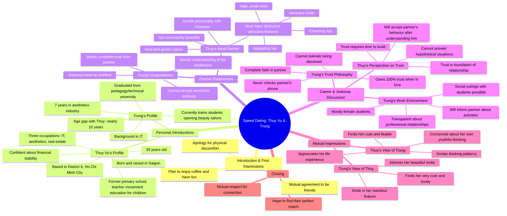

# Gentle Teacher Shocked as Real Estate Tycoon Rejects Her

> 🌐 **Read this in:** **English** · [中文](../../zh-CN/2026-09/tiktok-transcript-c-gi-o-d-u-d-ng-ng-ng-ng-b-i-gia-b-s-t-ch-i-ph-nghe-l-do-xon-359d.md)

> **Creator:** [@Yêu là cưới?](https://www.tiktok.com/@Yêu là cưới?) · **Views:** 441.9K · **Posted:** 2026-09-06 · **Niche:** entertainment
>
> **TL;DR:** Opens with a playful apology and immediate question, creating curiosity and a flirty dynamic.

[Watch original video →](https://www.facebook.com/share/v/1EiRCPjdmr/)

## Why This Went Viral

## Hook (first 3 seconds)
- **Verbatim opening:** "Em trai không bóp" (Brother, don't squeeze) — followed by "Anh xin lỗi em nha" (I'm sorry, sis).
- **Hook pattern:** Scene + contrast. It's a dating show where the man immediately apologizes for a physical mishap (likely an accidental touch during the intro), creating awkward, comedic tension.
- **Why it stops scroll:** The apology is unexpected and self-deprecating. It signals "something went wrong" and flips the usual confident-first-impression script, making viewers curious about what happened and how the dynamic will play out.

## Emotional Rhythm
1. **Awkwardness/Comedy** — The apology opens with a cringe-funny moment; viewers lean in.
2. **Curiosity/Assessment** — The woman (Thuy Vu, 39) lists her credentials (3 jobs: IT, aesthetics, real estate) — establishes she's independent and "won't starve."
3. **Tension** — The man admits his job (teaching aesthetics) means constant contact with women; he preemptively addresses jealousy.
4. **Relief/Resonance** — She responds maturely: "If we have nothing to hide, we don't need to be secretive." This defuses the tension and signals emotional intelligence.
5. **Vulnerability/Trust** — He declares he trusts 100% and never checks phones, but warns "don't let me find out." This is a twist — a firm boundary wrapped in a soft statement.
6. **Climax** — Mutual compliments: He says her smile is his favorite feature; she calls him "easy to like" and notes his life experience. The age gap (~10 years) is acknowledged and accepted.
7. **Resolution/Warmth** — Host wraps up: "We respect your connection. You'll find your missing piece." Ends on a hopeful, feel-good note.

## Keyword Density
- **"Tin" (trust)** — Appears ~10 times. Core emotional theme; drives the narrative and viewer investment.
- **"Anh/Em" (I/you, gendered)** — Constant; reinforces intimacy and the dating-show frame (algorithmic: high engagement in comments).
- **"Ghen" (jealous)** — Repeated in the conflict section; triggers debate in comments (algorithmic reach via comment wars).
- **"Công việc" (job)** — Referenced multiple times; grounds the conversation in real-world logistics (relatability).
- **"Cười" (smile)** — Highlighted as his favorite trait; emotional pull (positive association).
- **"39 tuổi" (39 years old)** — Specific number; anchors age, sparks demographic targeting and relatability.

## Why It Spreads
- **Unscripted awkwardness is gold.** The opening apology ("Em trai không bóp") is a genuine, unpolished moment that feels real — viewers share it because it's relatable cringe. It's not a polished pick-up line; it's a human fumble.
- **The jealousy question is a universal hook.** His job (teaching aesthetics to women) and her response ("If there's nothing to hide, no need for secrecy") create a mini-masterclass in mature relationships. Viewers tag partners or debate in comments, driving shares.
- **The trust boundary twist is quotable.** "I trust 100%, but don't let me find out" is a sharp, memorable line that gets clipped and repeated. It's a stance that people either agree with or argue against — perfect for engagement.
- **Age gap + life experience dynamic.** She's 39, he's ~49. She admits her thinking is "childish" sometimes; he values her smile. This flips the typical "younger woman" trope and resonates with older demographics who feel unseen in dating content.
- **The host's framing creates a safe space.** "We respect your connection" validates the interaction, making the video feel like a positive, supportive space — viewers share it as "wholesome content."

## What You Can Steal
- **Open with a flaw, not a flex.** Start your video by acknowledging a mistake or awkward moment. It disarms the audience and makes you instantly more likable than a polished opening.
- **Name the elephant in the room early.** If there's a potential objection (his job, her age, a past issue), address it head-on within the first 30 seconds. This builds trust and keeps viewers watching to see how it resolves.
- **End with a quotable boundary.** Craft a line that states a firm limit in a soft, memorable way ("I trust 100%, but don't let me find out"). This gives viewers something to clip, quote, and argue about — the fuel for shares.

## Mind Map

## Full Transcript (Generated by [free TikTok transcript generator](https://toktranscript.com/?utm_source=github&utm_medium=breakdown&utm_campaign=tool_attribution))

> 📝 Transcripts on this page are auto-generated and show the first 60%. Want to transcribe any TikTok in 30 seconds and get the full version? [Try TokTranscript free →](https://toktranscript.com/?utm_source=github&utm_medium=breakdown&utm_campaign=transcript_cta)

Em trai không bóp Anh xin lỗi em nha Dạ rồi, anh muốn sao anh? Anh muốn em một người bạn của anh Dạ rồi, ok Mình có thể uống cà phê chơi vui thôi Khi anh yêu, anh muốn cô gái tin Trên này anh hỏi rất là kỹ Tại rồi xưa anh cũng bị một vấn đề đó Anh muốn sao? Tin anh hoàn toàn Em tên là Thuy Vũ Năm nay em 39 tuổi Ngoại nghiệp của em thì em làm tới 3 ngày IT, thẩm mỹ và kinh doanh bất lộng sản Rồi, dạ Dạ, cho nên em sẽ không bao giờ sợ đói Em gái vậy anh bảo đảm em no Ở đâu? Dạ em ở Sài Gòn à? Quận mấy? Dạ em quận 6 à Tức là sinh ra lớn lên ở TP.HCM luôn Dạ, sinh ra Vua bạn gái của em là như thế nào? Trước tiên là tánh hiền Hiền nhưng phải ca tính nha Với đường hiền bánh bèo Không cần phải xinh, không cần phải đẹp Có một cái điểm ứng tưởng nào đó Ứng tưởng như là có cái mũi cao cao nhỏ nhỏ Và có bờ môi quý rũ Hay có dòng 1 hấp dẫn và dòng ba lôi cuốn vậy đó, có một cái điểm gì đó hay là tóc và hiền vậy đó một cái điểm ứng từ Nhiều trung em nghe cô giáo em cũng thích đó Ông ơi, em cô giáo dạy cấp mấy em? Em dạy cấp 1 nhưng mà hiện tại thì em đã nghỉ công việc ở trường rồi tại vì em muốn ra ngoài làm nhiều hơn Em là dạy về vận động cho bé bé nhỏ Em d tham m kh D D tham m l d v c g Em d v Phung Thi B c th b kia c c B kia c m m t G tr em g xinh D em ch anh c Linh Có cái điểm úy nào không? Có nhiều à Nhiều cái ấn tượng luôn á, chứ không phải là một đâu Hồi nãy em nghe nói là anh có dạy cái gì ta? Dạy về tham mỹ á Hồi trước anh làm bên IT Anh tốt nghiệp bên trường sư phẩm chú thuật á Mỗi năm làm một thời gian xong anh có bén duyên Bé duyên nghề thẩm mỹ Anh mới làm Anh làm cũng được 7 năm Xong bây giờ anh đi dạy học Anh đào tạo cho học viên cho mấy ai mà muốn mở tiệm á Anh dạy lại Thì đó, nói chung mà Cái nghề đó thì Trung anh nói trước nha Cái nghề đó thì anh tiếp xúc với con gái cũng hơi nhiều À dạ Tại vì đa số học viên là nữ không à À thì đó, em với em có ghen hay không? Cũng có đó anh Nhưng mà nói chung là Mình trao đổi rõ ràng thôi Tính chất công việc mà đâu ai muốn đâu Có nghĩa là nếu như mình không có gì Thì mình không cần phải mập mờ hay là gì đó Thì anh nói nghe là em có game bua không dạ? Nhưng mà học viên nó rủ anh đi ăn Thì lúc mà anh thì lịch sử Thì một người thầy giáo đi ăn với học viên đúng không? Thì xong rồi anh sẽ báo em Dạ rồi Th em c nh m em c bu hay em c b x c g kh Em tr ra c Th s anh c mu h k v em b C th m n c c hay kh th m Cái này chắc phải để thời gian trả lời đi anh. Tại vì nếu như bây giờ trong trường hợp này em chưa hiểu gì anh hết. Em không biết anh như thế nào thì em không thể trả lời được. Sau một thời gian tìm hiểu em cảm thấy anh là người đáng tin tưởng. Thì anh làm gì em sẽ chấp nhận. Nên em không có trả lời được. Trong tình yêu á, trước tiên là phải tin nhau. Tin trước đi. Tin trước đi.

*[Read the full transcript on TokTranscript →](https://toktranscript.com/plaza/tiktok-transcript-c-gi-o-d-u-d-ng-ng-ng-ng-b-i-gia-b-s-t-ch-i-ph-nghe-l-do-xon-359d?utm_source=github&utm_medium=breakdown&utm_campaign=transcript_full)*

## Browse More

- All [entertainment](../../by-niche/en/entertainment.md) breakdowns
- All [Apology tease](../../by-pattern/en/hook-apology-tease.md) examples

## Video Info

| | |
|---|---|
| Creator | [@Yêu là cưới?](https://www.tiktok.com/@Yêu là cưới?) |
| Original video | [https://www.facebook.com/share/v/1EiRCPjdmr/](https://www.facebook.com/share/v/1EiRCPjdmr/) |
| Original title | Cô giáo dịu dàng ngỡ ngàng bị đại gia BĐS từ chối phũ, nghe lý do xong nàng chỉ biết gượng cười |
| Views | 441.9K (441901) |
| Posted | 2026-09-06 |
| Duration | 0s |
| Niche | `entertainment` |
| Hook pattern | `Apology tease` |
| Original language | `en` |
| Available languages | en, zh-CN |
| Generated | 2026-09-07 by [TokTranscript](https://toktranscript.com/) |

---

*This breakdown is for educational analysis under fair use. Original video © [@Yêu là cưới?](https://www.tiktok.com/@Yêu là cưới?). All transcripts are auto-generated and may contain errors.*

*Want to analyze your own TikToks like this? [TokTranscript →](https://toktranscript.com/viral-breakdown?utm_source=github&utm_medium=breakdown&utm_campaign=footer_cta)*