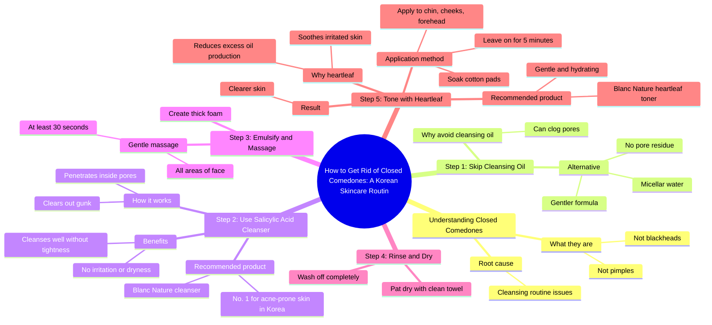

# Korean Cleansing Routine for Closed Comedones

> 🌐 **Read this in:** **English** · [中文](../../zh-CN/2026-09/tiktok-transcript-cleansing-routine-for-closed-comedones-kbeauty-koreanskincar-5408.md)

> **Creator:** [@hudsonsqrd](https://www.tiktok.com/@hudsonsqrd) · **Views:** 3.9M · **Posted:** 2026-09-12 · **Niche:** beauty
>
> **TL;DR:** It stops the scroll by directly accusing the viewer of a common mistake and pointing at a visible problem.

[Watch original video →](https://www.tiktok.com/@hudsonsqrd/video/7639402905992318238?_r=1&_t=ZS-99fJgDVzjzm)

## Why This Went Viral

## Hook (first 3 seconds)
- **Verbatim opening line:** "Stop washing your face like this. You have this or this."
- **Hook pattern:** Direct command + visual demonstration ("stop doing X") combined with a curiosity gap ("this or this" while pointing at skin).
- **Why it stops the scroll:** It attacks a daily habit the viewer is almost certainly guilty of, then immediately implies they have a visible problem they didn't know they had. The vague "this or this" forces the eye to stay on screen to identify the condition — the answer is withheld for several seconds.

## Emotional Rhythm
- **0–3s — Accusation/curiosity:** "Stop washing your face like this" creates mild guilt + a pattern interrupt.
- **3–8s — Relief reframe:** "They're not blackheads, they're not pimples. They're called closed comedones" — renames the problem, which feels like insider knowledge. Anxiety converts into "so that's what it is."
- **8–12s — Authority drop:** "your Korean brother says" — borrowed credibility, lowers skepticism.
- **12–40s — Instructional tension:** Five numbered steps create a checklist rhythm. Each step resolves a micro-worry (clogged pores → gentler option; dryness → "no tight feeling").
- **~30s — Social proof spike:** "No. 1 cleanser for acne prone skin in Korea" — reassurance beat.
- **Climax:** The heartleaf toner demo — "Soak cotton pad... leave them on your chin, cheeks, and forehead for five minutes." This is the visual payoff and the product hero moment.
- **Final beat — Promise/relief:** "Then your skin will be clear." A clean, absolute resolution that closes the loop opened in the first 3 seconds.

## Keyword Density
- **Strongest repeated terms:** *pores, cleanser, closed comedones, salicylic acid, Korean, gentle/gentler, toner, heartleaf, Blanc Nature, clear.*
- **Algorithmic-reach keywords:** *acne, blackheads, pimples, salicylic acid, cleanser, pores* — high-search, high-competition terms that anchor the video in skincare search and recommendation feeds.
- **Emotional-pull keywords:** *Korean brother, gentle, no tight feeling, irritation, clear* — these carry trust and relief, which drive saves and shares more than raw search volume.
- **Brand keyword:** *Blanc Nature* repeated twice with a ranking claim ("No. 1 in Korea") — converts reach into commercial intent.

## Why It Spreads
- **It names a problem the viewer didn't have a word for.** "They're not blackheads, they're not pimples. They're called closed comedones" gives viewers a label they can search, screenshot, and send to friends — the single most shareable line in the transcript.
- **It reframes a daily routine as a fixable mistake.** "Stop washing your face like this" turns passive viewers into people with an action item, which drives saves and rewatches.
- **Borrowed authority removes skepticism.** "your Korean brother says" and "No. 1 cleanser for acne prone skin in Korea" let the viewer outsource trust instead of evaluating claims themselves.
- **Numbered structure makes it feel complete and referenceable.** Steps 1–5 give the video a "save for later" architecture — the exact format that gets stored in collections and re-served by the algorithm.
- **A concrete, visual payoff at the end.** The cotton-pad toner demo ("leave them on your chin, cheeks, and forehead for five minutes") is screenshot-able and easy to imitate, which fuels duets, stitches, and comment-section questions.

## What You Can Steal
1. **Open by attacking a habit, not by introducing yourself.** Lead with "Stop doing X" and a vague visual ("this or this") that only resolves mid-video — it buys you 5–10 extra seconds of retention.
2. **Rename the problem before you sell the solution.** Giving viewers a new term for something they already have ("closed comedones") creates a screenshot moment and makes your video feel like insider knowledge rather than an ad.
3. **Wrap your product in a numbered protocol.** Steps 1–5 turn a single product pitch into a save-worthy routine, and the ranking claim ("No. 1 in Korea") does the persuasion work without you having to argue for it.

## Mind Map

## Full Transcript (Generated by [free TikTok transcript generator](https://toktranscript.com/?utm_source=github&utm_medium=breakdown&utm_campaign=tool_attribution))

> 📝 Transcripts on this page are auto-generated and show the first 60%. Want to transcribe any TikTok in 30 seconds and get the full version? [Try TokTranscript free →](https://toktranscript.com/?utm_source=github&utm_medium=breakdown&utm_campaign=transcript_cta)

Stop washing your face like this. You have this or this. They're not blackheads, they're not pimples. They're called closed comedones, and it's time to check your cleansing routine. Step one your Korean brother says skip cleansing oil. It can clog your pores. So switch to micellar water. It's gentler and doesn't leave residue in your pores. Step 2 use a cleanser with salicylic acid. It goes inside your pores and clears out the gunk. I've been using this cleanser from Blanc Nature because most acne cleansers dry my skin out, but this one cleanses really well without the tight feeling or irritation. And it's the No.. 1 cleanser for acne prone skin in Korea.

*[Read the full transcript on TokTranscript →](https://toktranscript.com/plaza/tiktok-transcript-cleansing-routine-for-closed-comedones-kbeauty-koreanskincar-5408?utm_source=github&utm_medium=breakdown&utm_campaign=transcript_full)*

## Browse More

- All [beauty](../../by-niche/en/beauty.md) breakdowns
- All [Pattern interrupt + callout](../../by-pattern/en/hook-pattern-interrupt-callout.md) examples

## Video Info

| | |
|---|---|
| Creator | [@hudsonsqrd](https://www.tiktok.com/@hudsonsqrd) |
| Original video | [https://www.tiktok.com/@hudsonsqrd/video/7639402905992318238?_r=1&_t=ZS-99fJgDVzjzm](https://www.tiktok.com/@hudsonsqrd/video/7639402905992318238?_r=1&_t=ZS-99fJgDVzjzm) |
| Original title | Cleansing routine for closed comedones! #kbeauty #koreanskincare #bla... |
| Views | 3.9M (3900000) |
| Posted | 2026-09-12 |
| Duration | 0s |
| Niche | `beauty` |
| Hook pattern | `Pattern interrupt + callout` |
| Original language | `en` |
| Available languages | en, zh-CN |
| Generated | 2026-09-13 by [TokTranscript](https://toktranscript.com/) |

---

*This breakdown is for educational analysis under fair use. Original video © [@hudsonsqrd](https://www.tiktok.com/@hudsonsqrd). All transcripts are auto-generated and may contain errors.*

*Want to analyze your own TikToks like this? [analyze your own TikToks →](https://toktranscript.com/viral-breakdown?utm_source=github&utm_medium=breakdown&utm_campaign=footer_cta)*