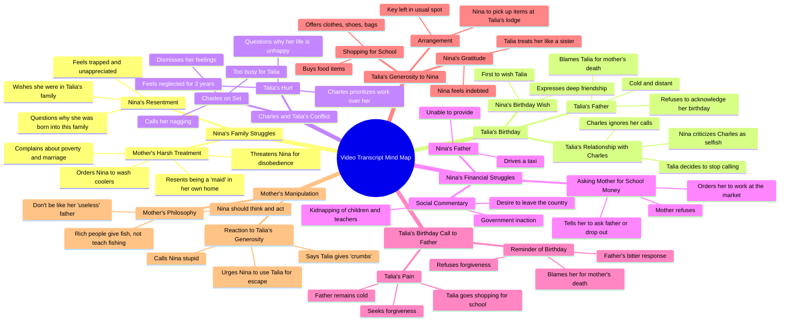

# Dear Talia: African AI Series Review

> 🌐 **Read this in:** **English** · [中文](../../zh-CN/2026-09/tiktok-transcript-dear-talia-the-african-ai-series-you-need-to-watch-deartalia-31f1.md)

> **Creator:** [@storybuzzhq](https://www.tiktok.com/@storybuzzhq) · **Views:** 1.5M · **Posted:** 2026-09-16 · **Niche:** entertainment
>
> **TL;DR:** The stark contrast between peaceful sleep and inhaling smoke immediately grabs attention and evokes sympathy.

[Watch original video →](https://vm.tiktok.com/ZN86L4fMo/)

## Why This Went Viral

## Hook (first 3 seconds)
- **Verbatim opening:** "My mates are still in bed sleeping peacefully. And I'm here inhaling smoke."
- **Hook pattern:** Contrast + relatability (peer comparison / "while they sleep, I suffer").
- **Why it stops the scroll:** Instantly frames a class/status gap ("my mates" vs. "me") and drops a sensory, unpleasant image ("inhaling smoke") in the first breath. The viewer is dropped mid-conflict with no context — the brain needs the missing setup, so it keeps watching.

## Emotional Rhythm
- **0–15s — Curiosity + resentment:** The mother's rant ("where is that stupid girl," "Nigeria will look like Ghana to you") establishes villain energy and stakes.
- **15–45s — Empathy for Nina:** Nina's internal monologue ("Why wasn't I born into Talia's family?") builds pity and a clear underdog.
- **45s–1:30 — Warmth + contrast:** Talia's birthday call is the emotional high — friendship, loyalty, and a brief relief beat.
- **1:30–2:00 — Tension spike:** Charles's call. Cold, dismissive, "you nag so much" — the betrayal beat lands here.
- **2:00–2:45 — Double rejection:** Father's line "How can I forget the day you killed my wife?" is the sharpest emotional cut in the script.
- **2:45–3:30 — Suspense + moral fork:** Talia offers to buy everything; Nina's mother reframes kindness as manipulation ("crumbs from a full loaf of bread").
- **Climax:** "Think, Nina, think!" — the mother's manipulation lands as the final beat, converting a sad story into a moral dilemma the audience must resolve themselves.

## Keyword Density
- **"birthday"** — anchors the entire episode; drives emotional pull (every beat is tied to it).
- **"money" / "school fees"** — drives class-conflict theme and algorithmic reach (high-search, high-relatability).
- **"maid" / "coolers" / "market"** — grounds the poverty setting; strong regional relatability.
- **"Talia"** — the emotional fulcrum; repeated name builds character branding.
- **"selfish" / "manipulative"** — moral labels that trigger comment-section debate.
- **"forgive" / "killed my wife"** — highest emotional-density phrase; drives shares and rewatches.
- **"think, Nina, think"** — the closing hook phrase; engineered for comment bait.
- **Algorithmic drivers:** "birthday," "school fees," "Nigeria," "maid" (search + regional targeting).
- **Emotional drivers:** "killed my wife," "crumbs from a full loaf," "selfish," "forgive."

## Why It Spreads
- **Stacked micro-cliffhangers.** Every 20–30 seconds ends on an unresolved beat ("where is that stupid girl?" → "I'll call Charles" → "Should I tell him?" → "Think, Nina, think!"). Viewers can't exit without resolution.
- **Universal villain archetypes.** The wicked stepmother ("you will regret having me as a mother"), the cold boyfriend ("you nag so much"), the unforgiving father ("bring my wife back"). Each one maps to a real audience wound, forcing identification.
- **Moral ambiguity engineered for comments.** The mother's speech — "Rich people like her will not teach you how to fish" — reframes the sympathetic Talia as a gatekeeper. This splits the audience into two camps (Nina should be loyal vs. Nina should use Talia), which is the single biggest driver of comment-section virality.
- **Class-porn relatability.** Lines like "I am being used as a maid in this house" and "a mother who sells food under the sun, and a father who drives a taxi" hit a mass African/working-class audience with high shareability.
- **Emotional whiplash in under 4 minutes.** The viewer is moved from pity → warmth → betrayal → grief → temptation in one sitting. High emotional velocity = high rewatch and completion rate, which the algorithm rewards.

## What You Can Steal
- **Open mid-conflict, not mid-setup.** Start with the loudest line in the scene ("Nigeria will look like Ghana to you") — never with exposition. The viewer should feel like they walked into a fight already in progress.
- **Give every character a quotable moral line.** "Crumbs from a full loaf of bread," "bring my wife back," "you nag so much." One memorable sentence per character is what gets screenshotted, captioned, and reposted.
- **End on a dilemma, not a resolution.** "Think, Nina, think!" forces the viewer to pick a side. Ask yourself before publishing: *what will people argue about in the comments?* If you can't answer that, the video won't spread.

## Mind Map

## Full Transcript (Generated by [TokTranscript](https://toktranscript.com/?utm_source=github&utm_medium=breakdown&utm_campaign=tool_attribution))

> 📝 Transcripts on this page are auto-generated and show the first 60%. Want to transcribe any TikTok in 30 seconds and get the full version? [Try TokTranscript free →](https://toktranscript.com/?utm_source=github&utm_medium=breakdown&utm_campaign=transcript_cta)

My mates are still in bed sleeping peacefully. And I'm here inhaling smoke. In fact, where is that stupid girl? Nina, if I meet you in that room, Nigeria will look like Ghana to you. All you know is how to ask me for money. But you won't help to make it. It's not like she would give me money for my school fees even after I help her. God, why did you bring me into this family? Why wasn't I born into Talia's family? Why are you still standing there? Will you go and wash those coolers before I descend on you this morning? You will know my true colour when I get to the market and find that my customers have already eaten. My maids that got married to rich men are in their beds now while their maids serve them. Meanwhile, I am being used as a maid in this house. Because I married a man with a bright future. Yet for 26 years, the future is still not bright. Why is she always complaining every day? It's not like anyone forced her to marry my father. I need to call Talia now before this woman comes back. Happy birthday to you. Happy birthday to you. Happy birthday, dear Talia. Happy birthday to you, my best friend. I wish you nothing but the best things life has to offer. Thank you so much, Nina. You are the first person who wish me a happy birthday today. I Honestly, wonder what my life would be without you. Really? What about your father? Is he still being cold to you and Charles? Didn't he call? Surely he did something fancy for you. I haven't heard from Charles since yesterday. I've called several times, but he won't pick up and he hasn't called back. Honestly, I'm done. I won't call him again. He's not the only one who's busy. I'm busy too. And as for my father, well, you already know what our relationship is like. Honestly, I wouldn't want to spoil my day by going to him just to remind him that it's my birthday. I never liked that Charles guy. I don't know what you even see in that selfish man. Even on your birthday, he didn't call or do anything romantic. I'm sure he's on set right now, flirting with anything in a skirt. He's just a wasted soul. Where is that stupid girl? I asked her to wash the coolers for me. Nina, if I meet you inside that house, you will regret having me as a mother. Will you come and wash these coolers? Mommy, I'm coming! I'm in the toilet. I'm having a running stomach. If I meet you in there, your stomach won't be the only thing running. Your tears will run too, you idiot! Talia, I have to go. I'll call you later. Let me try calling Charles for the very last time. This is the last time I'm going to explain This scene, if either of you messes it up again, you're off my set. Let's take a break. So you can finally take calls now? Charles, it's my birthday. You didn't even bother to call or wish me a happy birthday. Just how heartless can you be? Why do you nag so much? You called and I didn't pick up. Shouldn't your common sense tell you that I'm too busy to talk? As for your birthday, the day has only just started. Something can still be done about it. But if you keep nagging, I'm just going to ignore you. Just imagine the stupid things coming out of your mouth. I nag only because I'm trying to explain how your actions are hurting me. Anyway, I shouldn't have expected more from a selfish, manipulative man like you. Oh, so now I'm selfish and manipulative just because I said I'm busy? Talia, you are dating an alias director, not some common church rat. Hello, Talia. Break is over. Everyone back to work! How can a man not understand that he's hurting his woman? It's been 3 years, and Charles keeps putting his work above my needs. Why is my life like this? I'm never happy. I have a father who hates me, and now this. Mommy, please, I need money to get the things I need for school. I'm leaving tomorrow. Go and ask that stupid father of yours who sent you to school for the money. And if he can't, Give you the money for school, then drop out and join me in selling food at the market. But for today, make sure I don't get to the store before you. This country is a joke. Kids under 3 years old and their teachers have been kidnapped for weeks now, and the government says nothing. Honestly, it would be better if they just sold this country and gave me my own share so I could seek refuge somewhere else. Should I tell him? What if he gets cold or angry with me? He already hates me. But not telling him won't change anything. Oh, god, please help me. Daddy, I'm sorry to disturb you. It's just.

*[Read the full transcript on TokTranscript →](https://toktranscript.com/plaza/tiktok-transcript-dear-talia-the-african-ai-series-you-need-to-watch-deartalia-31f1?utm_source=github&utm_medium=breakdown&utm_campaign=transcript_full)*

## Browse More

- All [entertainment](../../by-niche/en/entertainment.md) breakdowns
- All [Contrast Hook](../../by-pattern/en/hook-contrast-hook.md) examples

## Video Info

| | |
|---|---|
| Creator | [@storybuzzhq](https://www.tiktok.com/@storybuzzhq) |
| Original video | [https://vm.tiktok.com/ZN86L4fMo/](https://vm.tiktok.com/ZN86L4fMo/) |
| Original title | Dear Talia | The African AI Series You Need To Watch#deartalia #story... |
| Views | 1.5M (1500000) |
| Posted | 2026-09-16 |
| Duration | 0s |
| Niche | `entertainment` |
| Hook pattern | `Contrast Hook` |
| Original language | `en` |
| Available languages | en, zh-CN |
| Generated | 2026-09-17 by [TokTranscript](https://toktranscript.com/) |

---

*This breakdown is for educational analysis under fair use. Original video © [@storybuzzhq](https://www.tiktok.com/@storybuzzhq). All transcripts are auto-generated and may contain errors.*

*Want to analyze your own TikToks like this? [try this transcription tool →](https://toktranscript.com/viral-breakdown?utm_source=github&utm_medium=breakdown&utm_campaign=footer_cta)*