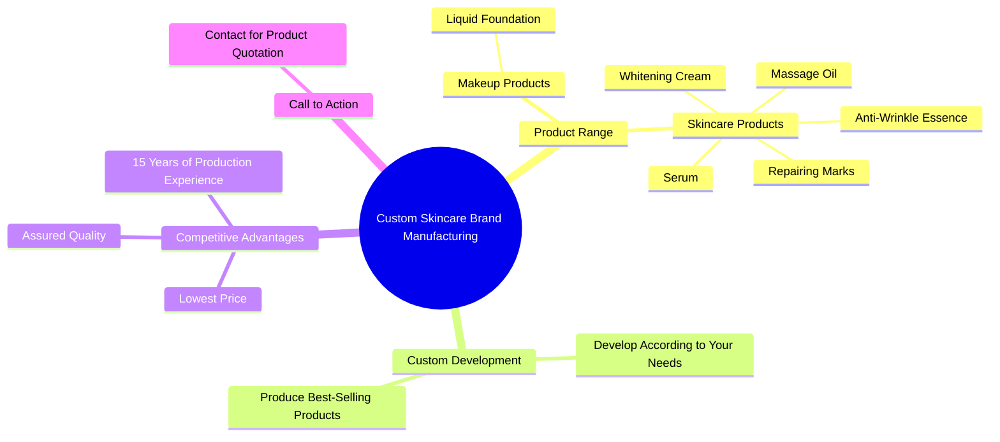

# Custom Private Label Skincare Products Manufacturing

> 🌐 **Read this in:** **English** · [中文](../../zh-CN/2026-09/tiktok-transcript-do-you-want-to-customize-your-own-brand-of-skin-care-product-7458.md)

> **Creator:** [@yuchengcosmeticsfactory](https://www.tiktok.com/@yuchengcosmeticsfactory) · **Views:** 1.8M · **Posted:** 2026-09-17 · **Niche:** beauty
>
> **TL;DR:** Immediately engages business owners by asking if they want to create their own brand, tapping into entrepreneurial aspirations.

[Watch original video →](https://www.tiktok.com/@yuchengcosmeticsfactory/video/7449962848203181354?is_from_webapp=1&sender_device=pc)

## Why This Went Viral

## Hook (first 3 seconds)
- **Verbatim opening line:** "Hello boss, do you want to customize your own brand of skincare products?"
- **Hook pattern:** Direct question + status flattery ("boss") + opportunity framing (own-brand manufacturing).
- **Why it stops the scroll:** It targets a specific viewer identity (aspiring brand owner / reseller / e-commerce seller) in the first second. The word "boss" creates instant ego-resonance, and "customize your own brand" promises ownership and profit — a high-value outcome. The question format forces a mental yes/no, which is hard to scroll past.

## Emotional Rhythm
- **0–3s — Curiosity + flattery:** "Hello boss… customize your own brand?" → viewer feels seen and intrigued.
- **3–8s — Aspiration stacking:** Lists product categories (repairing marks, whitening cream, foundation, anti-wrinkle essence, massage oil, serum). Rapid-fire listing builds a sense of abundance and possibility.
- **8–12s — Trust + authority:** "15 years of producing experience," "rest assured of the quality." Tension of "is this legit?" gets a partial answer.
- **12–15s — Price tension + relief:** "The lowest price. The lowest price." Repetition hammers the core pain point (cost) and delivers relief.
- **Climax moment:** The double "The lowest price" — it's the emotional peak because it resolves the biggest unspoken objection (margin/profitability) with maximum repetition.
- **15–18s — CTA + quirky outro:** "Contact me for a product quotation. Ka. Ka ka." The odd "Ka ka" ending creates a jarring, memorable, almost comedic beat that makes the video feel human and unpolished — which paradoxically increases shareability.

## Keyword Density
- **Strongest repeated words/phrases:**
  1. "boss"
  2. "customize / your own brand"
  3. "skincare products" (and product category names)
  4. "lowest price" (repeated twice back-to-back)
  5. "cosmetic factory in China"
  6. "15 years of producing experience"
  7. "quality"
  8. "contact me / product quotation"
  9. "Ka ka" (outro signature)
- **Algorithmic reach drivers:** "customize," "your own brand," "skincare," "cosmetic factory," "lowest price" — these match high-intent B2B search and recommendation queries.
- **Emotional pull drivers:** "boss," "rest assured," "quality," "Ka ka" — these build rapport, trust, and a sense of personal connection, making the viewer feel like they're being spoken to directly rather than advertised at.

## Why It Spreads
- **Hyper-specific audience targeting creates tribal sharing.** The line "do you want to customize your own brand of skincare products?" speaks directly to a niche (private-label seekers, dropshippers, beauty entrepreneurs). Niche audiences share content that feels made *for them*.
- **Rapid-fire product listing acts as a "menu" that triggers saves.** "Repairing Marks, Whitening Cream, liquid foundation, anti wrinkle essence, massage oil, serum" — viewers who want any one of these save the video as a reference, boosting the save metric.
- **Repetition of "lowest price" creates a sticky, quotable moment.** The doubled phrase is the kind of rhythmic emphasis that gets replayed, clipped, and turned into a meme or sound.
- **The "Ka ka" outro is anti-polished and therefore memorable.** It breaks the expected corporate tone, making the video feel authentic and slightly absurd — absurdity drives comments and shares ("did he just say ka ka?").
- **Clear CTA + low friction.** "Contact me for a product quotation" gives an immediate next step, converting curiosity into DMs and profile visits, which signals engagement to the algorithm.

## What You Can Steal
1. **Open with a direct identity callout + ownership promise.** Replace "boss" with your audience's self-identifier (e.g., "Hey founder," "Hey seller") and pair it with a high-value outcome in the first 3 seconds.
2. **Stack a rapid-fire list of concrete offerings.** Don't describe vaguely — name 5–7 specific products/services fast. This triggers saves and positions you as a one-stop source.
3. **Use one repeated phrase as your emotional anchor.** Pick your core benefit (price, speed, quality) and say it twice in a row at the climax. Repetition = retention.
4. **End with a weird, humanizing signature.** A quirky sign-off ("Ka ka") makes you memorable and gives commenters something to talk about.
5. **Always close with a single, frictionless CTA.** One action, clearly stated — "contact me for a quotation" — so the viewer knows exactly what to do next.

## Mind Map

## Full Transcript (Generated by [TokTranscript.com](https://toktranscript.com/?utm_source=github&utm_medium=breakdown&utm_campaign=tool_attribution))

> 📝 Transcripts on this page are auto-generated and show the first 60%. Want to transcribe any TikTok in 30 seconds and get the full version? [Try TokTranscript free →](https://toktranscript.com/?utm_source=github&utm_medium=breakdown&utm_campaign=transcript_cta)

Hello boss, do you want to customize your own brand of skincare products? Repairing Marks, Whitening Cream, liquid foundation, anti wrinkle essence, massage oil, serum and so on? We can develop and produce various best selling products according to your needs. The lowest price.

*[Read the full transcript on TokTranscript →](https://toktranscript.com/plaza/tiktok-transcript-do-you-want-to-customize-your-own-brand-of-skin-care-product-7458?utm_source=github&utm_medium=breakdown&utm_campaign=transcript_full)*

## Browse More

- All [beauty](../../by-niche/en/beauty.md) breakdowns
- All [Direct Question Hook](../../by-pattern/en/hook-direct-question-hook.md) examples

## Video Info

| | |
|---|---|
| Creator | [@yuchengcosmeticsfactory](https://www.tiktok.com/@yuchengcosmeticsfactory) |
| Original video | [https://www.tiktok.com/@yuchengcosmeticsfactory/video/7449962848203181354?is_from_webapp=1&sender_device=pc](https://www.tiktok.com/@yuchengcosmeticsfactory/video/7449962848203181354?is_from_webapp=1&sender_device=pc) |
| Original title | Do you want to customize your own brand of skin care products at a lo... |
| Views | 1.8M (1800000) |
| Posted | 2026-09-17 |
| Duration | 0s |
| Niche | `beauty` |
| Hook pattern | `Direct Question Hook` |
| Original language | `en` |
| Available languages | en, zh-CN |
| Generated | 2026-09-18 by [TokTranscript](https://toktranscript.com/) |

---

*This breakdown is for educational analysis under fair use. Original video © [@yuchengcosmeticsfactory](https://www.tiktok.com/@yuchengcosmeticsfactory). All transcripts are auto-generated and may contain errors.*

*Want to analyze your own TikToks like this? [try this transcription tool →](https://toktranscript.com/viral-breakdown?utm_source=github&utm_medium=breakdown&utm_campaign=footer_cta)*