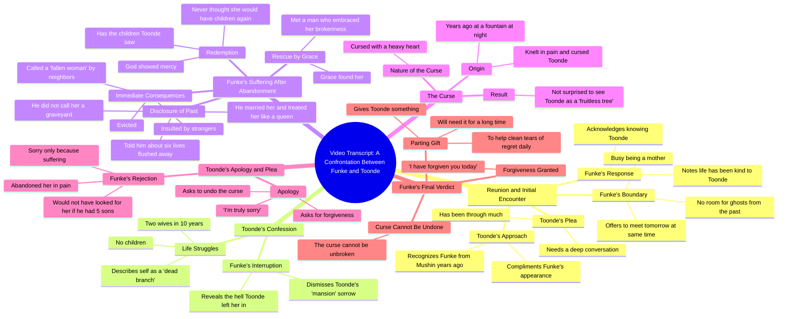

# Final Part: The Curse Nollywood Story

> 🌐 **Read this in:** **English** · [中文](../../zh-CN/2026-09/tiktok-transcript-final-part-the-curse-naijatiktok-fyp-viral-ai-ff42.md)

> **Creator:** [@talesbyoma02](https://www.tiktok.com/@talesbyoma02) · **Views:** 1.8M · **Posted:** 2026-09-30 · **Niche:** entertainment
>
> **TL;DR:** A familiar face from the past instantly creates curiosity and emotional stakes.

[Watch original video →](https://vm.tiktok.com/ZN8hFxsuw/)

## Why This Went Viral

## Hook (first 3 seconds)
- Verbatim: "Funke, yes, do I know you? It's me, Toonde, from years ago in Mushin."
- Pattern: **Recognition / reunion trigger** — a name + a place ("Mushin") + a time gap ("years ago") that instantly implies a buried backstory.
- Why it stops the scroll: It opens mid-conversation with a specific proper noun and location, so the viewer feels they've walked into a real confrontation already in progress. The brain reflexively asks "who are these people and what happened?" — and the answer is withheld.

## Emotional Rhythm
- **Curiosity** — "It's me, Toonde, from years ago in Mushin." Unresolved history is dangled.
- **Warmth / nostalgia** — "You look very good. Life has clearly been kind to you." Sets a false-safe tone.
- **Dread signal** — "I need to talk to you… something very deep today." The temperature drops.
- **Boundary / tension** — Funke refuses: "my life [has no] room for deep conversations with ghosts from my past." Power shifts to her.
- **Confession → contrast** — Toonde: "I had two wives in 10 years, yet no children." Immediately undercut by Funke's counter-reveal of *her* suffering.
- **Escalation / reveal** — "the six lives you made me flush away" — the moral stakes detonate.
- **Twist / reversal** — "He didn't call me a graveyard. He married me and treated me like a queen." Suffering converts to vindication.
- **Climax** — "I knelt in my pain and cursed you… I'm not surprised to see you sitting here as a fruitless tree." The curse is named and confirmed.
- **Cold resolution** — "the curse, it cannot be unbroken. Take this." No redemption, only consequence.

## Keyword Density
- **curse / cursed** — the engine of the whole story; drives both algorithm (high-emotion search term) and the moral payoff.
- **children / sons / fruitless tree** — the central stake; emotional pull (legacy, shame, blessing).
- **pain / suffering / hell** — emotional resonance anchor.
- **sorry / forgive / forgiveness** — the moral tension the audience argues about in comments.
- **abandoned / walked out / evicted** — establishes the villain and the stakes.
- **queen / mercy / god** — the redemption counterweight; triggers religious/aspirational engagement.
- **ghosts from my past** — the most quotable, shareable phrase; strong hook-replay driver.
- **Mushin** — hyper-specific local keyword; boosts regional algorithmic targeting and authenticity.

Algorithmic drivers: *curse, children, forgive, god, Mushin* (searchable, high-emotion, locally relevant). Emotional drivers: *pain, abandoned, queen, fruitless tree, ghosts*.

## Why It Spreads
- **Moral dilemma with no clean answer.** "I have forgive you today, but the curse, it cannot be unbroken" forces viewers to pick a side — the single biggest comment-bait mechanic. People don't share videos they agree with; they share videos they need to argue about.
- **The twist reframes the villain.** "He didn't call me a graveyard. He married me and treated me like a queen" turns a victim story into a revenge-adjacent triumph — the emotional payoff viewers replay and quote.
- **Specific, sensory details make it feel real.** "six lives you made me flush away," "a fountain at night," "Mushin," "fruitless tree" — concrete images are what get screenshotted, captioned, and retold.
- **The curse is the shareable unit.** "I cursed you… fruitless tree" is a self-contained, repeatable line — the kind that becomes a comment, a duet, or a stitch.
- **Cliffhanger-adjacent ending.** "Take this. It will help you clean your tears of regret daily" leaves an object and an implication unresolved — driving "part 2?" comments and rewatches.

## What You Can Steal
1. **Open mid-conflict with a name and a place.** Skip setup. Start with "It's me, [Name], from [specific place] years ago" so the viewer is dropped into a story already in motion.
2. **Build a reversal, not just a sad story.** Give the "victim" a second act — the queen line is why this spread. Suffering alone gets sympathy; suffering *plus vindication* gets shares.
3. **Plant one quotable, repeatable line.** Write a single sentence designed to be screenshotted or commented ("ghosts from my past," "a fruitless tree"). One line does more distribution work than the whole script.
4. **End on an unresolved object or action.** "Take this" without revealing what — that open loop is what triggers "part 2" demand and rewatches.
5. **Use hyper-local specificity.** "Mushin," "fountain at night" — specificity reads as truth and unlocks regional algorithmic reach.

## Mind Map

## Full Transcript (Generated by [TokTranscript](https://toktranscript.com/?utm_source=github&utm_medium=breakdown&utm_campaign=tool_attribution))

> 📝 Transcripts on this page are auto-generated and show the first 60%. Want to transcribe any TikTok in 30 seconds and get the full version? [Try TokTranscript free →](https://toktranscript.com/?utm_source=github&utm_medium=breakdown&utm_campaign=transcript_cta)

Funke, yes, do I know you? It's me, Toonde, from years ago in Mushin. Ah, Toonde, you look very good. Life has clearly been kind to you. Funky, I have been through so much. I saw you and I couldn't believe it. I need to talk to you, please. It's something very deep today. I am having fun with my children right now. And my life have room for deep conversations with ghosts from my past. Today, I come here often. If you really have something to say, I can meet you here tomorrow at the same time. But for now, I am busy being a mother. I am a dead branch, funk. I had two wives in 10 years, yet no children. Are you done? You talk about your sad life in a mansion. Let me tell you about the hell you left me in after you walked out. I was evicted. I was insulted by strangers, called a fallen woman by neighbors who knew my story. I suffered until Grace found me. I met a man who found my brokenness. I told him everything. I told him about the six lives you made me flush away. Do you know what he did? He didn't call me a graveyard.

*[Read the full transcript on TokTranscript →](https://toktranscript.com/plaza/tiktok-transcript-final-part-the-curse-naijatiktok-fyp-viral-ai-ff42?utm_source=github&utm_medium=breakdown&utm_campaign=transcript_full)*

## Browse More

- All [entertainment](../../by-niche/en/entertainment.md) breakdowns
- All [Recognition Hook](../../by-pattern/en/hook-recognition-hook.md) examples

## Video Info

| | |
|---|---|
| Creator | [@talesbyoma02](https://www.tiktok.com/@talesbyoma02) |
| Original video | [https://vm.tiktok.com/ZN8hFxsuw/](https://vm.tiktok.com/ZN8hFxsuw/) |
| Original title | FINAL PART: The Curse #naijatiktok #fyp #viral #ai  |
| Views | 1.8M (1800000) |
| Posted | 2026-09-30 |
| Duration | 0s |
| Niche | `entertainment` |
| Hook pattern | `Recognition Hook` |
| Original language | `en` |
| Available languages | en, zh-CN |
| Generated | 2026-10-01 by [TokTranscript](https://toktranscript.com/) |

---

*This breakdown is for educational analysis under fair use. Original video © [@talesbyoma02](https://www.tiktok.com/@talesbyoma02). All transcripts are auto-generated and may contain errors.*

*Want to analyze your own TikToks like this? [TokTranscript →](https://toktranscript.com/viral-breakdown?utm_source=github&utm_medium=breakdown&utm_campaign=footer_cta)*