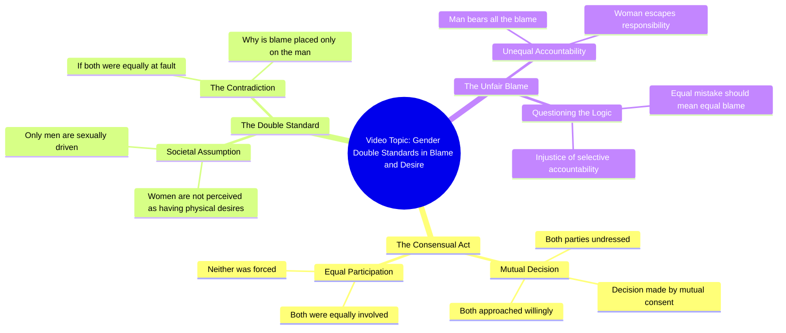

# Couple's Consent Double Standard Questioned

> 🌐 **Read this in:** **English** · [中文](../../zh-CN/2026-09/tiktok-transcript-foryoupage-viralvideo-tren-71c8.md)

> **Creator:** [@hania.writes05](https://www.tiktok.com/@hania.writes05) · **Views:** 3.9M · **Posted:** 2026-09-19 · **Niche:** entertainment
>
> **TL;DR:** Establishes shared responsibility upfront, setting up the hypocrisy reveal.

[Watch original video →](https://vt.tiktok.com/ZSq7FAaUe/)

## Why This Went Viral

## Hook (first 3 seconds)
- Opening line (translated): "Both had taken off their clothes, the decision was by both their consent, both came close by their own will — then who decided that only a man is hungry for the body and a woman is not?"
- Hook pattern: **Contrast + rhetorical question** (a stacked setup of mutual consent, flipped into an accusation of double standards).
- Why it stops the scroll: It front-loads a taboo premise (intimacy, mutual consent) in the first breath, then immediately poses an unresolved *injustice* question. The viewer's brain can't close the loop without hearing the answer — and the moral framing triggers either agreement or outrage, both of which keep the thumb off the screen.

## Emotional Rhythm
- **Beat 1 – Curiosity/Shock (0–3s):** Blunt physical imagery ("clothes off," "came close") grabs attention before any argument is made.
- **Beat 2 – Setup of fairness (3–6s):** "Both consented," "both by their own will" — builds a logical premise the viewer agrees with.
- **Beat 3 – Tension/turn (6–9s):** "Then who decided…" pivots from neutral fact to accusation. Suspense spikes.
- **Beat 4 – Resonance/indignation (9–12s):** "Only the man is hungry for the body, not the woman" — names the double standard directly. This is where viewers feel seen or provoked.
- **Climax:** The final line — "If the mistake was equal, why is all the blame only on the man's head?" This is the emotional peak and the line most likely to be quoted, stitched, or commented on.
- **Relief:** None offered — the video ends on an open wound, which is deliberate. Unresolved tension drives comments.

## Keyword Density
- **دونوں** (both) — repeated ~5x; anchors the "equality" argument.
- **مرد** (man) — the accused subject; drives gender-debate reach.
- **عورت** (woman) — the counterpart; completes the binary that fuels comment wars.
- **غلطی / الزام** (mistake / blame) — the moral core; emotional pull.
- **مرضی / اچھا** (will / own wish) — consent framing; legal-adjacent trigger.
- **جسم** (body) — the taboo keyword that boosts watch-through and shares.
- **کیوں** (why) — the rhetorical engine; invites response.

**Algorithmic reach drivers:** مرد, عورت, جسم, کیوں — high-search, high-comment, high-share terms in gender/social debate content.
**Emotional pull drivers:** غلطی, الزام, مرضی — these make viewers feel the unfairness personally and type a reply.

## Why It Spreads
- **It weaponizes a universal double standard.** The line "صرف مرد ہی جسم کا بھوکا ہوتا ہے اور عورت نہیں" states a belief millions have either lived or argued about — instant identification or instant rebuttal.
- **It's built as a logical trap.** The consent premise ("دونوں کی مرضی سے ہوا تھا") is stated so plainly that the final question ("سارا الزام صرف مرد کے سر کیوں") feels like it *must* be answered. Viewers comment to either defend or attack the logic.
- **It ends on an open question, not a conclusion.** "کیوں" as the last word forces the audience to finish the thought themselves — the single strongest driver of comment-section engagement.
- **It's short and quotable.** The whole argument fits in ~15 seconds, making it perfect for stitches, duets, and reposts with added commentary.
- **It picks a fight without naming anyone.** No politician, no celebrity — just a social norm. That means everyone feels licensed to weigh in, expanding the audience beyond any single niche.

## What You Can Steal
1. **Open with the premise everyone agrees on, then flip it.** State the shared fact ("both consented") in the first 3 seconds so the turn lands as betrayal, not opinion. Agreement first = attention held.
2. **End on a question, not a verdict.** Replace your closing statement with a "why/کیوں/how is that fair" line. Unresolved questions are comment fuel.
3. **Stack repetition of one anchor word.** Repeat "both/donoں" (or your equivalent) until it becomes the emotional drumbeat — it makes the injustice feel mathematically obvious and makes the video quotable in one line.

## Mind Map

## Full Transcript (Generated by [TokTranscript.com](https://toktranscript.com/?utm_source=github&utm_medium=breakdown&utm_campaign=tool_attribution))

> 📝 Transcripts on this page are auto-generated and show the first 60%. Want to transcribe any TikTok in 30 seconds and get the full version? [Try TokTranscript free →](https://toktranscript.com/?utm_source=github&utm_medium=breakdown&utm_campaign=transcript_cta)

کپڑے دونوں نے اتارے تھے فیصلہ بھی دونوں کی مرضی سے ہوا تھا قریب بھی دونوں اپنی اچھا سے آئے تھے پھر یہ کس نے طے کر دیا کہ صرف مرد ہی جسم 

*[Read the full transcript on TokTranscript →](https://toktranscript.com/plaza/tiktok-transcript-foryoupage-viralvideo-tren-71c8?utm_source=github&utm_medium=breakdown&utm_campaign=transcript_full)*

## Browse More

- All [entertainment](../../by-niche/en/entertainment.md) breakdowns
- All [Mutual Action Contrast](../../by-pattern/en/hook-mutual-action-contrast.md) examples

## Video Info

| | |
|---|---|
| Creator | [@hania.writes05](https://www.tiktok.com/@hania.writes05) |
| Original video | [https://vt.tiktok.com/ZSq7FAaUe/](https://vt.tiktok.com/ZSq7FAaUe/) |
| Original title | 𝙍𝙚𝙥𝙤𝙨𝙩 𝙈𝙮 𝙫𝙞𝙙𝙚𝙤𝙨 𝙋𝙡𝙚𝙖𝙨𝙚 𝙑𝙞𝙚𝙬𝙨 𝙋𝙧𝙤𝙗𝙡𝙚𝙢𝙨🥺😭#foryoupage #viralvideo #tren... |
| Views | 3.9M (3900000) |
| Posted | 2026-09-19 |
| Duration | 0s |
| Niche | `entertainment` |
| Hook pattern | `Mutual Action Contrast` |
| Original language | `en` |
| Available languages | en, zh-CN |
| Generated | 2026-09-20 by [TokTranscript](https://toktranscript.com/) |

---

*This breakdown is for educational analysis under fair use. Original video © [@hania.writes05](https://www.tiktok.com/@hania.writes05). All transcripts are auto-generated and may contain errors.*

*Want to analyze your own TikToks like this? [free TikTok transcript generator →](https://toktranscript.com/viral-breakdown?utm_source=github&utm_medium=breakdown&utm_campaign=footer_cta)*