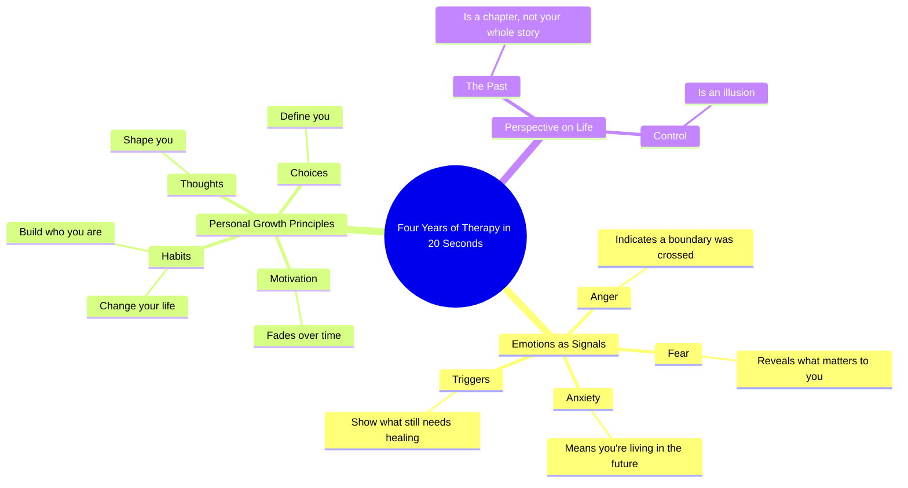

# Four Years of Therapy Explained in 20 Seconds

> 🌐 **Read this in:** **English** · [中文](../../zh-CN/2026-09/tiktok-transcript-four-years-of-therapy-in-20-seconds-bca2.md)

> **Creator:** [@Detach.Reinvent411](https://www.tiktok.com/@Detach.Reinvent411) · **Views:** 2.1M · **Posted:** 2026-09-29 · **Niche:** other
>
> **TL;DR:** It promises massive value in an impossibly short time, creating immediate curiosity and a reason to keep watching.

[Watch original video →](https://www.facebook.com/reel/1367182055184930)

## Why This Went Viral

## Hook (first 3 seconds)
- **Verbatim:** "Okay, here's four years of therapy in 20 seconds."
- **Hook pattern:** Time-compression promise + bold claim (a massive payoff compressed into an impossibly short window).
- **Why it stops the scroll:** It creates an open loop with a specific, almost absurd ratio (4 years → 20 seconds). Viewers feel they're about to get expensive knowledge for free, and the countdown pressure ("20 seconds") makes the cost of watching feel trivial. The word "therapy" also signals emotional stakes, not just information.

## Emotional Rhythm
- **0–3s — Curiosity/Intrigue:** The 4-years-in-20-seconds promise hooks attention.
- **3–8s — Recognition:** "Fear shows you what matters / Anger shows you where a boundary was crossed / Anxiety means you're living in the future" — viewers self-diagnose in real time. This is the resonance zone.
- **8–13s — Permission/Relief:** "Motivation fades. Habits change your life. Your past is a chapter, not your whole story." Tension softens into comfort and self-forgiveness.
- **13–18s — Escalation to meaning:** "Triggers show you what still needs healing. Control is an illusion." Stakes rise — deeper, more existential.
- **Climax (final line):** "Your thoughts shape you. Your habits build you and your choices define you." A triple-beat crescendo that lands as the emotional and rhetorical peak.
- **Landing:** The video ends on agency, not diagnosis — leaving the viewer empowered rather than exposed.

## Keyword Density
- **Strongest repeated/loaded terms:** therapy, fear, anger, anxiety, habits, triggers, control, thoughts, choices, you/your.
- **Algorithmic drivers:** "therapy," "anxiety," "habits," "triggers" — high-search, high-save mental-health keywords that push the video into wellness/self-improvement feeds.
- **Emotional pull:** "you/your," "matters," "boundary," "healing," "define" — second-person framing makes every line feel personally addressed.
- **Structural glue:** The parallel construction ("X shows you Y") creates rhythm that makes the lines quotable and screenshot-able, boosting shares.

## Why It Spreads
- **Extreme value-density:** "Four years of therapy in 20 seconds" sets an expectation the video actually delivers — every line is a standalone insight, so no second feels wasted. High completion rate → algorithm boost.
- **Screenshot/save mechanic:** Lines like "Your past is a chapter, not your whole story" and "Control is an illusion" are self-contained aphorisms. Viewers save and re-share them as text, extending reach beyond the video itself.
- **Universal self-identification:** "Fear shows you what matters," "Anxiety means you're living in the future," "Triggers show you what still needs healing" — each line lets a different viewer feel personally seen, widening the audience beyond any single niche.
- **Triple-beat climax:** "Your thoughts shape you. Your habits build you and your choices define you." The rhythmic escalation gives the video a satisfying ending that invites rewatches and quote-tweets.
- **Low production, high signal:** The content is pure script — no visuals needed to compete, which makes it trivially easy to remix, stitch, or repost across platforms.

## What You Can Steal
- **Open with a time-compression promise.** "Here's [huge thing] in [tiny amount of time]" forces an open loop and sets a completion expectation viewers want to satisfy.
- **Write in parallel, quotable lines.** Use a repeated sentence structure ("X shows you Y") so each line stands alone — this maximizes saves, screenshots, and shares.
- **End on a triple-beat crescendo.** Stack three short, escalating clauses in the final line to give the video a memorable, replay-worthy climax instead of trailing off.

## Mind Map

## Full Transcript (Generated by [analyze your own TikToks](https://toktranscript.com/?utm_source=github&utm_medium=breakdown&utm_campaign=tool_attribution))

> 📝 Transcripts on this page are auto-generated and show the first 60%. Want to transcribe any TikTok in 30 seconds and get the full version? [Try TokTranscript free →](https://toktranscript.com/?utm_source=github&utm_medium=breakdown&utm_campaign=transcript_cta)

Okay, here's four years of therapy in 20 seconds. Fear shows you what matters. Anger shows you where a boundary was crossed. Anxiety means you're living in the future. Motivation fades. Habits change your life.

*[Read the full transcript on TokTranscript →](https://toktranscript.com/plaza/tiktok-transcript-four-years-of-therapy-in-20-seconds-bca2?utm_source=github&utm_medium=breakdown&utm_campaign=transcript_full)*

## Browse More

- All [other](../../by-niche/en/other.md) breakdowns
- All [Time Compression Promise](../../by-pattern/en/hook-time-compression-promise.md) examples

## Video Info

| | |
|---|---|
| Creator | [@Detach.Reinvent411](https://www.tiktok.com/@Detach.Reinvent411) |
| Original video | [https://www.facebook.com/reel/1367182055184930](https://www.facebook.com/reel/1367182055184930) |
| Original title | Four Years of Therapy in 20 Seconds |
| Views | 2.1M (2079955) |
| Posted | 2026-09-29 |
| Duration | 0s |
| Niche | `other` |
| Hook pattern | `Time Compression Promise` |
| Original language | `en` |
| Available languages | en, zh-CN |
| Generated | 2026-09-30 by [TokTranscript](https://toktranscript.com/) |

---

*This breakdown is for educational analysis under fair use. Original video © [@Detach.Reinvent411](https://www.tiktok.com/@Detach.Reinvent411). All transcripts are auto-generated and may contain errors.*

*Want to analyze your own TikToks like this? [TokTranscript →](https://toktranscript.com/viral-breakdown?utm_source=github&utm_medium=breakdown&utm_campaign=footer_cta)*